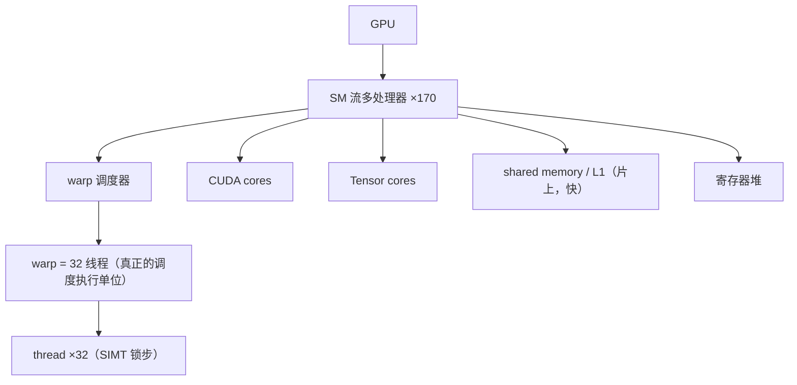
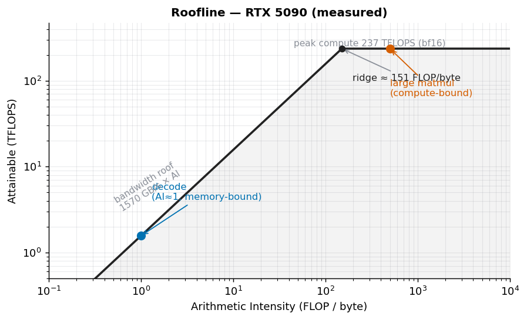
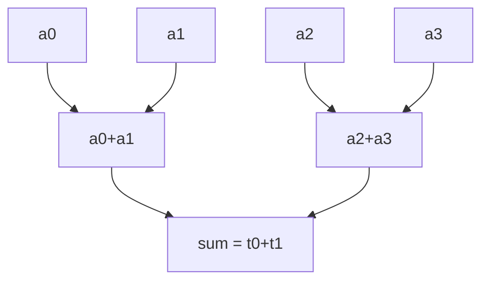

# 第 10 章 GPU 架构深入

> 本章目标：搞清 GPU 怎么组织和执行计算（SM / warp / SIMT / Tensor Core），把第 1 章的
> memory/compute-bound 升级成定量的 **roofline** 模型，并用 **Brent 定理**理解并行加速的上限。
> 数据在 RTX 5090 上实测。

## 10.1 GPU vs CPU：吞吐 vs 延迟

- **CPU**：少数几个很强的核，深流水线、大缓存、复杂分支预测——为**降低单个任务的延迟**而生。
- **GPU**：成千上万个简单核，弱单核但极多、极宽——为**最大化总吞吐**而生：靠海量线程并行，
  用"切换到别的线程"来掩盖访存延迟。

所以 GPU 的思维是：**别怕延迟，用足够多的并行把它藏起来**。这也是它适合大规模张量计算的原因。

## 10.2 执行层级：GPU → SM → warp → thread



软件侧你写的是 **grid → block → thread**：

- 一个 **block（线程块）** 被整体分派到**一个 SM** 上执行；
- block 里的线程按 **32 个一组**切成 **warp（线程束）**；
- **warp 是 GPU 真正的调度/执行单位**。

## 10.3 SIMT 与 warp divergence

GPU 的执行模型叫 **SIMT (Single Instruction, Multiple Threads)**：**一个 warp 里的 32 个线程，
在同一时刻执行同一条指令**（各自作用在自己的数据上），像 32 条锁步前进的车。

问题来了——**warp divergence（束内分支发散）**：

```c
if (cond) { A(); }   // warp 里一部分线程 cond 为真
else      { B(); }   // 另一部分为假
```

同一个 warp 里既有走 A 又有走 B 的线程，但硬件一次只能发一条指令。于是它**先让走 A 的线程执行、
走 B 的线程闲置（masked off），再反过来**——两个分支**串行**跑，warp 的有效吞吐直接减半。

> 优化启示：**让同一 warp 内的线程尽量走同一条路**。第 14 章会用"用掩码算术代替分支"的技巧消除它，
> 例如 `v += cond*a + (1-cond)*b`。

## 10.4 Tensor Core：矩阵乘的专用单元

普通 **CUDA core** 一次做一个标量乘加。**Tensor Core** 是专门的硬件单元，**一条指令做一小块矩阵的
乘加**（如 16×16），吞吐远高于 CUDA core——但只服务矩阵乘那类运算，且用低精度（bf16/fp16/tf32/int8/fp8）。

RTX 5090 实测同一个 8192³ 矩阵乘：

| 精度 / 单元 | TFLOPS | 相对 fp32 |
|------------|-------:|---------:|
| fp32（CUDA core） | 67.2  | 1.0× |
| TF32（Tensor Core） | 113.6 | 1.7× |
| bf16（Tensor Core） | 236.7 | **3.5×** |

**同样的矩阵乘，换到 Tensor Core + 低精度，快 3.5 倍。** 这就是为什么训练/推理都往 bf16/fp8 上走，
也是第 18 章低精度算子的硬件基础。

## 10.5 Roofline 模型：memory/compute-bound 的定量版

第 1 章我们定性说过 memory-bound / compute-bound。**Roofline** 把它画成一张图：

- 横轴：**算术强度**（arithmetic intensity，FLOP/byte）；
- 纵轴：**能达到的算力**（FLOP/s）；
- 两道"屋顶"：水平线 = **峰值算力**；斜线 = **带宽 × 算术强度**。
- 实际能达到的 = `min(峰值算力, 带宽 × 算术强度)`。

两道屋顶的交点叫 **ridge point（拐点）**：

> **拐点算术强度 = 峰值算力 ÷ 带宽**

RTX 5090 实测：峰值 bf16 ≈ 236 TFLOPS，带宽 ≈ 1570 GB/s → **拐点 ≈ 151 FLOP/byte**。



- 算术强度 **< 151** → 落在斜线上 → **memory-bound**（如 decode，强度 ≈ 1，远在左边）；
- 算术强度 **> 151** → 落在水平线上 → **compute-bound**（如大矩阵乘）。

> **注：这两个"屋顶"数字（236 TFLOPS、1570 GB/s）是怎么干净地测出来的？** 选运算有讲究——
> 一个运算的时间到底花在"算"还是"搬"，取决于它的算术强度，所以各取一个极端点来标定两道屋顶：
>
> - **测峰值算力**用**大矩阵乘**（N=8192）：FLOPs=2N³≈1.1×10¹²，搬运≈0.8 GB，算术强度 ≈1366 FLOP/byte
>   ≫ 拐点 → **compute-bound**。计算 ≈4.6 ms 远大于访存 ≈0.5 ms，且访存和计算重叠，所以总时间≈计算时间，
>   `FLOPs/时间` 就是有效算力，不必减访存。
> - **测带宽**用**逐元素相加** `c=a+b`：FLOPs≈6.7×10⁷（每元素 1 次加），搬运≈0.8 GB，算术强度 ≈0.08 FLOP/byte
>   ≪ 拐点 → **memory-bound**。计算 ≈0.0003 ms 可忽略，时间几乎全花在"读 2 个数组、写 1 个数组"上，
>   所以 `搬运字节/时间` 就是带宽。
>
> （练习里也没有主机↔设备拷贝要排除——数据一开始就用 `device=DEVICE` 建在 GPU 上了。）

**这就是第 1 章判据的定量版本**：不再是"感觉卡在搬数据"，而是算出算术强度，和拐点比大小。

## 10.6 Brent 定理：并行加速的上限

写并行 kernel（尤其 reduction/scan）前要懂一个基本极限。定义：

- **Work（W）**：总运算量（串行做要多少步）；
- **Span / Depth（D）**：最长依赖链（哪怕无限多核，也必须一步步走完的那条链）。

**Brent 定理**：用 p 个处理器，运行时间 T_p 满足

> **max(W/p, D) ≤ T_p ≤ W/p + D**

两个推论：

1. **再多核也快不过 D**：加速的下限被最长依赖链锁死；
2. 所以并行算法要**尽量压低 D**。

例子：对 N 个数求和。

- **顺序累加**：W = N-1，但依赖链 D = N-1（每步依赖上一步）→ 再多核也是 O(N)；
- **树状归约**：两两相加、层层折半，W 还是 N-1，但 D = log₂N → 给足够核，O(log N)。



上图：同一层的加法（`a0+a1` 与 `a2+a3`）互不依赖、可并行；只有"层与层"之间有依赖。
4 个数 → 2 层，depth = log₂N。

**同样的 work，树状把 depth 从 N 压到 log N，这才是并行的关键。** 第 14 章手撕 reduction 就是在实践这一点。

## 10.7 思考题

1. 实测里 bf16 矩阵乘比 fp32 快 3.5×，主要是靠什么？（两个原因）
2. 某个运算的算术强度是 10 FLOP/byte，在这块 5090（拐点 ≈ 151）上是 memory-bound 还是 compute-bound？
   要给它提速，该从"提高算力"还是"减少访存 / 提高算术强度"入手？
3. （Brent）对 N 个数求和，顺序累加的依赖链长 N-1，树状归约只有 log₂N。给足够多核，哪个更快？
   这说明并行加速的上限主要由 work 还是 depth 决定？

> 📖 **参考答案**（想清楚再看）：[Q1](../../qa/10-gpu-arch-qa.md#q1) · [Q2](../../qa/10-gpu-arch-qa.md#q2) · [Q3](../../qa/10-gpu-arch-qa.md#q3)

## 10.8 延伸阅读

- 第 11 章 CUDA 编程模型：把 grid/block/thread、shared memory 落到代码。
- 第 14 章 手撕 reduction：Brent 定理的直接实践。
- 补充 A（第一部分）：GPU 存储层级与 HBM——本章 SM/寄存器/shared memory 的存储侧背景。

## 10.9 附录：本章练习代码

源码：`exercises/02-gpu-kernels/10_gpu_arch_roofline.py`。

<!-- CODE:exercises/02-gpu-kernels/10_gpu_arch_roofline.py START -->
```python
#!/usr/bin/env python
# -*- coding: utf-8 -*-
"""
第 10 章练习：探测 GPU 架构，实测峰值算力 / 显存带宽，算出 roofline 拐点。

三件事：
  A) 打印这块卡的硬件参数（SM 数、显存等）。
  B) 峰值算力：同一个大矩阵乘，分别用 fp32(CUDA core) / TF32 / bf16(Tensor Core)，
     实测 TFLOPS —— 亲眼看见 Tensor Core 比普通 CUDA core 快多少。
  C) 显存带宽：大张量逐元素相加，实测 GB/s。
  由 B、C 算出 roofline 拐点（临界算术强度 = 峰值算力 / 带宽），呼应第 1 章 memory/compute-bound。
"""

import time
import torch

DEVICE = "cuda:0"


def sync():
    torch.cuda.synchronize()


def timed(fn, warmup=3, repeat=10):
    for _ in range(warmup):
        fn()
    sync(); t0 = time.perf_counter()
    for _ in range(repeat):
        fn()
    sync()
    return (time.perf_counter() - t0) / repeat


def main():
    p = torch.cuda.get_device_properties(DEVICE)
    print("=" * 60)
    print("A) GPU 硬件参数")
    print("=" * 60)
    print(f"名称                : {p.name}")
    print(f"SM 数 (multi_processor_count) : {p.multi_processor_count}")
    print(f"显存                : {p.total_memory/2**30:.1f} GiB")
    print(f"算力架构 (compute cap)        : {p.major}.{p.minor}")

    # ---------- B) 峰值算力：fp32 vs TF32 vs bf16 ----------
    print("\n" + "=" * 60)
    print("B) 峰值算力：大矩阵乘 (N=8192)，不同精度实测 TFLOPS")
    print("=" * 60)
    N = 8192
    flops = 2 * N ** 3  # 一次 N×N×N matmul 的浮点运算数
    a32 = torch.randn(N, N, device=DEVICE, dtype=torch.float32)
    b32 = torch.randn(N, N, device=DEVICE, dtype=torch.float32)
    a16 = a32.to(torch.bfloat16); b16 = b32.to(torch.bfloat16)

    # fp32：关掉 TF32，走真正的 FP32 CUDA core
    torch.backends.cuda.matmul.allow_tf32 = False
    t = timed(lambda: torch.mm(a32, b32))
    print(f"fp32  (CUDA core)   : {flops/t/1e12:>7.1f} TFLOPS   ({t*1e3:.1f} ms)")

    # TF32：开 TF32，fp32 输入走 Tensor Core 的 TF32 通路
    torch.backends.cuda.matmul.allow_tf32 = True
    t = timed(lambda: torch.mm(a32, b32))
    print(f"TF32  (Tensor Core) : {flops/t/1e12:>7.1f} TFLOPS   ({t*1e3:.1f} ms)")

    # bf16：走 Tensor Core
    t = timed(lambda: torch.mm(a16, b16))
    bf16_tflops = flops / t / 1e12
    print(f"bf16  (Tensor Core) : {bf16_tflops:>7.1f} TFLOPS   ({t*1e3:.1f} ms)")

    # ---------- C) 显存带宽 ----------
    print("\n" + "=" * 60)
    print("C) 显存带宽：大张量逐元素相加 (c = a + b)")
    print("=" * 60)
    M = 1 << 26  # 64M 个 float32
    x = torch.randn(M, device=DEVICE)
    y = torch.randn(M, device=DEVICE)
    t = timed(lambda: torch.add(x, y))
    bytes_moved = 3 * M * 4  # 读 a、读 b、写 c，各 4 字节
    bw = bytes_moved / t / 1e12  # TB/s
    print(f"实测带宽            : {bw*1e3:>7.0f} GB/s   ({t*1e3:.2f} ms)")

    # ---------- roofline 拐点 ----------
    print("\n" + "=" * 60)
    print("Roofline 拐点（临界算术强度）")
    print("=" * 60)
    ridge = bf16_tflops * 1e12 / (bw * 1e12)  # FLOP/byte
    print(f"临界算术强度 = 峰值算力 / 带宽 ≈ {ridge:.0f} FLOP/byte")
    print(f"→ 算术强度 < {ridge:.0f}：memory-bound（如 decode，强度≈1）")
    print(f"→ 算术强度 > {ridge:.0f}：compute-bound（如大矩阵乘 prefill）")
    print("这就是第 1 章 memory/compute-bound 判据的定量版本。")


if __name__ == "__main__":
    main()
```
<!-- CODE:exercises/02-gpu-kernels/10_gpu_arch_roofline.py END -->

**运行输出：**

<!-- OUTPUT:exercises/02-gpu-kernels/outputs/10_gpu_arch_roofline.txt START -->
```text
============================================================
A) GPU 硬件参数
============================================================
名称                : NVIDIA GeForce RTX 5090
SM 数 (multi_processor_count) : 170
显存                : 31.4 GiB
算力架构 (compute cap)        : 12.0

============================================================
B) 峰值算力：大矩阵乘 (N=8192)，不同精度实测 TFLOPS
============================================================
fp32  (CUDA core)   :    65.7 TFLOPS   (16.7 ms)
TF32  (Tensor Core) :   112.8 TFLOPS   (9.8 ms)
bf16  (Tensor Core) :   233.2 TFLOPS   (4.7 ms)

============================================================
C) 显存带宽：大张量逐元素相加 (c = a + b)
============================================================
实测带宽            :    1571 GB/s   (0.51 ms)

============================================================
Roofline 拐点（临界算术强度）
============================================================
临界算术强度 = 峰值算力 / 带宽 ≈ 148 FLOP/byte
→ 算术强度 < 148：memory-bound（如 decode，强度≈1）
→ 算术强度 > 148：compute-bound（如大矩阵乘 prefill）
这就是第 1 章 memory/compute-bound 判据的定量版本。
```
<!-- OUTPUT:exercises/02-gpu-kernels/outputs/10_gpu_arch_roofline.txt END -->

---

[^sm]: SM (Streaming Multiprocessor)：GPU 的基本计算单元。详见[术语表](../../glossary.md#sm)。
[^warp]: Warp（线程束）：32 个线程一组，GPU 的调度执行单位。详见[术语表](../../glossary.md#warp)。
[^tc]: Tensor Core：矩阵乘专用硬件单元。详见[术语表](../../glossary.md#tensor-core)。
[^roofline]: Roofline：用算术强度判断 memory/compute-bound 的模型。详见[术语表](../../glossary.md#roofline)。
