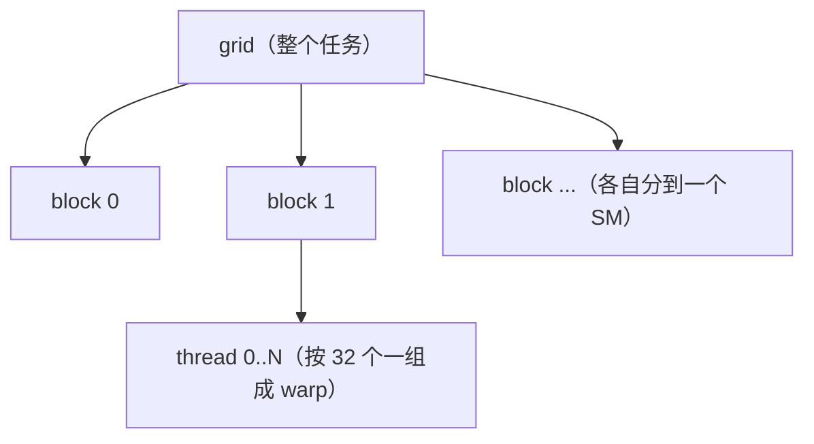

# 第 11 章 CUDA 编程模型：grid / block / thread、访存合并、shared memory

> 本章目标：搞清怎么把计算"铺"到 GPU 上（grid/block/thread），以及两条写 kernel 时最先要懂的
> 性能规则——**访存合并**和 **shared memory + tiling**。数据在 RTX 5090 上实测。

## 11.1 grid / block / thread：怎么把计算铺到 GPU 上

写 CUDA kernel 时，你把任务组织成三层（对应第 10 章的硬件层级）：



- 你启动一个 **grid**，里面有很多 **block**；每个 block 有很多 **thread**；
- 每个 thread 通常负责**一个（或几个）数据元素**；
- thread 用自己的坐标算出要处理哪个元素——全局下标 = `blockIdx * blockDim + threadIdx`。

以"逐元素相加 `c = a + b`"为例，每个 thread 干一个元素：

```
i = blockIdx.x * blockDim.x + threadIdx.x   // 我是第几个元素
if (i < N) c[i] = a[i] + b[i];
```

**这就是 GPU 编程的基本套路**：把数据摊平，一个 thread 管一格，几万个 thread 一起并行。

## 11.2 访存合并 (coalescing)：让同一 warp 访问连续内存

回忆第 10 章：一个 warp 的 32 个线程锁步执行同一条指令。当这条指令是"读内存"时，硬件会看这 32 个线程
要读的地址：

- 如果它们读的是**连续**的一段地址 → 合并成**一次（或很少几次）大内存事务** → 带宽拉满；
- 如果读的是**分散**的地址 → 退化成**很多次小事务** → 带宽暴跌。

这叫**访存合并 (memory coalescing)**[^coal]。用真机验证——搬同样多的数据（都读 N 个 float），只改访问顺序：

| 访问模式 | 有效带宽 | 相对顺序 |
|---------|--------:|--------:|
| 顺序（读 x[0],x[1],x[2]…） | 1594 GB/s | 1.00× |
| 跨步（读 x[0],x[P],x[2P]…） | 633 GB/s | 0.40× |
| 随机（读打乱的下标） | 288 GB/s | **0.18×** |

**数据量一模一样，只是访问顺序不同，带宽差了 5.5 倍。** 对 memory-bound 的 kernel（第 1 章讲的
decode、逐元素算子都是），访存合并几乎直接决定性能。

> 实践规则：**让同一 warp 内相邻的线程，去访问相邻的内存**（即 thread `i` 访问元素 `i`，行主序连续）。
> 避免让相邻线程跳着访问（列主序、大跨步、随机 gather）。躲不开时，用下面的 shared memory 中转。

## 11.3 shared memory 与 tiling：把数据留在片上复用

**shared memory**[^smem] 是**每个 block 独享的一块片上高速内存**（第 10 章存储层级里那层，比 HBM 快几十倍）。
一个 block 里的所有线程都能读写它。它的经典用法是 **tiling（分块）**[^tiling]：

> 把一小块数据**从 HBM 搬进 shared memory 一次**，然后让 block 里的线程**在片上反复复用它很多次**，
> 而不是每次都回 HBM 读。

以矩阵乘 `C = A × B` 为例：算 C 的一个块，需要 A 的一行条、B 的一列条，每个元素会被用很多次。
朴素做法每次乘加都回 HBM 读 → 访存爆炸；tiling 把 A、B 的小块先载入 shared memory，块内所有乘加都
从片上取数 → **HBM 访问次数按 tile 大小成倍减少**。

联系第 10 章的 roofline：**tiling 减少了访存、增加了每字节的计算量，也就是提高了算术强度**，
把算子从 memory-bound 往右推向 compute-bound——这正是 kernel 优化最核心的一招。

## 11.4 bank conflict（先埋个点）

shared memory 内部分成若干 **bank**；如果同一个 warp 的线程同时访问**同一个 bank 的不同地址**，会被
串行化（bank conflict），削弱 shared memory 的优势。怎么用 padding / swizzling 消除，留到第 13 章细讲。

## 11.5 思考题

1. 同样搬 N 个 float，随机访问比顺序访问慢约 5 倍。数据量一样，慢在哪一步？
2. 你发现一个 memory-bound 的 kernel 访问是"跨步"的（相邻线程跳着读）。有哪两类改善思路？
3. tiling（把数据块载入 shared memory 复用）为什么能让一个原本 memory-bound 的算子变快？
   用第 10 章的 roofline 语言说说它把算子往哪个方向推。

> 📖 **参考答案**（想清楚再看）：[Q1](../../qa/11-cuda-model-qa.md#q1) · [Q2](../../qa/11-cuda-model-qa.md#q2) · [Q3](../../qa/11-cuda-model-qa.md#q3)

## 11.6 延伸阅读

- 第 12 章 性能分析：用 Nsight 看一个 kernel 到底卡在访存还是计算、合并率多少。
- 第 13 章 算子优化基本功：bank conflict、向量化读取、occupancy、register spill。
- 第 14–15 章 手撕 kernel：reduction / sgemm 里 shared memory + tiling 的实战。

## 11.7 附录：本章练习代码

源码：`exercises/02-gpu-kernels/11_coalescing.py`。

<!-- CODE:exercises/02-gpu-kernels/11_coalescing.py START -->
```python
#!/usr/bin/env python
# -*- coding: utf-8 -*-
"""
第 11 章练习：亲眼看见"访存合并 (coalescing)"的威力。

同一个 warp 的 32 个线程如果访问**连续**的内存，硬件能把它们合并成一次（或很少几次）
内存事务，带宽拉满；如果访问**分散**的内存，就退化成很多次小事务，带宽暴跌。

我们搬运同样多的数据（都是读 N 个 float），只改**访问顺序**：
  - 顺序 (sequential)：读 x[0], x[1], x[2], ...   —— 完全合并
  - 跨步 (strided)   ：读 x[0], x[P], x[2P], ...   —— 部分分散
  - 随机 (random)    ：读打乱后的下标            —— 完全分散
比较三者的有效带宽。
"""

import time
import torch

DEVICE = "cuda:0"


def sync():
    torch.cuda.synchronize()


def timed(fn, warmup=3, repeat=20):
    for _ in range(warmup):
        fn()
    sync(); t0 = time.perf_counter()
    for _ in range(repeat):
        fn()
    sync()
    return (time.perf_counter() - t0) / repeat


def main():
    N = 1 << 26                      # 64M 个 float32
    x = torch.randn(N, device=DEVICE)
    idx_seq = torch.arange(N, device=DEVICE)
    # 跨步：一个与 N 互质的大步长，遍历所有元素但地址跳着走
    stride = 4096 + 1
    idx_strided = (torch.arange(N, device=DEVICE) * stride) % N
    idx_rand = torch.randperm(N, device=DEVICE)

    # 有效带宽：一次 gather 读 N 个 float(x) + 读 N 个 int64(idx) + 写 N 个 float(y)
    bytes_moved = N * 4 + N * 8 + N * 4

    print(f"数据量 N = {N/1e6:.0f}M float32\n")
    print(f"{'访问模式':>10} | {'耗时(ms)':>9} | {'有效带宽(GB/s)':>14} | {'相对顺序':>8}")
    print("-" * 52)
    base = None
    for name, idx in [("顺序", idx_seq), ("跨步", idx_strided), ("随机", idx_rand)]:
        t = timed(lambda: x[idx])
        bw = bytes_moved / t / 1e9
        if base is None:
            base = bw
        print(f"{name:>10} | {t*1e3:>9.2f} | {bw:>14.0f} | {bw/base:>7.2f}x")

    print("\n结论：搬运的数据量一模一样，只是访问顺序不同——")
    print("      顺序访问能被合并成大事务、带宽拉满；随机访问退化成一堆小事务，带宽大幅下降。")
    print("      这就是为什么写 kernel 要让同一 warp 的线程访问连续内存（coalesced access）。")


if __name__ == "__main__":
    main()
```
<!-- CODE:exercises/02-gpu-kernels/11_coalescing.py END -->

**运行输出：**

<!-- OUTPUT:exercises/02-gpu-kernels/outputs/11_coalescing.txt START -->
```text
数据量 N = 67M float32

      访问模式 |    耗时(ms) |     有效带宽(GB/s) |     相对顺序
----------------------------------------------------
        顺序 |      0.67 |           1596 |    1.00x
        跨步 |      1.70 |            633 |    0.40x
        随机 |      3.72 |            288 |    0.18x

结论：搬运的数据量一模一样，只是访问顺序不同——
      顺序访问能被合并成大事务、带宽拉满；随机访问退化成一堆小事务，带宽大幅下降。
      这就是为什么写 kernel 要让同一 warp 的线程访问连续内存（coalesced access）。
```
<!-- OUTPUT:exercises/02-gpu-kernels/outputs/11_coalescing.txt END -->

---

[^coal]: Memory Coalescing（访存合并）：同一 warp 的线程访问连续内存被合并成大事务。详见[术语表](../../glossary.md#coalescing)。
[^smem]: Shared Memory（共享内存）：每个 block 独享的片上高速内存。详见[术语表](../../glossary.md#shared-memory)。
[^tiling]: Tiling（分块）：把数据块载入 shared memory 复用以减少 HBM 访问。详见[术语表](../../glossary.md#tiling)。
