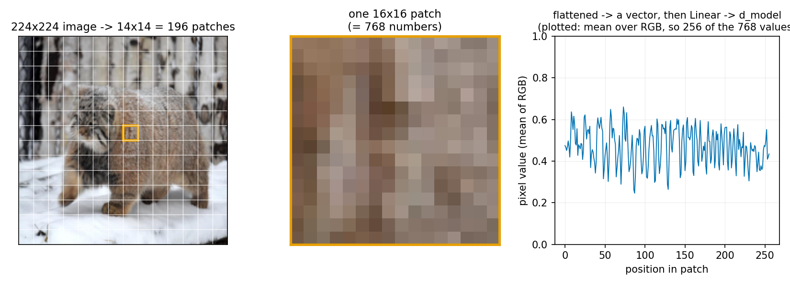
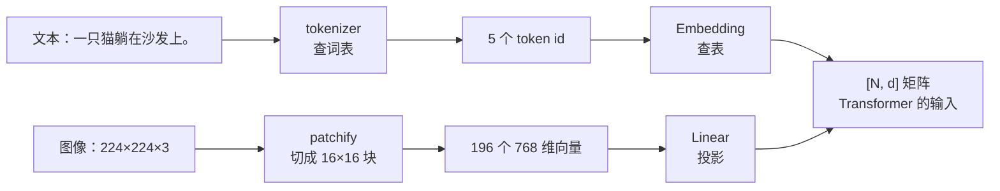
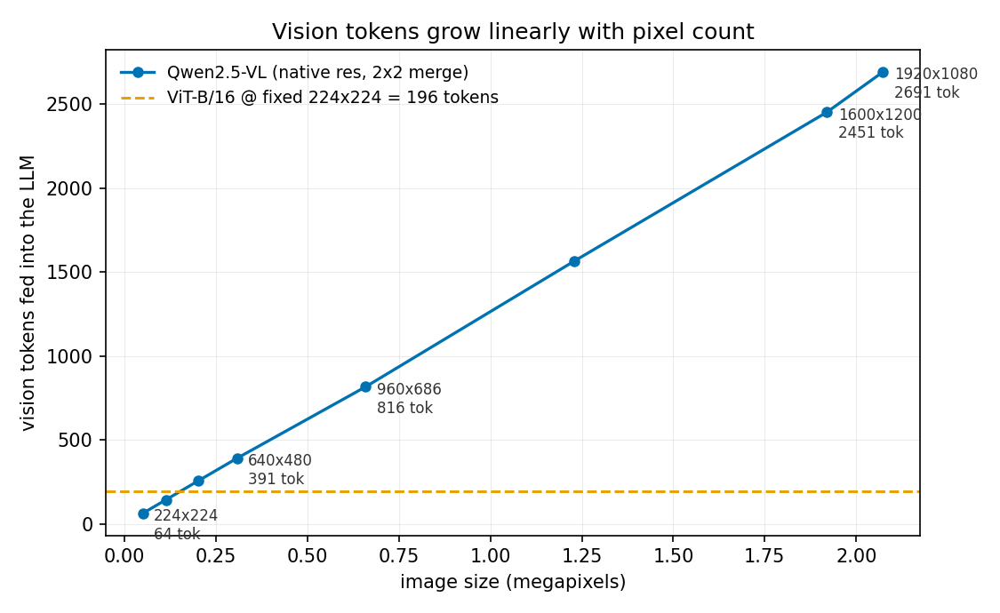

# 第 1 章 图像如何变成 token

> 本章目标：把"图像"这个陌生东西，翻译成你已经熟得不能再熟的三个词——**序列、token、embedding**。
> 学完你要能回答：一张 1920×1080 的图进了 Qwen2.5-VL，到底变成了多少个 token、
> 它们长什么样、要花多少显存。全部数字来自真机实测。

## 1.1 先把已知的东西摆出来

你写过无数遍这段推理代码：

```
"一只猫躺在沙发上。"
   ↓ tokenizer（查词表）
[102292, 100472, 103301, 117733, 1773]     ← 5 个 token id
   ↓ Embedding（查表）
[5, 2048] 的矩阵                            ← 序列长度 × 隐藏维度
   ↓ Transformer
...
```

**关键在最后那个形状**：`[序列长度, 隐藏维度]`。Transformer 只认这个。
它根本不知道也不关心这些向量是从中文、英文、代码还是别的什么东西来的——
它只看到一串向量，做注意力，输出一串向量。

> **这就是多模态的全部秘密。**
> 想让模型"看图"，你不需要发明新架构，只需要回答一个问题：
> **怎么把一张图变成 `[N, d]` 的矩阵？**

## 1.2 图像的难题：没有词表

文本能变成 token，靠的是**词表**（vocabulary）：几万个离散符号，每个符号有 id、有 embedding 向量。
图像没有这东西。一张 224×224 的 RGB 图是 224×224×3 = 150,528 个 0~255 的整数，
既不离散成"词"，也不天然有顺序。

历史上试过几条路：

| 做法 | 怎么做 | 为什么没成为主流 |
|------|--------|------------------|
| 每个像素当一个 token | 150,528 个 token | 序列太长，注意力 O(N²) 直接爆炸 |
| 用 CNN 抽特征再接上 | ResNet 输出特征图 | 能用，但与 Transformer 生态割裂（早期 VLM 确实这么干） |
| **切成小块，每块当一个 token** | **patchify** | ✅ **今天的标准答案** |

## 1.3 patchify：图像的 tokenizer

**patchify**[^patchify] 的想法朴素到有点无聊：既然没有词表，那就**人为规定**——
把图像切成固定大小的方块（比如 16×16 像素），**每个方块就是一个 token**。

224×224 的图，用 16×16 切，得到 14×14 = **196 个 patch**。每个 patch 是
16×16×3 = **768 个数字**，把它拉平成一个 768 维向量，再用一个线性层投影到 `d_model`——
**一个 patch 就成了一个和文本 token 完全同规格的向量**。



两条路殊途同归：



左边一路是"查表"，右边一路是"投影"，但**终点是同一个形状**。
所以 patchify 就是**图像的 tokenizer**，线性投影就是**图像的 embedding 层**。

## 1.4 patch embedding 的真身：一个 Conv2d

翻开任何 ViT[^vit] 的代码，你会看到 patch embedding 就一行：

```python
self.patch_embed = nn.Conv2d(3, d_model, kernel_size=16, stride=16)
```

第一次看到会愣一下：说好的"切块 + 线性投影"，怎么变成卷积了？

其实它俩**在数值上完全是同一件事**。一个 `kernel_size = stride = P` 的卷积，
每次取一个不重叠的 P×P 窗口、和权重做内积——这不就是"切一块、展平、乘一个矩阵"吗？
唯一的区别是卷积把这件事在整张图上并行做完了。

本章练习 B 部分做了严格验证：用同一份权重，`unfold + Linear` 和 `Conv2d(k=16, s=16)`
的输出**最大差异 2.32e-06**（纯浮点误差量级）：

```
线性投影后   : (1, 196, 768)  ← [序列长度, 隐藏维度]，和文本 embedding 同形状！
Conv2d(k=16, s=16) 的结果与 unfold+Linear 最大差异 = 2.32e-06  → 完全等价 ✅
```

> **记住这个等价关系。** 以后读 VLM 代码看到 `Conv2d(3, d, kernel_size=P, stride=P)`，
> 你应该条件反射地翻译成："这是图像的 tokenizer + embedding 层，patch 边长 P"。
> 顺带一提，Qwen2-VL 系列用的是 `Conv3d`——因为要同时处理视频的时间维，
> 但道理一模一样（第 9 章讲）。

## 1.5 视觉 token 和文本 token 的五个关键差异

同形状不等于同性质。这张表里的每一条，后面都会长出一整章内容：

| 维度 | 文本 token | 视觉 token |
|------|-----------|-----------|
| **来源** | 查词表得到离散 id，再查 embedding | 像素块直接线性投影，**没有 id，没有词表** |
| **数量由谁决定** | 内容长度（说得多就多） | **分辨率**（图片多大就多少，和内容无关） |
| **顺序** | 一维、有先后、**有因果** | 二维网格、**无因果**，所以视觉编码器用**双向注意力** |
| **语义粒度** | 一个 token 常常就是一个字/词 | 一个 patch 只是 16×16 像素，**可能只是猫毛的一角** |
| **可逆性** | decode 能还原原文 | **不可逆**，是有损压缩 |

第三条尤其值得停一下：**视觉编码器内部是双向注意力**（每个 patch 能看到所有 patch），
这和你熟悉的 causal LLM 完全不同。原因很简单——图像没有"从左到右"的因果关系，
左上角的像素并不"先于"右下角发生。因果掩码在这里没有意义，只会白白损失信息。

第四条则解释了一个常见困惑：**别指望某个 patch 对应某个物体**。
patch 是机械切分的，一只猫可能横跨 30 个 patch，一个 patch 里也可能同时有猫和沙发。
"把 patch 组织成语义"是 Transformer 那几十层要干的活。

## 1.6 真实 VLM 里的数字：Qwen2.5-VL

上面讲的是经典 ViT 的固定做法（永远缩到 224×224 → 永远 196 个 token）。
现代 VLM[^vlm] 更聪明：**保留原始分辨率**，图大就多出 token，图小就少出 token。
以 Qwen2.5-VL 为例（练习 C 部分的实测）：

```
patch_size = 14  merge_size = 2  → 每 28×28 像素最终变成 1 个视觉 token
min_pixels = 3136  max_pixels = 12845056  （超出范围会先等比缩放）
```

拆开看它做了三件事：

1. **对齐**：把宽高调整成 28 的倍数（保持长宽比），因为要能被 patch 网格整除；
2. **切 patch**：`patch_size = 14`，所以 644×476 的图 → 46×34 的 patch 网格；
3. **2×2 合并**：`merge_size = 2`，相邻的 4 个 patch 在送进 LLM 前**合并成 1 个 token**——
   token 数直接**降到 1/4**。这是最朴素也最有效的 token 压缩（第 8 章细讲）。

于是有了这条公式，和真机实测**逐行对上**（"实测"是数 `input_ids` 里
`<|image_pad|>` 占位符的个数，这是真正喂进 LLM 的视觉 token 数）：

> **视觉 token 数 = (对齐后高 ÷ 28) × (对齐后宽 ÷ 28)**

```
        输入尺寸 |          对齐后 |    grid(t,h,w) |     公式 |     实测 | 一致
----------------------------------------------------------------------------
     224×224 |      224×224 |      (1,16,16) |     64 |     64 | ✅
     336×336 |      336×336 |      (1,24,24) |    144 |    144 | ✅
     640×480 |      644×476 |      (1,34,46) |    391 |    391 | ✅
     960×686 |      952×672 |      (1,48,68) |    816 |    816 | ✅
    1280×960 |     1288×952 |      (1,68,92) |   1564 |   1564 | ✅
   1920×1080 |    1932×1092 |     (1,78,138) |   2691 |   2691 | ✅
```



注意这里的增长是**对像素数线性**（不是对边长线性）：边长翻倍 → 像素 ×4 → token ×4。
没人拦着的话，一张 4K 图能吃掉上万 token，所以 processor 用 `max_pixels` 兜底——
12,845,056 像素 ÷ 28² ≈ **16,384 个 token 的天花板**。

> **诚实说明（两点容易被忽略的细节）：**
>
> 1. 表里 `grid` 的第一维 `t` 是**时间维**。单图恒为 1；视频时 `t > 1`，
>    而且 Qwen2.5-VL 的 `temporal_patch_size = 2`，即**每 2 帧合并成一组**处理。
> 2. "对齐"不是简单向下取整，而是在保持长宽比的前提下就近对齐到 28 的倍数
>    （所以 640×480 变成了 644×476，宽反而涨了 4 像素）。别自己拿 `//28` 硬算，
>    会和实测差几个 token——要准就调 processor。

## 1.7 代价：视觉 token 也要占 KV cache

视觉 token 一旦进了 LLM，**它和文本 token 就没有任何区别了**——一样过每一层注意力，
一样要存 K 和 V。用 Qwen2.5-VL-3B 的 LLM 配置（36 层、2 个 KV 头、head_dim 128、bf16）：

每个 token 的 KV cache = 2 × 36 × 2 × 128 × 2 字节 = **36 KiB**[^kvcache]

```
      图像(宽×高) |   视觉 token |   KV cache |       ≈ 等量中文
--------------------------------------------------------
      224×224 |         64 |   2.25 MiB |        118 字
      640×480 |        391 |  13.75 MiB |        726 字
      960×686 |        816 |  28.69 MiB |       1516 字
     1920×1080 |       2691 |  94.61 MiB |       5002 字
```

（"等量中文"按实测的 1.86 汉字/token 换算，只为建立直觉。）

**一张 1080p 的图 ≈ 一篇五千字的文章。** 这一句话就能解释 VLM 工程里的大半问题：

- **prefill 变重**：这几千个 token 全都要走一遍完整前向，TTFT 天然比纯文本长；
- **显存变紧**：并发 32 路、每路一张 960×686 的图，光视觉部分的 KV cache 就 ≈ 918 MiB；
- **还得先过视觉塔**：这些 token 是 ViT 算出来的，那部分算力是纯文本推理里不存在的额外开销。

于是全书后面的内容，很大一部分都在回答这两个问题：

- **架构上怎么少出 token**：2×2 merge、Q-Former、token 剪枝与合并（第二部分）；
- **工程上怎么扛住这些 token**：变长序列 packing、视觉编码缓存、显存预算（第四、五部分）。

## 1.8 本章要记住的三件事

1. **patchify 是图像的 tokenizer**，patch embedding 就是一个 `Conv2d(k=P, s=P)`；
   图像和文本最终都变成 `[N, d]`，Transformer 一视同仁。
2. **视觉 token 的数量由分辨率决定，且正比于像素数**——这是纯文本世界里不存在的新变量，
   它同时是能力旋钮（看得清）和成本旋钮（吃 token）。
3. **视觉 token 的代价和文本 token 一样真实**：一样占 KV cache、一样过 prefill。
   一张 1080p 图 ≈ 几千字文章。

## 1.9 思考题

1. 实测里 1280×960 的图是 1564 个视觉 token，640×480 的图是 391 个。
   边长只缩了一半，token 数却掉到 1/4——为什么？
   那么，为了省 token 就把所有输入图都缩小，代价是什么？什么场景下这个代价不可接受？
2. 为什么 patch embedding 可以直接用 `nn.Conv2d(3, d, kernel_size=16, stride=16)` 实现？
   如果把 `stride` 改成 8（小于 kernel_size，patch 之间重叠），
   模型会得到什么、又要付出什么代价？
3. 假设你要服务一个 VLM：并发 32 路请求，每路带一张 960×686 的图 + 200 token 的文本提示。
   用本章的数字估算：**光 KV cache** 要多少显存？如果产品经理希望支持 1080p 原图，
   显存会变成多少？你会怎么劝他/她（或者怎么支持）？

> 📖 **参考答案**（想清楚再看）：[Q1](../../qa/01-image-to-tokens-qa.md#q1) · [Q2](../../qa/01-image-to-tokens-qa.md#q2) · [Q3](../../qa/01-image-to-tokens-qa.md#q3)

## 1.10 延伸阅读

- **第 2 章 ViT**：这 196 个 patch token 进了 Transformer 之后发生了什么（位置编码、CLS token）。
- **第 8 章 动态分辨率**：`smart_resize`、AnyRes、tiling 的完整设计空间。
- **第 23 章 VLM 推理特征**：本章 1.7 节的显存账，会展开成完整的服务容量规划。
- 姊妹篇《算法工程师的 Infra 入门》第 2 章 KV Cache：显存公式的完整推导。

## 1.11 附录：本章练习代码

源码：`exercises/01-vision-basics/01_image_to_tokens.py`。
只读 config/processor（几百 KB），**不下载模型权重**，纯 CPU 也能跑。

<!-- CODE:exercises/01-vision-basics/01_image_to_tokens.py START -->
```python
#!/usr/bin/env python
# -*- coding: utf-8 -*-
"""
第 1 章练习：图像是怎么变成 LLM 能吃的 token 的。

四件事：
  A) 文本侧回顾：一句话 → tokenizer → token id → embedding 矩阵 [N, d]（你已熟悉的路径）；
  B) 图像侧手撕 patchify：一张图 → 切成 P×P 的 patch → 展平 → 线性投影 → [N, d]，
     并证明"unfold + Linear"与"stride=P 的 Conv2d"在数值上完全等价（patch embedding 的真身）；
  C) 真实 VLM（Qwen2.5-VL）：不同分辨率的图会产生多少视觉 token，公式与实测逐一对齐；
  D) infra 视角：这些视觉 token 进了 LLM，要占多少 KV cache、相当于多少字的文本。

只需要 config/processor（几百 KB），不下载模型权重，单卡/纯 CPU 都能跑。
"""

import os
import sys

import numpy as np
import torch
import torch.nn as nn

sys.path.insert(0, os.path.dirname(os.path.dirname(os.path.abspath(__file__))))
from common import sample_image  # noqa: E402

VLM_MODEL = os.environ.get("MM_VLM", "Qwen/Qwen2.5-VL-3B-Instruct")

SEP = "=" * 68


def human(n_bytes):
    n = float(n_bytes)
    for unit in ["B", "KiB", "MiB", "GiB"]:
        if n < 1024 or unit == "GiB":
            return f"{n:.2f} {unit}"
        n /= 1024


# ---------------------------------------------------------------- A) 文本侧
def part_a(tokenizer, d_model):
    print(SEP)
    print("A) 文本侧回顾：句子 → token → embedding（你已经熟悉的路径）")
    print(SEP)
    text = "一只猫躺在沙发上。"
    ids = tokenizer(text, add_special_tokens=False)["input_ids"]
    pieces = [tokenizer.decode([i]) for i in ids]
    print(f"原文        : {text}")
    print(f"token 数    : {len(ids)}")
    print(f"切分结果    : {pieces}")
    print(f"token id    : {ids}")
    print(f"embedding 后: [{len(ids)}, {d_model}] 的矩阵  ← 序列长度 × 隐藏维度")

    # 顺手量一下中文的"字/token"比值，D 部分要用它做等价换算（别拍脑袋）
    para = (
        "多模态模型的核心问题是把不同形态的信号统一到同一个表示空间里。"
        "对文本来说这件事已经被 tokenizer 解决了：一段话被切成若干 token，"
        "每个 token 查表得到一个向量。图像没有天然的词表，于是研究者选择了另一条路——"
        "把图像切成固定大小的小块，每一块经过一次线性变换成为一个向量。"
    )
    n_para = len(tokenizer(para, add_special_tokens=False)["input_ids"])
    ratio = len(para) / n_para
    print(f"\n（顺手一量）一段 {len(para)} 字的中文 = {n_para} 个 token"
          f"  → 约 {ratio:.2f} 汉字/token，D 部分做换算要用")

    print("\n关键：LLM 眼里的输入永远是 [序列长度, 隐藏维度] 的矩阵。")
    print("      图像要进来，也必须变成同样形状的东西——这就是下面 B 要做的事。")
    return len(ids), ratio


# ---------------------------------------------------------------- B) 手撕 patchify
def part_b(img):
    print("\n" + SEP)
    print("B) 图像侧：手撕 patchify（图像的 tokenizer）")
    print(SEP)

    P, D_MODEL, RES = 16, 768, 224   # patch 边长 / 投影维度 / 缩放到的分辨率
    arr = np.asarray(img.resize((RES, RES)), dtype=np.float32) / 255.0  # [H, W, 3]
    x = torch.from_numpy(arr).permute(2, 0, 1).unsqueeze(0)             # [1, 3, 224, 224]
    print(f"输入张量     : {tuple(x.shape)}  (batch, 通道, 高, 宽)")

    # 1) 切 patch：unfold 把每个 P×P 窗口拉成一列
    patches = nn.functional.unfold(x, kernel_size=P, stride=P)  # [1, 3*P*P, N]
    patches = patches.transpose(1, 2)                           # [1, N, 3*P*P]
    n_patch = patches.shape[1]
    grid = RES // P
    print(f"patch 大小   : {P}×{P}")
    print(f"patch 网格   : {grid}×{grid} = {n_patch} 个 patch  ← 这就是图像的『序列长度』")
    print(f"每个 patch   : {P}×{P}×3 = {P * P * 3} 个数字，展平成一个向量")
    print(f"展平后       : {tuple(patches.shape)}")

    # 2) 线性投影到 d_model —— 等价于 kernel=stride=P 的 Conv2d
    torch.manual_seed(0)
    proj = nn.Linear(P * P * 3, D_MODEL, bias=True)
    tokens = proj(patches)  # [1, N, d_model]
    print(f"线性投影后   : {tuple(tokens.shape)}  ← [序列长度, 隐藏维度]，和文本 embedding 同形状！")

    conv = nn.Conv2d(3, D_MODEL, kernel_size=P, stride=P)
    with torch.no_grad():  # 用同一份权重，验证两种写法等价
        conv.weight.copy_(proj.weight.view(D_MODEL, 3, P, P))
        conv.bias.copy_(proj.bias)
        tokens_conv = conv(x).flatten(2).transpose(1, 2)
    max_diff = (tokens - tokens_conv).abs().max().item()
    print(f"\nConv2d(k={P}, s={P}) 的结果与 unfold+Linear 最大差异 = {max_diff:.2e}"
          f"  → {'完全等价 ✅' if max_diff < 1e-4 else '不等价 ❌'}")
    print("所以框架里那句 nn.Conv2d(3, d, kernel_size=P, stride=P) 就是 patch embedding，")
    print("它同时干了『切块』和『投影』两件事，没有任何玄学。")

    # 3) token 数随分辨率变化：面积关系
    print(f"\n分辨率 → token 数（patch={P}）：")
    print(f"{'分辨率':>12} | {'token 数':>9} | 相对 224²")
    print("-" * 40)
    base = (224 // P) ** 2
    for r in [224, 336, 448, 896]:
        n = (r // P) ** 2
        print(f"{f'{r}×{r}':>12} | {n:>9} | {n / base:>6.1f}×")
    print("规律：token 数 ∝ 像素数 ∝ 边长²。边长翻倍 → token 数 ×4 → 注意力算力 ×16。")
    return n_patch


# ---------------------------------------------------------------- C) 真实 VLM
def part_c(processor, img):
    print("\n" + SEP)
    print("C) 真实 VLM：Qwen2.5-VL 把一张图变成多少 token")
    print(SEP)

    ip = processor.image_processor
    p, merge = ip.patch_size, ip.merge_size
    unit = p * merge
    print(f"patch_size = {p}  merge_size = {merge}"
          f"  → 每 {unit}×{unit} 像素最终变成 1 个视觉 token")
    print(f"min_pixels = {ip.min_pixels}  max_pixels = {ip.max_pixels}"
          f"  （超出范围会先等比缩放）")

    print(f"\n（尺寸一律写成 宽×高）")
    print(f"{'输入尺寸':>12} | {'对齐后':>12} | {'grid(t,h,w)':>14} | {'公式':>6} | {'实测':>6} | 一致")
    print("-" * 76)
    results = []
    for size in [(224, 224), (336, 336), (640, 480), (960, 686), (1280, 960), (1920, 1080)]:
        im = img.resize(size)
        enc = ip(images=im, return_tensors="pt")
        t, h, w = enc["image_grid_thw"][0].tolist()
        formula = t * h * w // (merge * merge)

        # 实测：走完整对话模板，数一数 input_ids 里有多少个 <|image_pad|>
        messages = [{"role": "user", "content": [
            {"type": "image"}, {"type": "text", "text": "描述这张图"}]}]
        prompt = processor.apply_chat_template(messages, add_generation_prompt=True)
        inputs = processor(text=[prompt], images=[im], return_tensors="pt")
        pad_id = processor.tokenizer.convert_tokens_to_ids("<|image_pad|>")
        measured = int((inputs["input_ids"][0] == pad_id).sum())

        ok = "✅" if formula == measured else "❌"
        print(f"{f'{size[0]}×{size[1]}':>12} | {f'{w * p}×{h * p}':>12} |"
              f" {f'({t},{h},{w})':>14} | {formula:>6} | {measured:>6} | {ok}")
        results.append((size, measured))

    print(f"\n公式：视觉 token 数 = (H/{unit}) × (W/{unit})，其中 H、W 是缩放对齐后的高宽。")
    print("注意它和分辨率是**像素级线性**关系：像素翻倍，token 就翻倍——没有上限保护的话很危险，")
    print(f"所以 processor 用 max_pixels 兜底（{ip.max_pixels} 像素 ≈ "
          f"{ip.max_pixels // (unit * unit)} 个 token 的天花板）。")
    return results


# ---------------------------------------------------------------- D) infra 视角
def part_d(cfg, vision_results, n_text_tokens, chars_per_token):
    print("\n" + SEP)
    print("D) infra 视角：视觉 token 的代价")
    print(SEP)

    text_cfg = getattr(cfg, "text_config", cfg)
    L = text_cfg.num_hidden_layers
    n_kv = text_cfg.num_key_value_heads
    hidden = text_cfg.hidden_size
    head_dim = getattr(text_cfg, "head_dim", None) or hidden // text_cfg.num_attention_heads
    bpe = 2  # bf16
    per_token = 2 * L * n_kv * head_dim * bpe
    print(f"Qwen2.5-VL-3B 的 LLM 部分：层数={L}  KV头={n_kv}  head_dim={head_dim}  hidden={hidden}")
    print(f"每个 token 的 KV cache = 2×{L}×{n_kv}×{head_dim}×{bpe} = {human(per_token)}")

    print(f"\n（视觉 token 数直接用 C 部分的实测值，按 {chars_per_token:.2f} 汉字/token 换算文本等价量）")
    print(f"{'图像(宽×高)':>13} | {'视觉 token':>10} | {'KV cache':>10} | {'≈ 等量中文':>12}")
    print("-" * 56)
    for (w, h), n_tok in vision_results:
        print(f"{f'{w}×{h}':>13} | {n_tok:>10} | {human(n_tok * per_token):>10} |"
              f" {int(n_tok * chars_per_token):>10} 字")

    print(f"\n对比：本练习 A 里那句 {n_text_tokens} 个 token 的中文，KV cache 只有 "
          f"{human(n_text_tokens * per_token)}。")
    print("结论（贯穿全书的主线之一）：")
    print("  1. 一张图 = 几百到几千个 token：一张 1080p 图 ≈ 一篇几千字的文章；")
    print("  2. 这些 token 全部要过 prefill、全部要占 KV cache —— VLM 的 prefill 天然比纯文本重得多；")
    print("  3. 于是就有了后面章节的两条主线：")
    print("     · 架构上怎么『少出 token』（2×2 merge、Q-Former、token 压缩）；")
    print("     · 工程上怎么『扛住这些 token』（变长 packing、缓存复用、显存预算）。")


def main():
    from transformers import AutoConfig, AutoProcessor

    print(f"模型（只读 config/processor，不下权重）：{VLM_MODEL}\n")
    processor = AutoProcessor.from_pretrained(VLM_MODEL)
    cfg = AutoConfig.from_pretrained(VLM_MODEL)
    img = sample_image()
    print()

    text_cfg = getattr(cfg, "text_config", cfg)
    n_text, ratio = part_a(processor.tokenizer, text_cfg.hidden_size)
    part_b(img)
    vision_results = part_c(processor, img)
    part_d(cfg, vision_results, n_text, ratio)


if __name__ == "__main__":
    main()
```
<!-- CODE:exercises/01-vision-basics/01_image_to_tokens.py END -->

**运行输出：**

<!-- OUTPUT:exercises/01-vision-basics/outputs/01_image_to_tokens.txt START -->
```text
模型（只读 config/processor，不下权重）：Qwen/Qwen2.5-VL-3B-Instruct

[图片] 使用示例图 assets/sample/cat.jpg，尺寸 960×686

====================================================================
A) 文本侧回顾：句子 → token → embedding（你已经熟悉的路径）
====================================================================
原文        : 一只猫躺在沙发上。
token 数    : 5
切分结果    : ['一只', '猫', '躺在', '沙发上', '。']
token id    : [102292, 100472, 103301, 117733, 1773]
embedding 后: [5, 2048] 的矩阵  ← 序列长度 × 隐藏维度

（顺手一量）一段 145 字的中文 = 78 个 token  → 约 1.86 汉字/token，D 部分做换算要用

关键：LLM 眼里的输入永远是 [序列长度, 隐藏维度] 的矩阵。
      图像要进来，也必须变成同样形状的东西——这就是下面 B 要做的事。

====================================================================
B) 图像侧：手撕 patchify（图像的 tokenizer）
====================================================================
输入张量     : (1, 3, 224, 224)  (batch, 通道, 高, 宽)
patch 大小   : 16×16
patch 网格   : 14×14 = 196 个 patch  ← 这就是图像的『序列长度』
每个 patch   : 16×16×3 = 768 个数字，展平成一个向量
展平后       : (1, 196, 768)
线性投影后   : (1, 196, 768)  ← [序列长度, 隐藏维度]，和文本 embedding 同形状！

Conv2d(k=16, s=16) 的结果与 unfold+Linear 最大差异 = 2.32e-06  → 完全等价 ✅
所以框架里那句 nn.Conv2d(3, d, kernel_size=P, stride=P) 就是 patch embedding，
它同时干了『切块』和『投影』两件事，没有任何玄学。

分辨率 → token 数（patch=16）：
         分辨率 |   token 数 | 相对 224²
----------------------------------------
     224×224 |       196 |    1.0×
     336×336 |       441 |    2.2×
     448×448 |       784 |    4.0×
     896×896 |      3136 |   16.0×
规律：token 数 ∝ 像素数 ∝ 边长²。边长翻倍 → token 数 ×4 → 注意力算力 ×16。

====================================================================
C) 真实 VLM：Qwen2.5-VL 把一张图变成多少 token
====================================================================
patch_size = 14  merge_size = 2  → 每 28×28 像素最终变成 1 个视觉 token
min_pixels = 3136  max_pixels = 12845056  （超出范围会先等比缩放）

（尺寸一律写成 宽×高）
        输入尺寸 |          对齐后 |    grid(t,h,w) |     公式 |     实测 | 一致
----------------------------------------------------------------------------
     224×224 |      224×224 |      (1,16,16) |     64 |     64 | ✅
     336×336 |      336×336 |      (1,24,24) |    144 |    144 | ✅
     640×480 |      644×476 |      (1,34,46) |    391 |    391 | ✅
     960×686 |      952×672 |      (1,48,68) |    816 |    816 | ✅
    1280×960 |     1288×952 |      (1,68,92) |   1564 |   1564 | ✅
   1920×1080 |    1932×1092 |     (1,78,138) |   2691 |   2691 | ✅

公式：视觉 token 数 = (H/28) × (W/28)，其中 H、W 是缩放对齐后的高宽。
注意它和分辨率是**像素级线性**关系：像素翻倍，token 就翻倍——没有上限保护的话很危险，
所以 processor 用 max_pixels 兜底（12845056 像素 ≈ 16384 个 token 的天花板）。

====================================================================
D) infra 视角：视觉 token 的代价
====================================================================
Qwen2.5-VL-3B 的 LLM 部分：层数=36  KV头=2  head_dim=128  hidden=2048
每个 token 的 KV cache = 2×36×2×128×2 = 36.00 KiB

（视觉 token 数直接用 C 部分的实测值，按 1.86 汉字/token 换算文本等价量）
      图像(宽×高) |   视觉 token |   KV cache |       ≈ 等量中文
--------------------------------------------------------
      224×224 |         64 |   2.25 MiB |        118 字
      336×336 |        144 |   5.06 MiB |        267 字
      640×480 |        391 |  13.75 MiB |        726 字
      960×686 |        816 |  28.69 MiB |       1516 字
     1280×960 |       1564 |  54.98 MiB |       2907 字
    1920×1080 |       2691 |  94.61 MiB |       5002 字

对比：本练习 A 里那句 5 个 token 的中文，KV cache 只有 180.00 KiB。
结论（贯穿全书的主线之一）：
  1. 一张图 = 几百到几千个 token：一张 1080p 图 ≈ 一篇几千字的文章；
  2. 这些 token 全部要过 prefill、全部要占 KV cache —— VLM 的 prefill 天然比纯文本重得多；
  3. 于是就有了后面章节的两条主线：
     · 架构上怎么『少出 token』（2×2 merge、Q-Former、token 压缩）；
     · 工程上怎么『扛住这些 token』（变长 packing、缓存复用、显存预算）。
```
<!-- OUTPUT:exercises/01-vision-basics/outputs/01_image_to_tokens.txt END -->

---

[^patchify]: Patchify（图像分块）：把图像切成固定大小的小块，每块当作一个 token。详见[术语表](../../glossary.md#patchify)。
[^vit]: ViT (Vision Transformer)：把 Transformer 直接用在 patch 序列上的视觉模型。详见[术语表](../../glossary.md#vit)。
[^vlm]: VLM (Vision-Language Model，视觉语言模型)：能同时处理图像和文本的模型。详见[术语表](../../glossary.md#vlm)。
[^kvcache]: KV Cache（键值缓存）：缓存历史 token 的 Key/Value，避免解码时重算。详见[术语表](../../glossary.md#kv-cache)。
