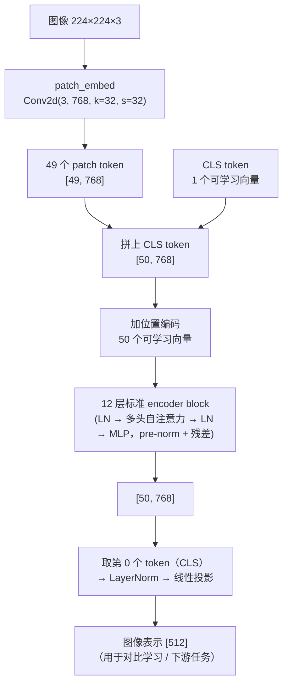
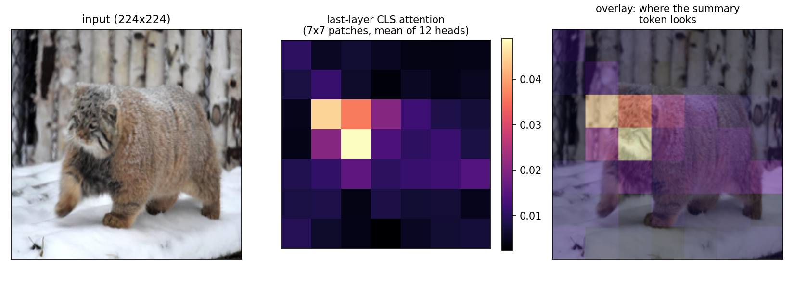
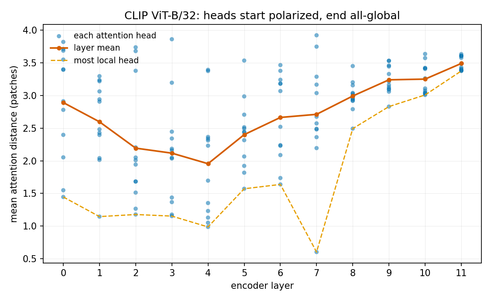

# 第 2 章 ViT：把 Transformer 用到图像上

> 本章目标：第 1 章我们把图像变成了 196 个 token，本章看**它们进了 Transformer 之后发生什么**。
> 三个新东西要交代清楚：CLS token、位置编码、以及"图像版注意力"和你熟悉的 causal 注意力差在哪。
> 全部结论用 CLIP ViT-B/32 真机拆出来验证——包括一条**和教科书说法不一致**的实测结果。

## 2.1 先说结论：ViT 几乎没有新东西

如果用一句话概括 ViT[^vit]（Vision Transformer）：

> **把图像切成 patch token，然后原封不动地跑一个标准 Transformer encoder。**

真的就这么直白。你已经掌握的注意力、多头、pre-norm、残差、MLP、GELU，一个都不用改。
ViT 论文的贡献恰恰在于证明了"**不需要**为视觉发明新架构"。

需要新学的只有三件事，本章逐个拆：

1. **CLS token**：一个不来自任何像素的"额外"token，用来当整图的摘要；
2. **位置编码**：patch 序列本身是无序的，空间信息得显式注入；
3. **双向注意力**：没有因果掩码，每个 patch 都能看到所有 patch。

## 2.2 ViT 全貌



真机拆出来的 CLIP ViT-B/32 参数分布，能直接看出**钱花在哪**：

```
部件                       |          参数量 | 占视觉塔
----------------------------------------------------
patch_embed（切块+投影）       |    2,359,296 |    2.7%
位置编码                     |       38,400 |    0.0%
12 层 encoder             |   85,054,464 |   97.3%
视觉塔合计                    |   87,456,000 |  100.0%
```

**97.3% 的参数在 encoder 里**。patch_embed 和位置编码只是入口，便宜到可以忽略。
这条事实后面会反复用到：谈"视觉塔的成本"，谈的基本就是 encoder 的成本。

## 2.3 CLS token：为什么要多加一个不存在的 token

49 个 patch token 各自代表图像的一小块。但下游任务（比如 CLIP 的图文对比）需要**一个**向量代表整张图。
怎么得到它？

ViT 的做法（继承 BERT）：**凭空加一个可学习的向量**，拼在序列最前面，叫 CLS token[^cls]。
它不来自任何像素，就是一组参数（768 维）。跑完 12 层后，取它的输出当整图表示。

这个设计乍看很怪——一个和图像无关的向量，凭什么代表这张图？
答案是：**它靠注意力把信息"读"过来**。真机数据（练习 B 部分）：

```
   层 |   cos(CLS_i, CLS_初始) |   cos(CLS_i, CLS_末层) |       该层 CLS 注意力投向 patch 的比例
------------------------------------------------------------------------------------
   0 |                1.000 |               -0.013 |           —（还没进 encoder）
   1 |                0.926 |               -0.003 |                       44.8%
   2 |                0.917 |                0.003 |                       14.4%
   3 |                0.901 |               -0.001 |                       16.4%
   6 |                0.816 |                0.005 |                       49.7%
   9 |                0.367 |                0.027 |                       40.7%
  11 |                0.257 |                0.215 |                       44.5%
  12 |               -0.013 |                1.000 |                       50.8%
```

三个观察，其中两个反直觉：

1. **CLS 确实在被改写**：与初始值的 cosine 从 1.00 一路掉到 -0.01。
2. **但"摘要"是在最后一两层才成形的**：与末层表示的 cosine 长期贴在 0 附近，
   第 11 层才 0.22、第 12 层直接 1.00。**这不是渐进收敛，是末端突变。**
   为什么？因为 CLIP 的训练目标只作用在**最后一层**的 CLS 上——中间层的 CLS 没有任何直接约束，
   自然不必长得像最终答案。
3. **CLS 每层"读图"的力度很不均匀**：投向 patch 的注意力比例在 14%~51% 之间跳。
   有的层它几乎只在自我更新（第 2、3 层只有 ~15%），有的层才大口吸信息。
   别把它想象成"每层均匀汇聚"。

看看最后一层 CLS 到底在看哪里（练习配图，注意力对 12 个头取了平均）：



> **诚实说明：注意力图 ≠ 模型的"解释"。**
> 这张热力图很直观，但它只是最后一层的注意力权重，**不能**当作"模型就是靠这几块判断的"。
> 信息在 12 层里被反复搬运混合，早就不是"某个 patch 对应某块像素"的关系了。
> 注意力可视化适合建立直觉，不适合当因果证据——这个坑在可解释性研究里踩过很多次。

**有没有别的选择？** 有，而且都在用：

| 池化方式 | 做法 | 谁在用 |
|----------|------|--------|
| **CLS token** | 加一个可学习 token，取它的输出 | ViT 原版、CLIP、大多数 VLM 的视觉塔 |
| **平均池化** | 把所有 patch token 求平均 | 部分 ViT 变体、DINOv2 的一些用法 |
| **注意力池化** | 用一个可学习 query 对 patch 做一次 cross-attention | SigLIP、CoCa 等 |

注意一个**对 VLM 特别重要**的点：VLM 用视觉塔时，**往往根本不用 CLS**——
它要的是 49（或几千）个 patch token 全部送进 LLM，而不是一个摘要向量。
所以在 LLaVA 这类模型里，你会看到代码里明确地把 CLS 丢掉（`hidden_states[:, 1:]`）。
CLS 是"给分类/检索用的摘要"，VLM 要的是"给 LLM 看的细节"。

## 2.4 位置编码：patch 序列本身是无序的

第 1 章说过：图像没有"从左到右"的因果顺序。但这不意味着**位置不重要**——
猫在左上角还是右下角、眼睛在鼻子上面还是下面，这些都是空间关系，必须让模型知道。

而自注意力对输入顺序是**置换等变**的（打乱输入顺序，输出跟着打乱，内容不变）。
所以位置信息**只能显式加进去**。ViT 的做法朴素得让人意外：

```
位置编码      : (50, 768)  ← 50 个位置各一个向量，**一维可学习**，不是 sin/cos
```

- **一维**：把 7×7 的网格拉平成 49 个位置，编号 0~48，每个编号学一个向量。
  **模型并不知道"编号 7 在编号 0 的下面"**——这个二维结构是它自己从数据里学出来的；
- **可学习**：不是正弦编码，就是一张 `[50, 768]` 的参数表；
- **含 CLS 的位置**：第 0 行是给 CLS 的。

**它到底有多重要？** 练习 D 部分做了两个消融（CLIP zero-shot 分类，输入是雪地里的一只猫）：

```
① 原始（完整位置编码）    → 判为『a photo of a cat』   cat=0.76  dog=0.04  car=0.00  snowy forest=0.19
② 位置编码置零           → 判为『a photo of a car』   cat=0.28  dog=0.30  car=0.33  snowy forest=0.10
③ 位置编码随机打乱        → 判为『a photo of a snowy forest』  cat=0.14  dog=0.14  car=0.01  snowy forest=0.71
④ 恢复原始（自检）        → 判为『a photo of a cat』   cat=0.76  dog=0.04  car=0.00  snowy forest=0.19
```

两种破坏方式的**失败姿态完全不同**，很值得玩味：

- **置零**后所有 patch 共享同一个位置向量 → 模型看到的是"一袋无序碎片"，
  只能靠纹理统计瞎猜，概率退化到接近均匀（0.28/0.30/0.33）；
- **打乱**后每个 patch 仍有一个"合法"的位置编码，分布还在模型见过的范围内，
  于是它**照常自信地整合**，只是空间关系全是错的 → 雪和树干的纹理占了上风，
  给出 0.71 的高置信度错误答案。

> **工程直觉**：结构性错误（打乱）比信息缺失（置零）更危险——前者会产生**自信的错误**。
> 这条在多模态工程里很常见：图像预处理的顺序 bug、多图时 token 拼接顺序错了，
> 模型往往不会报错，而是**一本正经地答错**。

## 2.5 换分辨率就得插值：ViT 最硬的一道枷锁

位置编码表是 `[50, 768]`——它**按数量**学出来的。那如果我想输入 448×448（197 个 token）呢？
表里没有第 51~197 行。练习 E 部分实测：

```
       输入分辨率 |   token 数 |       插值位置编码 |      与 224 特征的 cos
--------------------------------------------------------------
        224² |        50 |            — |              1.000
        336² |       101 |            ✅ |              0.959
        448² |       197 |            ✅ |              0.914

不插值直接喂 448²：ValueError: Input image size (448*448) doesn't match model (224*224).
```

两件事：

1. **不插值直接报错**——这不是精度问题，是形状对不上，根本跑不了；
2. **插值能救，但会漂移**：把 7×7 的位置编码双线性插值成 14×14 之后能跑，
   但特征和 224 输入的 cosine 掉到 **0.914**。分辨率提得越多，漂移越大。
   （所以想真正用高分辨率，通常还得**再训一轮**去适应插值后的位置编码。）

这就解释了第 1 章那个对比图里的橙色虚线：**经典 ViT 被钉死在训练分辨率上**。
现代 VLM 要做"原生分辨率 / 任意长宽比"，第一件事就是把这套一维可学习位置编码换掉——
换成能外推的方案（2D RoPE、M-RoPE 等）。这是第 8、9 章的正题。

## 2.6 注意力距离：一条和教科书不完全一致的实测

流行说法是"ViT 底层学局部特征、高层学全局语义，像 CNN 一样有层级"。
我们来量一下：定义**平均注意力距离** = 每个 query patch 的注意力权重，
加权它到各个 key patch 的空间距离（单位：patch）。距离小 = 看邻居，距离大 = 看全图。

先看**层平均**（练习 C 部分）：

```
第 0 层 2.89 → 第 4 层 1.95 → 第 11 层 3.49
```

**第 0 层反而比中间层更"全局"**——层平均并不单调。这说明"底层局部"这句话至少不准确。
按**每个头**分别统计才看清真相：



```
   层 |      最局部的头 |      12 个头的平均 |      最全局的头
   0 |       1.45 |          2.89 |       3.82
   4 |       0.99 |          1.95 |       3.39
   7 |       0.60 |          2.71 |       3.92
  11 |       3.37 |          3.49 |       3.63
```

准确的说法应该是：

- **ViT 从第 1 层起就有头在看全图**（第 0 层最全局的头已达 3.82，接近网格尺度）——
  这和 CNN 有**本质区别**：卷积底层的感受野被 kernel 大小物理限制死了，只能局部；
  自注意力从第一层就有"看任意远"的能力，用不用是学出来的。
- **深层的"局部选项"被挤掉了**：最局部的头从 1.45（第 0 层）涨到 3.37（第 11 层），
  12 个头的跨度从 2.37 收缩到 0.26——**高层几乎所有头都在做全局整合**。
- 所以"层级"这件事在 ViT 里是**统计倾向**，不是结构保证；
  而且它**依赖网格大小**：7×7 网格最大距离才 8.5，一个头"看全图"很容易；
  换成 ViT-B/16 的 14×14（最大距离 18.4），同样的结论要重新量。

> **诚实说明**：以上是**单张图**在 CLIP ViT-B/32 上的测量，用来演示方法和纠正一个流行说法，
> 不是严谨的统计结论。ViT 论文（Fig. 7）在多图平均、且用 ViT-B/16 上得到的图形与这里一致：
> 底层头分布很宽、高层收窄上移。要下判断请自己在目标模型上按这个方法量一遍。

## 2.7 和你熟悉的 GPT 比，差在哪

| 维度 | GPT（causal LM） | ViT |
|------|------------------|-----|
| **token 来源** | 词表查表 | patch 线性投影（第 1 章） |
| **注意力掩码** | **causal**（只能看左边） | **无掩码**，双向全连接 |
| **位置编码** | RoPE / ALiBi 等（可外推） | 一维**可学习**表（不可外推，换分辨率要插值） |
| **序列长度** | 变长，随生成增长 | **定长**（= patch 数 + 1），前向一次算完 |
| **输出怎么用** | 取最后一个 token 预测下一个 | 取 CLS（或所有 patch token 给 LLM） |
| **是否有 KV cache** | 有（自回归复用） | **没有**（一次前向，无自回归） |
| **block 内部** | LN → attn → LN → MLP，残差 | **一模一样** |

最后一行是重点：**block 内部完全相同**。你在 LLM 上积累的算子级知识
（FlashAttention、融合 kernel、LayerNorm 优化）在视觉塔上**直接适用**。

倒数第二行也很关键：**视觉塔没有 KV cache**（因为不自回归）。
所以 VLM 的显存构成是"视觉塔的**激活**" + "LLM 的 **KV cache**"两块性质不同的东西，
第 17 章算显存预算时会分开算。

## 2.8 本章要记住的四件事

1. **ViT = patchify + 标准 Transformer encoder**，block 内部和 GPT 一样，参数 97% 在 encoder。
2. **CLS token 是靠注意力"读"出来的摘要**，且（在 CLIP 里）只有最后一层的它被真正约束；
   **VLM 通常不用 CLS**，而是把所有 patch token 送进 LLM。
3. **位置编码是硬需求**：置零 → 退化成"碎片袋"；打乱 → 产生**自信的错误**。
   它一维、可学习、**按数量**定义，所以换分辨率必须插值（还会掉特征相似度）——
   这是经典 ViT 被钉死在训练分辨率上的根本原因。
4. **"底层局部、高层全局"要打折听**：实测第 0 层就有头看全图；真实规律是
   **越深，局部的头越少**。下判断前自己量。

## 2.9 思考题

1. ViT-B/32 在 224² 下是 49 个 patch，ViT-B/16 是 196 个。两者参数量几乎一样
   （patch_embed 差 4 倍，但它只占 2.7%）。那么它们的**计算量**差多少倍？
   为什么业界普遍认为 /16 更强、更贵？如果我把 /32 的输入分辨率提到 448 让它也产生 196 个 token，
   它会等价于 /16 吗？
2. 如果去掉 CLS token，改用 49 个 patch token 的**平均池化**作图像表示，
   你预期 zero-shot 检索效果会怎样？CLS 相比平均池化的优势到底是什么？
   （提示：想想"可学习的 query"和"无参数的平均"在信息选择上的差别。）
3. 实测显示：第 0 层最全局的头注意力距离已达 3.82，最后一层最局部的头也有 3.37。
   基于这两个数字，"ViT 像 CNN 一样底层看局部、高层看全局"这句话，哪部分对、哪部分错？
   如果换成 ViT-B/16（14×14 网格）重做这个实验，你预期哪个数字会变、怎么变？
4. 位置编码**置零**时模型给出接近均匀的概率（0.28/0.30/0.33/0.10），
   **打乱**时却给出 0.71 的高置信度错误答案。为什么"错误的位置信息"比"没有位置信息"更能骗到模型？
   把这个现象翻译成一条你在多模态工程里该警惕的 bug 模式。

> 📖 **参考答案**（想清楚再看）：[Q1](../../qa/02-vit-qa.md#q1) · [Q2](../../qa/02-vit-qa.md#q2) · [Q3](../../qa/02-vit-qa.md#q3) · [Q4](../../qa/02-vit-qa.md#q4)

## 2.10 延伸阅读

- **第 3 章 CLIP**：这个 CLS 向量是怎么被训成"能和文本对齐"的。
- **第 8 章 动态分辨率**：本章 2.5 节那道枷锁怎么被解开。
- **第 9 章 位置编码与 M-RoPE**：可外推的位置编码长什么样。
- **第 17 章 显存预算**：视觉塔"没有 KV cache、只有激活"这件事的量化后果。
- 论文：*An Image is Worth 16x16 Words* (Dosovitskiy et al., 2020)，Fig. 7 是本章 2.6 节的原始版本。

## 2.11 附录：本章练习代码

源码：`exercises/01-vision-basics/02_vit_internals.py`（需要一张 GPU，CLIP ViT-B/32 约 600 MB 权重）。
配图脚本：`exercises/01-vision-basics/plot_ch2_figures.py`。

<!-- CODE:exercises/01-vision-basics/02_vit_internals.py START -->
```python
#!/usr/bin/env python
# -*- coding: utf-8 -*-
"""
第 2 章练习：把一个真实的 ViT（CLIP ViT-B/32）拆开看，验证四件事。

  A) 结构与参数量：CLS token、位置编码、12 层 encoder 各占多少参数；序列长度 = 49 patch + 1 CLS；
  B) 逐层前向：每层 hidden_states 的形状，以及 CLS 表示逐层"离开起点"的过程；
  C) 平均注意力距离（mean attention distance）：早期层看局部、后期层看全局——ViT 自己学出来的层级；
  D) 位置编码到底有多重要：置零 / 打乱 两种消融，看 zero-shot 分类崩成什么样；
  E) 换分辨率：448 输入 + 位置编码插值，token 数变 197，特征还对不对得上。

单卡即可（bf16 下 CLIP ViT-B/32 只要几百 MB）。
"""

import os
import sys

import numpy as np
import torch

sys.path.insert(0, os.path.dirname(os.path.dirname(os.path.abspath(__file__))))
from common import sample_image  # noqa: E402

CLIP_MODEL = os.environ.get("MM_CLIP", "openai/clip-vit-base-patch32")
DEVICE = "cuda:0" if torch.cuda.is_available() else "cpu"
SEP = "=" * 68

# zero-shot 分类用的候选文本（示例图是雪地里的猫科动物）
LABELS = ["a photo of a cat", "a photo of a dog", "a photo of a car",
          "a photo of a snowy forest"]


def part_a(model, cfg):
    print(SEP)
    print("A) 结构与参数量：ViT-B/32 里都有什么")
    print(SEP)
    grid = cfg.image_size // cfg.patch_size
    n_patch = grid * grid
    print(f"输入图像      : {cfg.image_size}×{cfg.image_size}")
    print(f"patch         : {cfg.patch_size}×{cfg.patch_size} → {grid}×{grid} = {n_patch} 个 patch")
    print(f"序列长度      : {n_patch} patch + 1 CLS = {n_patch + 1} 个 token")
    print(f"隐藏维度      : {cfg.hidden_size}   层数: {cfg.num_hidden_layers}"
          f"   注意力头: {cfg.num_attention_heads}")

    emb = model.vision_model.embeddings
    print(f"\nCLS token     : {tuple(emb.class_embedding.shape)}  ← 一个可学习的向量，不来自任何像素")
    print(f"位置编码      : {tuple(emb.position_embedding.weight.shape)}"
          f"  ← {n_patch + 1} 个位置各一个向量，**一维可学习**，不是 sin/cos")
    print(f"patch_embed   : {type(emb.patch_embedding).__name__}"
          f"(kernel={emb.patch_embedding.kernel_size}, stride={emb.patch_embedding.stride})"
          f"  ← 就是第 1 章那个 Conv2d")

    groups = {"patch_embed（切块+投影）": emb.patch_embedding,
              "位置编码": emb.position_embedding,
              "12 层 encoder": model.vision_model.encoder}
    total = sum(p.numel() for p in model.vision_model.parameters())
    print(f"\n{'部件':<24} | {'参数量':>12} | 占视觉塔")
    print("-" * 52)
    for name, mod in groups.items():
        n = sum(p.numel() for p in mod.parameters())
        print(f"{name:<24} | {n:>12,} | {n / total:>7.1%}")
    print(f"{'视觉塔合计':<24} | {total:>12,} | {1:>7.1%}")
    print("\n看清楚：参数几乎全在 encoder 里。patch_embed 和位置编码只是入口，很便宜。")
    return n_patch, grid


def part_b(model, pixel_values, cfg):
    print("\n" + SEP)
    print("B) 逐层前向：形状不变，内容在变")
    print(SEP)
    with torch.no_grad():
        out = model.vision_model(pixel_values, output_hidden_states=True)
    hs = out.hidden_states
    attns = model.vision_model(pixel_values, output_attentions=True).attentions
    print(f"hidden_states 共 {len(hs)} 份（embedding 输出 + {cfg.num_hidden_layers} 层）")
    print(f"每一份的形状都是 {tuple(hs[0].shape)}  ← [batch, 序列长, 隐藏维度]，**全程不变**")

    # CLS 逐层演化：离起点多远、离终点多近，以及它每层从 patch 那里"读"了多少
    cos = torch.nn.functional.cosine_similarity
    cls0, cls_last = hs[0][:, 0], hs[-1][:, 0]
    print(f"\n{'层':>4} | {'cos(CLS_i, CLS_初始)':>20} | {'cos(CLS_i, CLS_末层)':>20}"
          f" | {'该层 CLS 注意力投向 patch 的比例':>28}")
    print("-" * 84)
    for i in range(len(hs)):
        if i not in (0, 1, 2, 3, 6, 9, 11, 12):
            continue
        cls_i = hs[i][:, 0]
        # 第 i 层的注意力（i>=1 时对应 attns[i-1]）里，CLS 这一行有多少权重给了 patch
        if i >= 1:
            cls_row = attns[i - 1][0, :, 0, :].float()      # [heads, 序列长]
            to_patch = cls_row[:, 1:].sum(dim=-1).mean().item()
            frac = f"{to_patch:>27.1%}"
        else:
            frac = f"{'—（还没进 encoder）':>24}"
        print(f"{i:>4} | {cos(cls_i, cls0).item():>20.3f} | {cos(cls_i, cls_last).item():>20.3f} | {frac}")

    print("\n三个观察（都按上面的实测说，不套教科书）：")
    print("  1. 形状全程 [1, 50, 768] 不变——Transformer 是『等长变换』，只改内容不改长度；")
    print("  2. CLS 一路远离初始值（与 CLS_初始 的 cos：1.00 → 0.26 → -0.01），说明它确实在被改写；")
    print("     但**它与最终表示的相似度长期贴近 0，直到最后一两层才突然拉起来**")
    print("     （第 11 层 0.22 → 第 12 层 1.00）。也就是说『图像摘要』是在末层才成形的——")
    print("     这与 CLIP 的训练方式一致：只有最后一层的 CLS 被投影出去参与对比学习，")
    print("     中间层的 CLS 没有任何直接约束，不必长得像最终答案。")
    print("  3. CLS 每层从 patch 那里『读』多少并不均匀（14%~51%）：有的层几乎只在自我更新，")
    print("     有的层才大口吸信息。别想象成『每层都在均匀汇聚』。")


def part_c(model, pixel_values, grid):
    """平均注意力距离：每层的注意力平均跨越多少个 patch 的距离。"""
    print("\n" + SEP)
    print("C) 平均注意力距离：ViT 自己学出的『由局部到全局』")
    print(SEP)
    with torch.no_grad():
        out = model.vision_model(pixel_values, output_attentions=True)

    # patch 在 grid 上的坐标，两两欧氏距离（单位：patch）
    ys, xs = np.meshgrid(np.arange(grid), np.arange(grid), indexing="ij")
    coords = np.stack([ys.ravel(), xs.ravel()], axis=1).astype(np.float32)
    dist = np.linalg.norm(coords[:, None, :] - coords[None, :, :], axis=-1)
    dist_t = torch.from_numpy(dist).to(pixel_values.device)

    print(f"（grid = {grid}×{grid}，patch 间最大距离 = {dist.max():.1f}）")
    print("按**每个头**分别统计——层平均会把真相抹平（见下面的解读）")
    print(f"\n{'层':>4} | {'最局部的头':>10} | {'12 个头的平均':>13} | {'最全局的头':>10} | 每个头的分布")
    print("-" * 86)
    per_head = []
    for i, attn in enumerate(out.attentions):
        # attn: [batch, heads, q, k]，去掉 CLS 行列，只看 patch→patch
        a = attn[0, :, 1:, 1:].float()
        a = a / a.sum(dim=-1, keepdim=True)              # 去掉 CLS 后重新归一化
        d_head = (a * dist_t).sum(dim=-1).mean(dim=-1)   # 每个头一个平均距离
        per_head.append(d_head.tolist())
        # 把 12 个头画到一条 0~5 patch 的刻度上
        line = [" "] * 26
        for d in d_head.tolist():
            line[min(25, int(d / 5 * 25))] = "•"
        print(f"{i:>4} | {d_head.min():>10.2f} | {d_head.mean():>13.2f} | {d_head.max():>10.2f} |"
              f" |{''.join(line)}|")

    first, last = per_head[0], per_head[-1]
    print(f"\n真相（和『底层都局部』的教科书说法不完全一样，诚实说明）：")
    print(f"  · 第 0 层的头**两极分化**：最局部的只有 {min(first):.2f}，最全局的已达 {max(first):.2f}"
          f"（跨度 {max(first) - min(first):.2f}）——")
    print(f"    也就是说 ViT 从第一层起就有头在看全图，这和 CNN『底层只能看局部』有本质区别；")
    print(f"  · 到最后一层，**最局部的头也变全局了**（min 从 {min(first):.2f} 涨到 {min(last):.2f}），")
    print(f"    12 个头挤在一起（跨度只剩 {max(last) - min(last):.2f}）；")
    print(f"  · 所以正确的说法是：**层数越深，注意力的『局部选项』越少**，而不是『底层一定局部』。")
    print(f"  · 也别只看层平均：第 0 层平均 {sum(first) / len(first):.2f} 反而比中间层高，")
    print(f"    因为它被那几个全局头拉上去了——平均值在这里是会骗人的。")
    return per_head


def zero_shot(model, processor, pixel_values):
    """返回 (最高分标签, 各标签概率)。"""
    with torch.no_grad():
        text = processor(text=LABELS, return_tensors="pt", padding=True).to(pixel_values.device)
        img_f = model.get_image_features(pixel_values=pixel_values)
        txt_f = model.get_text_features(**text)
        img_f = img_f / img_f.norm(dim=-1, keepdim=True)
        txt_f = txt_f / txt_f.norm(dim=-1, keepdim=True)
        probs = (model.logit_scale.exp() * img_f @ txt_f.T).softmax(dim=-1)[0]
    return LABELS[int(probs.argmax())], probs


def part_d(model, processor, pixel_values, n_patch):
    print("\n" + SEP)
    print("D) 位置编码消融：ViT 到底有多依赖『我在哪』")
    print(SEP)
    emb = model.vision_model.embeddings
    orig = emb.position_embedding.weight.data.clone()

    def show(tag):
        best, probs = zero_shot(model, processor, pixel_values)
        detail = "  ".join(f"{lb.replace('a photo of ', '')}={p:.2f}"
                           for lb, p in zip(LABELS, probs.tolist()))
        print(f"{tag:<28} → 判为『{best}』   {detail}")

    show("① 原始（完整位置编码）")

    emb.position_embedding.weight.data[1:] = 0            # 只清 patch 的位置编码
    show("② 位置编码置零")

    emb.position_embedding.weight.data.copy_(orig)
    g = torch.Generator().manual_seed(0)
    perm = torch.randperm(n_patch, generator=g) + 1
    emb.position_embedding.weight.data[1:] = orig[perm]   # 等价于打乱 patch 的空间位置
    show("③ 位置编码随机打乱")

    emb.position_embedding.weight.data.copy_(orig)        # 恢复
    show("④ 恢复原始（自检）")
    print("\n结论：patch 序列本身是**无序**的，空间信息全靠位置编码注入。")
    print("      置零/打乱之后模型看到的是『一袋碎片』，判断随之漂移。")


def part_e(model, processor, img, cfg):
    print("\n" + SEP)
    print("E) 换分辨率：位置编码要插值")
    print(SEP)
    cos = torch.nn.functional.cosine_similarity
    base = processor(images=img, return_tensors="pt").to(DEVICE)["pixel_values"]
    with torch.no_grad():
        f224 = model.get_image_features(pixel_values=base)

    print(f"{'输入分辨率':>12} | {'token 数':>9} | {'插值位置编码':>12} | {'与 224 特征的 cos':>18}")
    print("-" * 62)
    grid = cfg.image_size // cfg.patch_size
    print(f"{f'{cfg.image_size}²':>12} | {grid * grid + 1:>9} | {'—':>12} | {1.0:>18.3f}")

    for res in [336, 448]:
        px = processor(images=img, return_tensors="pt",
                       size={"shortest_edge": res},
                       crop_size={"height": res, "width": res}).to(DEVICE)["pixel_values"]
        g = res // cfg.patch_size
        with torch.no_grad():
            f = model.get_image_features(pixel_values=px, interpolate_pos_encoding=True)
        print(f"{f'{res}²':>12} | {g * g + 1:>9} | {'✅':>12} | {cos(f, f224).item():>18.3f}")

    # 不插值会怎样：直接报错（位置编码数量对不上）
    px = processor(images=img, return_tensors="pt",
                   size={"shortest_edge": 448},
                   crop_size={"height": 448, "width": 448}).to(DEVICE)["pixel_values"]
    try:
        with torch.no_grad():
            model.get_image_features(pixel_values=px, interpolate_pos_encoding=False)
        print(f"{'448²':>12} | {'—':>9} | {'❌ 不插值':>12} | {'居然没报错？':>18}")
    except Exception as e:
        print(f"\n不插值直接喂 448²：{type(e).__name__}: {str(e).splitlines()[0][:80]}")
    print("\n这正是第 1 章说的『固定 224』的枷锁：ViT 的位置编码是**按数量**学出来的，")
    print("换分辨率就得插值。现代 VLM 要支持任意分辨率，位置编码必须换成可外推的方案（第 9 章 M-RoPE）。")


def main():
    from transformers import CLIPModel, CLIPProcessor

    print(f"模型：{CLIP_MODEL}  设备：{DEVICE}\n")
    model = CLIPModel.from_pretrained(CLIP_MODEL).to(DEVICE).eval()
    processor = CLIPProcessor.from_pretrained(CLIP_MODEL)
    cfg = model.config.vision_config
    img = sample_image()
    pixel_values = processor(images=img, return_tensors="pt").to(DEVICE)["pixel_values"]
    print()

    n_patch, grid = part_a(model, cfg)
    part_b(model, pixel_values, cfg)
    part_c(model, pixel_values, grid)
    part_d(model, processor, pixel_values, n_patch)
    part_e(model, processor, img, cfg)


if __name__ == "__main__":
    main()
```
<!-- CODE:exercises/01-vision-basics/02_vit_internals.py END -->

**运行输出：**

<!-- OUTPUT:exercises/01-vision-basics/outputs/02_vit_internals.txt START -->
```text
模型：openai/clip-vit-base-patch32  设备：cuda:0

[图片] 使用示例图 assets/sample/cat.jpg，尺寸 960×686

====================================================================
A) 结构与参数量：ViT-B/32 里都有什么
====================================================================
输入图像      : 224×224
patch         : 32×32 → 7×7 = 49 个 patch
序列长度      : 49 patch + 1 CLS = 50 个 token
隐藏维度      : 768   层数: 12   注意力头: 12

CLS token     : (768,)  ← 一个可学习的向量，不来自任何像素
位置编码      : (50, 768)  ← 50 个位置各一个向量，**一维可学习**，不是 sin/cos
patch_embed   : Conv2d(kernel=(32, 32), stride=(32, 32))  ← 就是第 1 章那个 Conv2d

部件                       |          参数量 | 占视觉塔
----------------------------------------------------
patch_embed（切块+投影）       |    2,359,296 |    2.7%
位置编码                     |       38,400 |    0.0%
12 层 encoder             |   85,054,464 |   97.3%
视觉塔合计                    |   87,456,000 |  100.0%

看清楚：参数几乎全在 encoder 里。patch_embed 和位置编码只是入口，很便宜。

====================================================================
B) 逐层前向：形状不变，内容在变
====================================================================
hidden_states 共 13 份（embedding 输出 + 12 层）
每一份的形状都是 (1, 50, 768)  ← [batch, 序列长, 隐藏维度]，**全程不变**

   层 |   cos(CLS_i, CLS_初始) |   cos(CLS_i, CLS_末层) |       该层 CLS 注意力投向 patch 的比例
------------------------------------------------------------------------------------
   0 |                1.000 |               -0.013 |           —（还没进 encoder）
   1 |                0.926 |               -0.003 |                       44.8%
   2 |                0.917 |                0.003 |                       14.4%
   3 |                0.901 |               -0.001 |                       16.4%
   6 |                0.816 |                0.005 |                       49.7%
   9 |                0.367 |                0.027 |                       40.7%
  11 |                0.257 |                0.215 |                       44.5%
  12 |               -0.013 |                1.000 |                       50.8%

三个观察（都按上面的实测说，不套教科书）：
  1. 形状全程 [1, 50, 768] 不变——Transformer 是『等长变换』，只改内容不改长度；
  2. CLS 一路远离初始值（与 CLS_初始 的 cos：1.00 → 0.26 → -0.01），说明它确实在被改写；
     但**它与最终表示的相似度长期贴近 0，直到最后一两层才突然拉起来**
     （第 11 层 0.22 → 第 12 层 1.00）。也就是说『图像摘要』是在末层才成形的——
     这与 CLIP 的训练方式一致：只有最后一层的 CLS 被投影出去参与对比学习，
     中间层的 CLS 没有任何直接约束，不必长得像最终答案。
  3. CLS 每层从 patch 那里『读』多少并不均匀（14%~51%）：有的层几乎只在自我更新，
     有的层才大口吸信息。别想象成『每层都在均匀汇聚』。

====================================================================
C) 平均注意力距离：ViT 自己学出的『由局部到全局』
====================================================================
（grid = 7×7，patch 间最大距离 = 8.5）
按**每个头**分别统计——层平均会把真相抹平（见下面的解读）

   层 |      最局部的头 |      12 个头的平均 |      最全局的头 | 每个头的分布
--------------------------------------------------------------------------------------
   0 |       1.45 |          2.89 |       3.82 | |       •  •• •• ••••      |
   1 |       1.15 |          2.60 |       3.29 | |     •    ••• •••         |
   2 |       1.18 |          2.19 |       3.73 | |     •••••••    • •       |
   3 |       1.15 |          2.12 |       3.86 | |     •••  •••  •   •      |
   4 |       0.99 |          1.95 |       3.39 | |    ••• •  •    •         |
   5 |       1.57 |          2.40 |       3.53 | |       • ••••••  •        |
   6 |       1.64 |          2.66 |       3.46 | |        • •••  •••        |
   7 |       0.60 |          2.71 |       3.92 | |   •      •••• •• ••      |
   8 |       2.49 |          2.99 |       3.45 | |            •••• •        |
   9 |       2.83 |          3.24 |       3.53 | |              ••••        |
  10 |       3.01 |          3.25 |       3.63 | |               ••••       |
  11 |       3.37 |          3.49 |       3.63 | |                •••       |

真相（和『底层都局部』的教科书说法不完全一样，诚实说明）：
  · 第 0 层的头**两极分化**：最局部的只有 1.45，最全局的已达 3.82（跨度 2.37）——
    也就是说 ViT 从第一层起就有头在看全图，这和 CNN『底层只能看局部』有本质区别；
  · 到最后一层，**最局部的头也变全局了**（min 从 1.45 涨到 3.37），
    12 个头挤在一起（跨度只剩 0.26）；
  · 所以正确的说法是：**层数越深，注意力的『局部选项』越少**，而不是『底层一定局部』。
  · 也别只看层平均：第 0 层平均 2.89 反而比中间层高，
    因为它被那几个全局头拉上去了——平均值在这里是会骗人的。

====================================================================
D) 位置编码消融：ViT 到底有多依赖『我在哪』
====================================================================
① 原始（完整位置编码）                 → 判为『a photo of a cat』   a cat=0.76  a dog=0.04  a car=0.00  a snowy forest=0.19
② 位置编码置零                     → 判为『a photo of a car』   a cat=0.28  a dog=0.30  a car=0.33  a snowy forest=0.10
③ 位置编码随机打乱                   → 判为『a photo of a snowy forest』   a cat=0.14  a dog=0.14  a car=0.01  a snowy forest=0.71
④ 恢复原始（自检）                   → 判为『a photo of a cat』   a cat=0.76  a dog=0.04  a car=0.00  a snowy forest=0.19

结论：patch 序列本身是**无序**的，空间信息全靠位置编码注入。
      置零/打乱之后模型看到的是『一袋碎片』，判断随之漂移。

====================================================================
E) 换分辨率：位置编码要插值
====================================================================
       输入分辨率 |   token 数 |       插值位置编码 |      与 224 特征的 cos
--------------------------------------------------------------
        224² |        50 |            — |              1.000
        336² |       101 |            ✅ |              0.959
        448² |       197 |            ✅ |              0.914

不插值直接喂 448²：ValueError: Input image size (448*448) doesn't match model (224*224).

这正是第 1 章说的『固定 224』的枷锁：ViT 的位置编码是**按数量**学出来的，
换分辨率就得插值。现代 VLM 要支持任意分辨率，位置编码必须换成可外推的方案（第 9 章 M-RoPE）。
```
<!-- OUTPUT:exercises/01-vision-basics/outputs/02_vit_internals.txt END -->

---

[^vit]: ViT (Vision Transformer)：把标准 Transformer encoder 直接用在 patch 序列上的视觉模型。详见[术语表](../../glossary.md#vit)。
[^cls]: CLS token（分类 token）：拼在序列最前的一个可学习向量，用其输出作为整体表示。详见[术语表](../../glossary.md#cls-token)。
</content>
