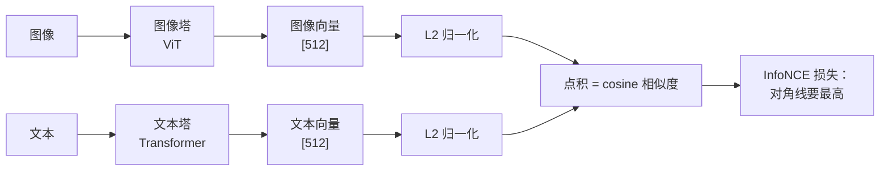
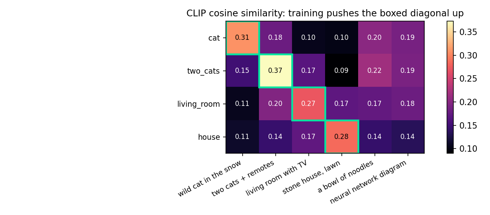
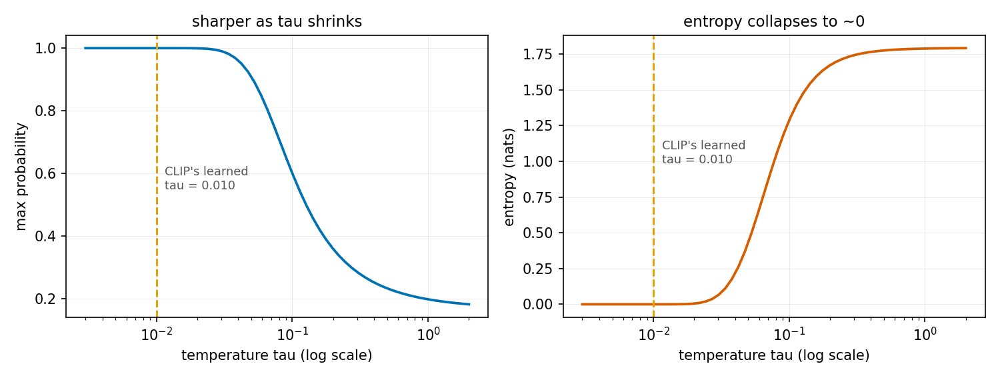

# 第 3 章 CLIP：对比学习怎么把图文对齐

> 本章目标：回答一个你可能一直没想清楚的问题——**图像 embedding 和文本 embedding，凭什么能直接比？**
> 顺带把三件常被当成玄学的事讲透：温度系数在干什么、`a photo of a {}` 为什么有用、
> 以及 CLIP 到底**学不到**什么。数字全部来自 CLIP ViT-B/32 真机跑分。

## 3.1 问题：两个塔的输出凭什么可比

第 2 章我们拿到了图像的表示（512 维向量）。文本这边你早就熟悉了（也是个向量）。
但这两个向量来自**完全不同的网络、完全不同的训练**——凭什么能算相似度？

答案是：**不训练就不能比。** 必须专门训练，把两个空间"拉到一起"。
CLIP[^clip] 干的就是这件事，方法简单到只有一句话：

> **让配对的图文相似度高、不配对的低。**



注意两塔**完全独立**（这叫双塔 / dual-encoder）：图像不看文本，文本不看图像，
只在最后算一个点积。这个设计的好处是**可以离线建索引**（把亿级图片的向量预先算好），
代价是**没有任何跨模态的细粒度交互**——3.6 节会看到这个代价有多大。

## 3.2 InfoNCE：把"配对"变成一道分类题

具体怎么"让配对的高、不配对的低"？CLIP 用的是 InfoNCE[^infonce] 损失，
它的核心技巧是：**把 batch 内的其他样本当成负样本**。

一个 batch 有 N 个图文对。算出 N×N 的相似度矩阵后：

- 对**第 i 行**（图 i 对所有文本）：这是一道 N 选 1 的分类题，正确答案是第 i 个文本；
- 对**第 i 列**（文本 i 对所有图）：同样是 N 选 1，正确答案是第 i 张图。

两个方向各算一次交叉熵，取平均。伪代码就是官方论文里那 11 行：

```python
# 两塔各自编码 + 投影到同一维度
I_f = image_encoder(images)          # [N, d_i]
T_f = text_encoder(texts)            # [N, d_t]
I_e = l2_normalize(I_f @ W_i)        # [N, d]
T_e = l2_normalize(T_f @ W_t)        # [N, d]

logits = (I_e @ T_e.T) * exp(logit_scale)   # [N, N]，乘温度的倒数

labels = arange(N)                   # 正确答案就在对角线上
loss = (cross_entropy(logits, labels, axis=0)     # 文本 → 图
      + cross_entropy(logits, labels, axis=1)) / 2  # 图 → 文
```

**三个值得停下来想的点**：

1. **不需要人工标注负样本**。同一 batch 里其他图文对天然就是负样本——
   这就是对比学习能吃下 4 亿网页图文对的原因（数据只需要"配对"，不需要"标签"）。
2. **batch size = 负样本数**。N=32768 时每个 anchor 有 32767 个负样本。
   这是 CLIP 类模型必须用巨大 batch 的根本原因（3.7 节讲工程后果）。
3. **损失是对称的**。既约束"图找文"也约束"文找图"，因为检索是双向任务。

## 3.3 真机：相似度矩阵长什么样

拿 4 张图 × 6 句话（前 4 句与 4 张图一一对应，后 2 句是干扰项）跑一遍：



```
cosine 相似度矩阵（行=图，列=文本）：
                  T0      T1      T2      T3      T4      T5
     cat.jpg   0.308   0.180   0.105   0.102   0.203   0.189  ← 最高分: T0
two_cats.jpg   0.150   0.373   0.166   0.090   0.216   0.191  ← 最高分: T1
living_room.jpg 0.107  0.195   0.272   0.172   0.175   0.181  ← 最高分: T2
   house.jpg   0.113   0.145   0.172   0.285   0.144   0.135  ← 最高分: T3

对角线命中 4/4
```

**最该记住的一条**：cosine 的**绝对值毫无意义**。
正确配对是 0.27~0.37，而"一碗面条"这种完全无关的句子也有 0.14~0.22。
CLIP 只保证**相对顺序**（正确的比错误的高），**绝不保证** 0.3 = "30% 相似"。

> **踩坑警告**：拿 CLIP 相似度设固定阈值做"图文是否匹配"的判断（比如 `sim > 0.3 就算匹配`）
> 是常见错误。这个阈值不可迁移——换个 prompt 写法、换个图片域，整个分布就漂移了。
> 要做匹配判断，得在**你自己的数据**上扫阈值、或者干脆改用排序（top-k）。

## 3.4 温度系数：那个被当成玄学的旋钮

相似度矩阵有了，怎么变成 softmax 概率？要除以**温度** τ（等价于乘 `1/τ`）。
CLIP 把它做成**可学习参数** `logit_scale`，真机读出来：

```
CLIP 学出来的 logit_scale.exp() = 100.00   → 等价温度 τ = 1/100 = 0.0100
```

把 τ 从 1.0 扫到 0.005，看同一行相似度变成什么样的概率分布：

```
      温度 τ |   等价 scale |      最高概率 |   熵(nats) | 概率分布
------------------------------------------------------------------------------
    1.0000 |        1.0 |     0.198 |     1.788 | 0.16 0.20 0.16 0.15 0.17 0.16
    0.1000 |       10.0 |     0.601 |     1.285 | 0.06 0.60 0.08 0.04 0.13 0.10
    0.0100 |      100.0 |     1.000 |     0.000 | 0.00 1.00 0.00 0.00 0.00 0.00  ← CLIP 实际用的
    0.0050 |      200.0 |     1.000 |     0.000 | 0.00 1.00 0.00 0.00 0.00 0.00
```



**τ 在干什么（从梯度看）**：

- **τ 大**（分布平坦）：正样本和负样本的 logit 差被压扁，梯度里"难负样本"和"易负样本"
  权重差不多 → 学得慢，学不出精细的判别边界；
- **τ 小**（分布尖锐）：等价于**放大对难负样本的惩罚**（softmax 里 logit 最高的那个负样本
  拿到绝大部分梯度）→ 学得快、边界锐利，但太小会梯度爆炸、对噪声标注过拟合；
- 所以 CLIP 干脆**让模型自己学** τ（初始化在 0.07 附近，并对 `logit_scale` 做上限裁剪防爆）。
  它最后收敛到 0.01——比初始值更尖锐。

> **一个必须纠正的误解**：上表里 τ=0.01 时 softmax 输出 **1.000**。
> 这**不是**"模型有 100% 的信心"，而是"0.37 和 0.22 的 cosine 差被放大了 100 倍变成 15 个 logit"
> 的必然结果。**CLIP 的 zero-shot 概率完全没有校准**，别拿它当置信度做业务决策（比如自动过审）。
> 要置信度就得在目标域上重新校准（温度重标定、阈值扫描）。

## 3.5 zero-shot 分类：为什么"没训练过也能分类"

有了图文对齐，分类就变成了检索：**把每个类别名写成一句话，编码成文本向量，
然后看图像向量和谁最近**。类别集合可以现场换——这就是 zero-shot。

它成立的关键前提是：**类别名的那句话，落在文本塔训练过的分布里**。
这就引出了 prompt 工程。实测三种写法（4 张图，4 个类别）：

```
          方案 |    cat.jpg | two_cats.j | living_roo |  house.jpg | 判对数 | 正确类概率均值
--------------------------------------------------------------------------------------------
         裸标签 |   ✅   0.99 |   ✅   0.66 |   ✅   0.89 |   ✅   1.00 | 4/4   |      0.884
        标准模板 |   ✅   0.91 |   ✅   0.80 |   ✅   0.95 |   ✅   1.00 | 4/4   |      0.913
      3 模板集成 |   ✅   0.93 |   ✅   0.81 |   ✅   0.98 |   ✅   1.00 | 4/4   |      0.928
```

> **诚实说明：这个实验没能证明 prompt 工程"更准"。**
> 4 张图太好分了，三种写法都 4/4 全对。能看到的只有正确类概率均值单调上升
> （0.884 → 0.913 → 0.928），而且**不是一致变好**——`cat.jpg` 反而从 0.99 掉到 0.93
> （因为"a photo of a cat"把它和另一张猫图拉近了）。
> **几张图只能演示机制，量不出收益。** 真实量级看论文：CLIP 报告 prompt 工程 + 80 模板集成
> 在 ImageNet 上带来**约 5 个点**的提升。

**机制是什么**：CLIP 的文本塔训练数据是网页 alt-text，全是自然句子。
裸标签 `cat` 在那个分布里很罕见；`a photo of a cat` 才是它见惯的形态。
所以套模板不是玄学调参，是**把输入拉回训练分布**。
同理，领域特定的模板会更好（卫星图用 `a satellite photo of a {}`）。

## 3.6 CLIP 学不到什么：词袋式对齐

这一节比前面都重要——**知道模型的边界，比知道它的能力更值钱**。

用那张"粉毯子上两只虎斑猫 + 两个遥控器"的图做三个探针：

```
【计数】
    0.689  two cats on a couch          ←选中(正确)   ✅
    0.210  three cats on a couch
    0.026  one cat on a couch

【空间关系】
    0.323  two remote controls next to two cats       (正确)
    0.677  two cats standing on top of two remote controls  ←选中   ❌

【属性绑定】
    0.592  a pink blanket and two grey cats    ←选中(正确)   ✅
    0.408  a grey blanket and two pink cats
```

三个探针错了一个（空间关系），而且"猫站在遥控器上面"这种明显错误的描述拿到了 **0.677**。
属性绑定虽然选对，但 0.592 : 0.408 也谈不上有把握。

> **诚实说明**：这是**单张图的三个探针**，不是基准评测，不能当定量结论。
> 但方向与文献一致——Winoground、ARO 这类专门设计的基准显示：
> **CLIP 类模型在"同样的词、不同的序/关系"上接近随机猜。**

**为什么结构上就难**？回到 3.2 节的损失：InfoNCE 只要求"配对的整体相似度 > 不配对的"。
网页数据里的负样本几乎都是**易负样本**（一张猫图 vs "一碗面条"的描述）——
模型只要抓住"猫、毯子、室内"这些**词袋级**特征就能把 loss 降到很低，
**根本没有梯度压力去学词序和空间关系**。要学会那些，需要大量"同词不同序"的**难负样本**，
而这种数据在网页上极少自然出现。

**这解释了 VLM 为什么必须存在**：CLIP 负责把图像变成好用的特征，
**细粒度的关系推理交给后面的 LLM 去做**。指望一个双塔对比模型理解"左边还是右边"，
是方向性的误解。

## 3.7 工程一瞥：为什么 CLIP 训练要那么大的 batch

前面说过 batch size = 负样本数。这带来一个很硬的工程约束：

- **batch 必须大**：CLIP 用 32768。batch 小了负样本不足，学到的边界粗糙；
- **多卡时必须跨卡 all-gather 特征**：8 卡 × 每卡 4096，如果各算各的，
  每个样本只有 4095 个负样本——**白扔了 8 倍的负样本**。
  好消息是 gather 的是**512 维的特征向量**，不是激活，通信量很小（这点和一般的模型并行很不一样）；
- **显存主要花在激活上**（两塔的前向），不在 KV cache——ViT 不自回归（第 2 章）。

**SigLIP 的动机就在这里**：它把 softmax 交叉熵换成**逐对的 sigmoid 损失**，
不需要在整个 batch 上做归一化，于是对 batch size 的依赖大幅降低、也省掉了全局同步。
这是第 4 章要展开的对比。

> 通用的分布式与通信优化（all-gather 的代价、梯度累积、混合精度）见姊妹篇
> 《算法工程师的 Infra 入门》第四部分，本书不重复。

## 3.8 VLM 到底取 CLIP 的哪一层

这是本章最有工程价值的一个细节。CLIP 有三种"输出"可用，真机形状如下：

```
① 检索/分类用的 pooled 特征 : (1, 512)      ← CLS → LayerNorm → 512 维投影，一张图只剩一个向量
② 最后一层 hidden_states    : (1, 50, 768)  （含 CLS，共 50 个 token）
③ 倒数第二层 hidden_states  : (1, 50, 768)

VLM（LLaVA 系）用的是 ③ 去掉 CLS 后的 patch token：(1, 49, 768)

最后一层与倒数第二层的 patch token 逐个比 cosine：均值 0.623  最小 0.504  最大 0.756
```

两个结论：

1. **VLM 不用 ①**。512 维的单向量是为检索准备的摘要，信息量太小；
   VLM 要的是 49（或几千）个 patch token 的**空间细节**。
2. **VLM 常用 ③ 而不是 ②**，两层的差异是实打实的（patch token 平均 cosine 只有 **0.623**）。
   LLaVA 的消融给出的解释：最后一层被训练成"为图文对比服务的全局摘要"，
   局部细节相对被压缩；倒数第二层保留更多空间信息，更适合喂给 LLM 做细粒度问答。

> **诚实说明**：这是消融实验得到的**工程经验**，不是理论定理。也有模型选别的层、
> 或做多层特征融合（InternVL 等）。你自己接视觉塔时，"取哪一层"是应该做消融的超参之一。

## 3.9 本章要记住的四件事

1. **图文可比不是天然的，是训出来的**。InfoNCE 把"配对"变成 batch 内的 N 选 1 分类题，
   负样本免费（batch 内其他样本），所以能吃下 4 亿网页图文对。
2. **相似度只有相对意义**：正确配对 0.37、完全无关也有 0.22。别设固定阈值，别当百分比。
3. **温度是锐度旋钮，不是置信度校准**：CLIP 学到 τ=0.01，导致 softmax 直接饱和到 1.000。
   zero-shot 概率**未经校准**，不能当业务置信度用。
4. **CLIP 是词袋式对齐**：整句 ↔ 整图的相似度，学不好词序/空间/计数。
   这是它的结构性边界，也是"必须接一个 LLM"的根本原因。

## 3.10 思考题

1. CLIP 的损失为什么要**对称**（图→文 和 文→图 各算一次）？如果只保留"图→文"这一个方向，
   训出来的模型会在什么任务上出问题？
2. batch=32768 时每个 anchor 有多少负样本？如果用 8 卡数据并行、每卡 4096，
   但**忘了跨卡 all-gather 特征**，实际负样本数变成多少？这会怎么影响效果？
   （再想一步：为什么 CLIP 的这个 all-gather 通信量其实很小？）
3. 实测 τ=0.01 时 softmax 给出 1.000。为什么这不能解读成"模型 100% 确信"？
   如果产品要求"匹配度低于某个值就拒绝"，你会怎么做才是对的？
4. 空间关系探针里 CLIP 把"猫站在遥控器上"排到了第一（0.677）。
   结合 3.2 节的损失定义，解释这**不是训练不充分、而是结构性的**。
   如果你的任务就是要判断"遥控器在猫的左边还是右边"，有哪几条可行路线？

> 📖 **参考答案**（想清楚再看）：[Q1](../../qa/03-clip-qa.md#q1) · [Q2](../../qa/03-clip-qa.md#q2) · [Q3](../../qa/03-clip-qa.md#q3) · [Q4](../../qa/03-clip-qa.md#q4)

## 3.11 延伸阅读

- **第 4 章 视觉编码器家族**：SigLIP（sigmoid 损失）、DINOv2（纯自监督，没有文本）怎么改进这套东西。
- **第 6 章 连接器**：那 49 个 patch token 怎么被映射进 LLM 的词嵌入空间。
- **第 15 章 幻觉**：本章 3.6 节的"词袋式对齐"是多模态幻觉的源头之一。
- 论文：*Learning Transferable Visual Models From Natural Language Supervision* (Radford et al., 2021)；
  短板相关：*Winoground* (2022)、*When and Why Vision-Language Models Behave like Bags-of-Words* (ARO, 2023)。

## 3.12 附录：本章练习代码

源码：`exercises/01-vision-basics/03_clip_contrastive.py`（需要一张 GPU）。
配图脚本：`exercises/01-vision-basics/plot_ch3_figures.py`。

<!-- CODE:exercises/01-vision-basics/03_clip_contrastive.py START -->
```python
#!/usr/bin/env python
# -*- coding: utf-8 -*-
"""
第 3 章练习：把 CLIP 的对比学习拆开验证。

  A) 双塔 + 相似度矩阵：4 张图 × 6 句话，看对角线是否亮；顺手验证"投影后归一化"这套流程；
  B) 温度系数：CLIP 学出来的 logit_scale 是多少？把温度调大调小，概率分布怎么变；
  C) prompt 工程：裸标签 vs "a photo of a {}" vs 多模板集成，zero-shot 分数差多少；
  D) CLIP 的短板（诚实说明）：计数、空间关系、属性绑定——这些是"词袋式对齐"的代价；
  E) VLM 到底取哪一层：投影后的 512 维 pooled 特征 vs 倒数第二层的 patch token。

单卡即可。图片由 exercises/common.py 准备（下载失败会退化成合成图，实验仍能跑）。
"""

import os
import sys

import torch

sys.path.insert(0, os.path.dirname(os.path.dirname(os.path.abspath(__file__))))
from common import sample_images  # noqa: E402

CLIP_MODEL = os.environ.get("MM_CLIP", "openai/clip-vit-base-patch32")
DEVICE = "cuda:0" if torch.cuda.is_available() else "cpu"
SEP = "=" * 74


def encode(model, processor, images, texts):
    """返回 L2 归一化后的图像/文本特征。这就是 CLIP 推理的全部流程。"""
    with torch.no_grad():
        px = processor(images=images, return_tensors="pt").to(DEVICE)["pixel_values"]
        tk = processor(text=texts, return_tensors="pt", padding=True).to(DEVICE)
        f_img = model.get_image_features(pixel_values=px)
        f_txt = model.get_text_features(**tk)
    return (f_img / f_img.norm(dim=-1, keepdim=True),
            f_txt / f_txt.norm(dim=-1, keepdim=True))


def part_a(model, processor, imgs):
    print(SEP)
    print("A) 双塔 + 相似度矩阵：图文在同一个空间里能直接点积")
    print(SEP)
    names = [n for n, _, _ in imgs]
    pil = [i for _, i, _ in imgs]
    texts = [                          # 前 4 句与 4 张图一一对应（顺序相同）
        "a close-up photo of a wild cat standing in the snow",
        "two tabby cats lying on a pink blanket with two remote controls",
        "an indoor living room with a television and a dining table",
        "an old stone house with a red tiled roof and a green lawn",
        "a bowl of noodles",          # 干扰项：谁都不该匹配
        "a diagram of a neural network",   # 干扰项
    ]
    f_img, f_txt = encode(model, processor, pil, texts)
    print(f"图像特征 {tuple(f_img.shape)}   文本特征 {tuple(f_txt.shape)}"
          f"   ← 两塔输出**同维度**({f_img.shape[1]})，这是能点积的前提")

    sim = f_img @ f_txt.T                     # cosine 相似度（已归一化）
    print(f"\ncosine 相似度矩阵（行=图，列=文本）：")
    print("            " + "".join(f"{'T' + str(j):>8}" for j in range(len(texts))))
    for i, n in enumerate(names):
        row = "".join(f"{v:>8.3f}" for v in sim[i].tolist())
        star = "  ← 最高分: T%d" % int(sim[i].argmax())
        print(f"{n:>12}{row}{star}")
    print("\n文本对照：" + "  ".join(f"T{j}={t[:26]}" for j, t in enumerate(texts[:4])))
    print("          " + "  ".join(f"T{j}={t[:26]}" for j, t in enumerate(texts[4:], start=4)))

    hit = sum(int(sim[i].argmax()) == i for i in range(len(names)))
    print(f"\n对角线命中 {hit}/{len(names)}。注意 cosine 的绝对值都不高（0.2~0.3）——")
    print("CLIP 只保证**相对**顺序有意义，别拿绝对值当『相似度百分比』。")
    return sim


def part_b(model, sim):
    print("\n" + SEP)
    print("B) 温度系数：把相似度变成概率的那个旋钮")
    print(SEP)
    scale = model.logit_scale.exp().item()
    print(f"CLIP 学出来的 logit_scale.exp() = {scale:.2f}"
          f"   → 等价温度 τ = 1/{scale:.2f} = {1 / scale:.4f}")
    print("（论文里 τ 被参数化成 exp(logit_scale) 并做了上限裁剪，防止训练早期爆掉）")

    row = sim[1]           # 拿第二张图（两只猫）那一行做演示
    print(f"\n以『两只猫』那张图为例，看不同温度下的 softmax：")
    print(f"{'温度 τ':>10} | {'等价 scale':>10} | {'最高概率':>9} | {'熵(nats)':>9} | 概率分布")
    print("-" * 78)
    for tau in [1.0, 0.1, 1 / scale, 0.005]:
        probs = (row / tau).softmax(dim=-1)
        ent = -(probs * probs.clamp_min(1e-12).log()).sum().item()
        bars = " ".join(f"{p:.2f}" for p in probs.tolist())
        tag = "  ← CLIP 实际用的" if abs(tau - 1 / scale) < 1e-9 else ""
        print(f"{tau:>10.4f} | {1 / tau:>10.1f} | {probs.max():>9.3f} | {ent:>9.3f} | {bars}{tag}")

    print("\n温度在干什么：")
    print("  · τ 大（scale 小）→ 分布平坦，正负样本的梯度差别小，学得慢、也学不『尖』；")
    print("  · τ 小（scale 大）→ 分布尖锐，等价于**放大难负样本的惩罚**，但太小会梯度爆炸/过拟合；")
    print("  · CLIP 干脆把它当**可学习参数**（初始 0.07 附近），让模型自己找合适的锐度。")


def part_c(model, processor, imgs):
    print("\n" + SEP)
    print("C) prompt 工程：同一个类别，换个说法分数就变")
    print(SEP)
    pil = [i for _, i, _ in imgs]
    classes = ["cat", "living room", "house", "noodles"]
    templates = {
        "裸标签": ["{}"],
        "标准模板": ["a photo of a {}"],
        "3 模板集成": ["a photo of a {}", "a blurry photo of a {}", "a close-up photo of a {}"],
    }

    print(f"（4 张图，类别 {classes}；报告每张图判对与否 + 正确类的概率）\n")
    print(f"{'方案':>12} | " + " | ".join(f"{n[:10]:>10}" for n, _, _ in imgs)
          + " | 判对数 | 正确类概率均值")
    print("-" * 92)
    truth = [0, 0, 1, 2]   # cat.jpg→cat, two_cats→cat, living_room→living room, house→house
    for tag, tpls in templates.items():
        # 多模板：对每个类别的多个模板取特征平均（CLIP 官方做法）
        feats = []
        for c in classes:
            _, f_txt = encode(model, processor, pil[:1], [t.format(c) for t in tpls])
            f = f_txt.mean(dim=0, keepdim=True)
            feats.append(f / f.norm(dim=-1, keepdim=True))
        f_txt = torch.cat(feats, dim=0)
        f_img, _ = encode(model, processor, pil, ["x"])
        probs = (model.logit_scale.exp() * f_img @ f_txt.T).softmax(dim=-1)
        cells, correct, ps = [], 0, []
        for i in range(len(pil)):
            p = probs[i, truth[i]].item()
            ps.append(p)
            ok = int(probs[i].argmax()) == truth[i]
            correct += ok
            cells.append(f"{'✅' if ok else '❌'}{p:>7.2f}")
        print(f"{tag:>12} | " + " | ".join(f"{c:>10}" for c in cells)
              + f" | {correct}/{len(pil)}   | {sum(ps) / len(ps):>10.3f}")

    print("\n诚实说明：这 4 张图**太好分了**，三种方案都 4/4 全对，看不出准确率差异；")
    print("能看到的只是**正确类概率**的变化（而且不是一致变好：cat.jpg 反而从 0.99 掉到 0.93，")
    print("因为『a photo of a cat』把它和 two_cats.jpg 拉近了）。想量出 prompt 工程的收益，")
    print("必须上有难度的基准（几十个类、上千张图），几张图的演示只能说明**机制**。")
    print("\n机制是什么：CLIP 的文本塔训的是**自然句子**（网页 alt-text），裸标签『cat』在训练")
    print("分布里很罕见；套上模板是**把输入拉回训练分布**。CLIP 论文报告：prompt 工程 + 多模板")
    print("集成在 ImageNet 上带来约 5 个点的提升（官方用了 80 个模板）——这才是可信的量级。")


def part_d(model, processor, imgs):
    print("\n" + SEP)
    print("D) CLIP 的短板：它更像『词袋匹配』而不是『理解』")
    print(SEP)
    two_cats = [i for n, i, _ in imgs if n == "two_cats.jpg"][0]

    probes = [
        ("计数", ["two cats on a couch", "three cats on a couch", "one cat on a couch",
                  "four cats on a couch"], 0),
        ("空间关系", ["two remote controls next to two cats",
                      "two cats standing on top of two remote controls"], 0),
        ("属性绑定", ["a pink blanket and two grey cats", "a grey blanket and two pink cats"], 0),
    ]
    for tag, texts, gold in probes:
        f_img, f_txt = encode(model, processor, [two_cats], texts)
        probs = (model.logit_scale.exp() * f_img @ f_txt.T).softmax(dim=-1)[0]
        pick = int(probs.argmax())
        print(f"\n【{tag}】（图：沙发上**两只**猫 + 两个遥控器）")
        for j, t in enumerate(texts):
            mark = "←选中" if j == pick else ""
            gold_mark = "(正确)" if j == gold else ""
            print(f"   {probs[j]:>6.3f}  {t:<48}{mark}{gold_mark}")
        print(f"   → {'✅ 选对' if pick == gold else '❌ 选错'}")

    print("\n诚实说明：这是**单张图的几个探针**，不是基准评测，别当成定量结论。")
    print("但方向和文献一致（Winoground、ARO 等基准）：对比学习优化的是**整句 ↔ 整图**的相似度，")
    print("句子里的词序、数量、绑定关系很容易被『平均掉』——所以 CLIP 常被形容为词袋式对齐。")
    print("这也正是 VLM 需要一个 LLM 接在后面的原因：细粒度推理交给 LLM，CLIP 只负责给好特征。")


def part_e(model, processor, imgs):
    print("\n" + SEP)
    print("E) VLM 到底取 CLIP 的哪一层？")
    print(SEP)
    pil = [imgs[0][1]]
    with torch.no_grad():
        px = processor(images=pil, return_tensors="pt").to(DEVICE)["pixel_values"]
        vout = model.vision_model(px, output_hidden_states=True)
        pooled = model.get_image_features(pixel_values=px)

    last, penult = vout.hidden_states[-1], vout.hidden_states[-2]
    print(f"① 检索/分类用的 pooled 特征 : {tuple(pooled.shape)}"
          f"   ← CLS → LayerNorm → 512 维投影，**一张图只剩一个向量**")
    print(f"② 最后一层 hidden_states    : {tuple(last.shape)}   （含 CLS，共 50 个 token）")
    print(f"③ 倒数第二层 hidden_states  : {tuple(penult.shape)}")
    print(f"\nVLM（LLaVA 系）用的是 ③ 去掉 CLS 后的 patch token：{tuple(penult[:, 1:].shape)}")

    cos = torch.nn.functional.cosine_similarity
    same = cos(last[:, 1:], penult[:, 1:], dim=-1)
    print(f"\n最后一层与倒数第二层的 patch token 逐个比 cosine："
          f"均值 {same.mean():.3f}  最小 {same.min():.3f}  最大 {same.max():.3f}")
    print("→ 两层**并不相同**，差异主要来自最后一层为了『对比学习目标』做的特化。")
    print("\nLLaVA 论文的经验做法与解读：最后一层被训练成『为图文对比服务的全局摘要』，")
    print("局部细节相对被压缩；倒数第二层保留更多空间/细节信息，更适合喂给 LLM 做细粒度问答。")
    print("（诚实说明：这是消融实验得到的工程经验，不是理论定理；也有模型选别的层或多层融合。）")


def main():
    from transformers import CLIPModel, CLIPProcessor

    print(f"模型：{CLIP_MODEL}  设备：{DEVICE}\n")
    model = CLIPModel.from_pretrained(CLIP_MODEL).to(DEVICE).eval()
    processor = CLIPProcessor.from_pretrained(CLIP_MODEL)
    imgs = sample_images()
    print()

    sim = part_a(model, processor, imgs)
    part_b(model, sim)
    part_c(model, processor, imgs)
    part_d(model, processor, imgs)
    part_e(model, processor, imgs)


if __name__ == "__main__":
    main()
```
<!-- CODE:exercises/01-vision-basics/03_clip_contrastive.py END -->

**运行输出：**

<!-- OUTPUT:exercises/01-vision-basics/outputs/03_clip_contrastive.txt START -->
```text
模型：openai/clip-vit-base-patch32  设备：cuda:0

[图片] 共 4 张：cat.jpg(960×686)、two_cats.jpg(640×480)、living_room.jpg(640×426)、house.jpg(683×512)

==========================================================================
A) 双塔 + 相似度矩阵：图文在同一个空间里能直接点积
==========================================================================
图像特征 (4, 512)   文本特征 (6, 512)   ← 两塔输出**同维度**(512)，这是能点积的前提

cosine 相似度矩阵（行=图，列=文本）：
                  T0      T1      T2      T3      T4      T5
     cat.jpg   0.308   0.180   0.105   0.102   0.203   0.189  ← 最高分: T0
two_cats.jpg   0.150   0.373   0.166   0.090   0.216   0.191  ← 最高分: T1
living_room.jpg   0.107   0.195   0.272   0.172   0.175   0.181  ← 最高分: T2
   house.jpg   0.113   0.145   0.172   0.285   0.144   0.135  ← 最高分: T3

文本对照：T0=a close-up photo of a wild  T1=two tabby cats lying on a   T2=an indoor living room with  T3=an old stone house with a 
          T4=a bowl of noodles  T5=a diagram of a neural netw

对角线命中 4/4。注意 cosine 的绝对值都不高（0.2~0.3）——
CLIP 只保证**相对**顺序有意义，别拿绝对值当『相似度百分比』。

==========================================================================
B) 温度系数：把相似度变成概率的那个旋钮
==========================================================================
CLIP 学出来的 logit_scale.exp() = 100.00   → 等价温度 τ = 1/100.00 = 0.0100
（论文里 τ 被参数化成 exp(logit_scale) 并做了上限裁剪，防止训练早期爆掉）

以『两只猫』那张图为例，看不同温度下的 softmax：
      温度 τ |   等价 scale |      最高概率 |   熵(nats) | 概率分布
------------------------------------------------------------------------------
    1.0000 |        1.0 |     0.198 |     1.788 | 0.16 0.20 0.16 0.15 0.17 0.16
    0.1000 |       10.0 |     0.601 |     1.285 | 0.06 0.60 0.08 0.04 0.13 0.10
    0.0100 |      100.0 |     1.000 |     0.000 | 0.00 1.00 0.00 0.00 0.00 0.00  ← CLIP 实际用的
    0.0050 |      200.0 |     1.000 |     0.000 | 0.00 1.00 0.00 0.00 0.00 0.00

温度在干什么：
  · τ 大（scale 小）→ 分布平坦，正负样本的梯度差别小，学得慢、也学不『尖』；
  · τ 小（scale 大）→ 分布尖锐，等价于**放大难负样本的惩罚**，但太小会梯度爆炸/过拟合；
  · CLIP 干脆把它当**可学习参数**（初始 0.07 附近），让模型自己找合适的锐度。

==========================================================================
C) prompt 工程：同一个类别，换个说法分数就变
==========================================================================
（4 张图，类别 ['cat', 'living room', 'house', 'noodles']；报告每张图判对与否 + 正确类的概率）

          方案 |    cat.jpg | two_cats.j | living_roo |  house.jpg | 判对数 | 正确类概率均值
--------------------------------------------------------------------------------------------
         裸标签 |   ✅   0.99 |   ✅   0.66 |   ✅   0.89 |   ✅   1.00 | 4/4   |      0.884
        标准模板 |   ✅   0.91 |   ✅   0.80 |   ✅   0.95 |   ✅   1.00 | 4/4   |      0.913
      3 模板集成 |   ✅   0.93 |   ✅   0.81 |   ✅   0.98 |   ✅   1.00 | 4/4   |      0.928

诚实说明：这 4 张图**太好分了**，三种方案都 4/4 全对，看不出准确率差异；
能看到的只是**正确类概率**的变化（而且不是一致变好：cat.jpg 反而从 0.99 掉到 0.93，
因为『a photo of a cat』把它和 two_cats.jpg 拉近了）。想量出 prompt 工程的收益，
必须上有难度的基准（几十个类、上千张图），几张图的演示只能说明**机制**。

机制是什么：CLIP 的文本塔训的是**自然句子**（网页 alt-text），裸标签『cat』在训练
分布里很罕见；套上模板是**把输入拉回训练分布**。CLIP 论文报告：prompt 工程 + 多模板
集成在 ImageNet 上带来约 5 个点的提升（官方用了 80 个模板）——这才是可信的量级。

==========================================================================
D) CLIP 的短板：它更像『词袋匹配』而不是『理解』
==========================================================================

【计数】（图：沙发上**两只**猫 + 两个遥控器）
    0.689  two cats on a couch                             ←选中(正确)
    0.210  three cats on a couch                           
    0.026  one cat on a couch                              
    0.076  four cats on a couch                            
   → ✅ 选对

【空间关系】（图：沙发上**两只**猫 + 两个遥控器）
    0.323  two remote controls next to two cats            (正确)
    0.677  two cats standing on top of two remote controls ←选中
   → ❌ 选错

【属性绑定】（图：沙发上**两只**猫 + 两个遥控器）
    0.592  a pink blanket and two grey cats                ←选中(正确)
    0.408  a grey blanket and two pink cats                
   → ✅ 选对

诚实说明：这是**单张图的几个探针**，不是基准评测，别当成定量结论。
但方向和文献一致（Winoground、ARO 等基准）：对比学习优化的是**整句 ↔ 整图**的相似度，
句子里的词序、数量、绑定关系很容易被『平均掉』——所以 CLIP 常被形容为词袋式对齐。
这也正是 VLM 需要一个 LLM 接在后面的原因：细粒度推理交给 LLM，CLIP 只负责给好特征。

==========================================================================
E) VLM 到底取 CLIP 的哪一层？
==========================================================================
① 检索/分类用的 pooled 特征 : (1, 512)   ← CLS → LayerNorm → 512 维投影，**一张图只剩一个向量**
② 最后一层 hidden_states    : (1, 50, 768)   （含 CLS，共 50 个 token）
③ 倒数第二层 hidden_states  : (1, 50, 768)

VLM（LLaVA 系）用的是 ③ 去掉 CLS 后的 patch token：(1, 49, 768)

最后一层与倒数第二层的 patch token 逐个比 cosine：均值 0.623  最小 0.504  最大 0.756
→ 两层**并不相同**，差异主要来自最后一层为了『对比学习目标』做的特化。

LLaVA 论文的经验做法与解读：最后一层被训练成『为图文对比服务的全局摘要』，
局部细节相对被压缩；倒数第二层保留更多空间/细节信息，更适合喂给 LLM 做细粒度问答。
（诚实说明：这是消融实验得到的工程经验，不是理论定理；也有模型选别的层或多层融合。）
```
<!-- OUTPUT:exercises/01-vision-basics/outputs/03_clip_contrastive.txt END -->

---

[^clip]: CLIP (Contrastive Language-Image Pre-training)：用对比学习把图像与文本对齐到同一空间的双塔模型。详见[术语表](../../glossary.md#clip)。
[^infonce]: InfoNCE：把"找出配对样本"变成 batch 内 N 选 1 分类的对比损失。详见[术语表](../../glossary.md#infonce)。
