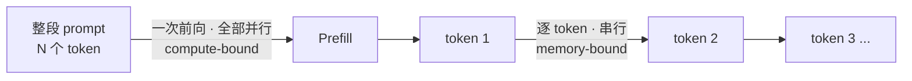
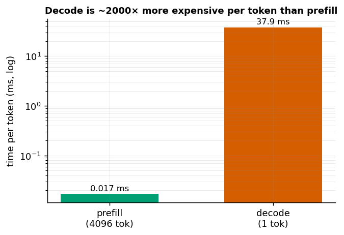

# 第 1 章 推理的两个阶段：Prefill 与 Decode

> 本章目标：理解 LLM 推理为什么天然分成"预填充"和"解码"两个阶段，
> 以及这个不对称性如何决定了后面几乎所有的推理优化技术。
> 本章数据均在 4× RTX 5090 之一上、用 Qwen3-0.6B (fp16) 实测得到。

## 1.1 一个根本事实：自回归

大语言模型是**自回归 (autoregressive)** 的：它一次只能预测"下一个 token"，
然后把这个 token 接到序列末尾，再预测下一个，如此循环。

```
输入: "今天天气"
     → 预测 "很"    → "今天天气很"
     → 预测 "好"    → "今天天气很好"
     → 预测 "。"    → "今天天气很好。"
```

这个"逐 token"的特性，把推理天然切成了两个阶段：



## 1.2 两个阶段

### Prefill（预填充）

你把整段 prompt（比如 500 个 token）一次性喂给模型，模型做**一次前向传播**，
同时处理这 500 个 token，算出：

- 每个位置的中间结果（后面要缓存的 Key/Value，见第 2 章）；
- 最后一个位置的输出，用来预测**第一个**新 token。

关键点：**prompt 里的所有 token 是并行处理的**。因为 prompt 已经全部已知，
不存在"要等前一个算完才能算后一个"的依赖，可以塞满 GPU 一起算。

### Decode（解码）

从第一个新 token 开始，模型进入逐 token 模式：

```
拿到 token_1 → 前向 → 预测 token_2
拿到 token_2 → 前向 → 预测 token_3
...
```

每一步只处理**一个**新 token（靠 KV cache 复用历史，见第 2 章）。
这一步是**串行的**：token_2 依赖 token_1，你没法提前算 token_3。

## 1.3 两个阶段的不对称（本章重点）

这是全书最重要的直觉之一。我们用实测数据说话。

### 实验 A：Prefill 高度并行，per-token 成本极低

处理不同长度的 prompt，测一次 prefill 前向的耗时：

| prompt 长度 | prefill 总耗时 | 每 token 耗时 |
|------------:|---------------:|--------------:|
| 16          | 52.1 ms        | 3.259 ms      |
| 64          | 36.8 ms        | 0.574 ms      |
| 256         | 33.3 ms        | 0.130 ms      |
| 1024        | 41.4 ms        | 0.040 ms      |
| 4096        | 71.6 ms        | 0.017 ms      |

**怎么读这张表（两个诚实的结论）：**

1. **"每 token 耗时"一路暴跌**（3.26 → 0.017 ms，差 ~190 倍）。
   这说明 prefill 并行度极高：token 越多，GPU 越吃得饱，摊到每个 token 的成本越低。

2. **"总耗时"不是单调增的**：16 个 token 竟然比 256 个还慢！
   这不是 bug，而是一个关键现象——**小规模时耗时被"固定开销"主导**
   （kernel 发射、Python 调用、GPU 没喂饱）。只有当 token 多到让计算本身
   成为瓶颈（这里约 ≥1024）后，总耗时才随长度明显上升。
   - 小 N 区间：overhead-bound（开销主导，时间近似恒定）
   - 大 N 区间：compute-bound（计算主导，时间随长度增长；长上下文时因 attention 的
     O(N²) 会超线性）

> 教训：**微基准测试要看对指标**。只看"16 tokens 比 256 tokens 慢"会得出
> "prompt 越短越慢"的荒谬结论；看"每 token 耗时"才看到真相。

**换一台更空闲的机器复现**，规律完全一致、绝对值更干净：

| prompt 长度 | prefill 总耗时 | 每 token 耗时 |
|------------:|---------------:|--------------:|
| 16          | 18.3 ms        | 1.146 ms      |
| 64          | 18.6 ms        | 0.290 ms      |
| 256         | 19.0 ms        | 0.074 ms      |
| 1024        | 19.6 ms        | 0.019 ms      |
| 4096        | 54.1 ms        | 0.013 ms      |

这次 16 / 64 / 256 / 1024 齐刷刷卡在 ~18–19 ms 一条平线上，把"固定开销主导区间"画得更清楚；
到 4096 才跳到 54 ms（计算终于超过开销）。**绝对值随机器负载变，规律不变**——这正是为什么
本书讲原理、把具体数字只当示例。

### 实验 B：Decode 的真实节奏

用一个真实 prompt 生成 50 个 token：

- **TTFT**（Time To First Token，首 token 延迟，主要就是 prefill 时间）：**80.0 ms**
- **TPOT**（Time Per Output Token，每个后续 token 的耗时）：**37.9 ms**
- 解码吞吐：**26.4 tokens/s**

### 实验 A + B 放一起看，惊人的对比

- Prefill **4096** 个 token 只要 **71.6 ms**；
- Decode **1** 个 token 却要 **37.9 ms**。

**解码 1 个 token 的耗时，是预填充 4096 个 token 的一半！**

换算成"每 token 成本"，decode 比 prefill 贵约 2000 倍：



为什么单个 token 这么"贵"？因为 decode 阶段是**访存受限 (memory-bound)** 的：

- Prefill 是"矩阵 × 矩阵"（一堆 token 一起算），算术强度高，GPU 算力用得满；
- Decode 每步是"矩阵 × 向量"（只有 1 个 token），算得极少，但**每一步都要把
  整个模型的权重从显存 (HBM) 读一遍**。瓶颈不在算，而在"搬运权重"。
- 结果：GPU 的算力单元大量空闲，时间花在等显存上。

**这一条是理解后续所有推理优化的钥匙：**
- 为什么 **batching** 能大幅提升吞吐？因为 decode 时权重都已经从显存读出来了，
  顺手多算几条序列几乎不额外花时间（把 memory-bound 变得更划算）——第 3 章。
- 为什么 **KV cache** 是必需的？见实验 C 和第 2 章。
- 为什么长上下文、高并发会爆显存？因为 KV cache 占显存——第 2、4 章。

### 实验 C：KV cache 到底省多少

同样生成 20 个 token，对比开/关 KV cache：

| 方式 | 生成 20 token 耗时 |
|------|-------------------:|
| 有 KV cache（每步只喂 1 个新 token） | 684 ms |
| 无 KV cache（每步把整段历史重算一遍） | 1206 ms |
| **加速比** | **1.8×** |

这里只有 1.8×，是因为 prompt 很短（19 token）、只生成 20 步，重算的量不大。
**KV cache 的收益随上下文长度快速放大**：prompt 几千 token、生成几百 token 时，
不用 cache 每步都要 O(当前长度) 地重算，总量是 O(N²)，会慢到不可用。
（练习里可以把 prompt 加长，亲眼看加速比飙升。）

## 1.4 小结

| | Prefill | Decode |
|---|---|---|
| 处理什么 | 整段 prompt，所有 token | 每步 1 个新 token |
| 并行性 | 高度并行 | 串行（token 间有依赖） |
| 瓶颈 | 计算受限 (compute-bound) | 访存受限 (memory-bound) |
| 对应指标 | TTFT（首 token 延迟） | TPOT（每 token 延迟）、吞吐 |
| 优化方向 | 减少重复 prefill（前缀复用，第 5 章） | batching、KV cache、量化、投机解码 |

**一句话记住**：LLM 推理 = 一次"吃满算力"的 prefill + 一长串"喂不饱算力"的 decode。
后面所有花活，几乎都是在跟 decode 阶段的 memory-bound 特性作斗争。

## 1.5 关键术语

- **Autoregressive（自回归）**：逐 token 生成，每个 token 依赖之前所有 token。
- **Prefill / Decode**：推理的两个阶段。
- **TTFT (Time To First Token)**：从收到请求到吐出第一个 token 的时间，主要由 prefill 决定。
- **TPOT (Time Per Output Token)** / ITL (Inter-Token Latency)：解码阶段每个 token 的间隔。
- **Compute-bound / Memory-bound**：瓶颈在算力 / 在显存带宽。
- **KV Cache**：缓存历史 token 的 Key/Value，避免重算（第 2 章详解）。

## 1.6 思考题

1. 解码阶段，8 个请求一起 decode，总耗时更接近 `1×TPOT` 还是 `8×TPOT`？为什么？
   这对提升吞吐有什么启示？
2. 实验 A 中，16 个 token 的 prefill 反而比 256 个慢。这不是 bug，为什么？
   （提示：这个区间的瓶颈不在"算"。）
3. （进阶）为什么 decode 阶段是访存受限 (memory-bound) 的？试着用"算术强度"来解释。

> 📖 **参考答案**（想清楚再看）：[Q1](../../qa/01-prefill-decode-qa.md#q1) · [Q2](../../qa/01-prefill-decode-qa.md#q2) · [Q3](../../qa/01-prefill-decode-qa.md#q3)

## 1.7 延伸阅读（本章补充）

- [补充 A：GPU 的存储层级与 HBM](A1-gpu-storage-hbm.md) —— "从显存搬权重"的硬件背景。
- [补充 B：CUDA 的异步执行、同步与正确的基准测试](A2-cuda-async-sync-benchmark.md) ——
  为什么练习脚本里到处是 `synchronize()`。

## 1.8 附录：本章练习代码

下面是练习脚本的完整内容（由 `scripts/sync_code.py` 从源码自动同步，勿手改）。
源码文件：`exercises/01-inference/01_prefill_vs_decode.py`。

<!-- CODE:exercises/01-inference/01_prefill_vs_decode.py START -->
```python
#!/usr/bin/env python
# -*- coding: utf-8 -*-
"""
第 1 章练习：亲眼看见 Prefill 与 Decode 两个阶段的不同。

我们不调用高层的 model.generate()，而是手动拆开推理过程，这样才能
把 prefill（处理整段 prompt）和 decode（逐 token 生成）分别计时。

结论预期：
  1) Prefill 的“每 token 耗时”随 prompt 变长而暴跌（并行度高）；总耗时在小规模时
     被固定开销主导（近似平线），只有 token 足够多时才随长度明显上升。
  2) Decode 每个 token 的时间基本恒定（每步只算 1 个 token），单个 token 却可能比
     prefill 几千个 token 还慢 —— 因为 decode 是访存受限的（第 1 章正文详解）。

绝对路径：
  /volume/data/hjiang02/workspace/infra-learning/exercises/01-inference/01_prefill_vs_decode.py
"""

import time
import torch
from transformers import AutoModelForCausalLM, AutoTokenizer

MODEL_PATH = "/volume/data/models/Qwen3-0.6B"
DEVICE = "cuda:0"


def sync():
    """CUDA 是异步的：kernel 发射后 CPU 立刻返回。计时前必须同步，否则测的是发射时间而非真实耗时。"""
    torch.cuda.synchronize()


def timeit(fn, warmup=1, repeat=3):
    """跑 warmup 次预热（第一次有 kernel 编译/缓存开销），再取 repeat 次的中位数。"""
    for _ in range(warmup):
        fn()
    sync()
    ts = []
    for _ in range(repeat):
        sync(); t0 = time.perf_counter()
        fn()
        sync(); ts.append(time.perf_counter() - t0)
    ts.sort()
    return ts[len(ts) // 2]


def main():
    print(f"加载模型: {MODEL_PATH}")
    tok = AutoTokenizer.from_pretrained(MODEL_PATH)
    model = AutoModelForCausalLM.from_pretrained(
        MODEL_PATH, torch_dtype=torch.float16
    ).to(DEVICE).eval()
    print(f"模型参数量: {sum(p.numel() for p in model.parameters())/1e6:.0f}M\n")

    # ---------- 实验 A：Prefill 时间随 prompt 长度变化 ----------
    print("=" * 60)
    print("实验 A：Prefill（处理整段 prompt 的一次前向）耗时 vs prompt 长度")
    print("=" * 60)
    print(f"{'prompt_len':>12} | {'prefill_ms':>12} | {'ms/token':>10}")
    print("-" * 40)
    for n in [16, 64, 256, 1024, 4096]:
        ids = torch.randint(0, tok.vocab_size, (1, n), device=DEVICE)

        @torch.no_grad()
        def prefill():
            return model(ids, use_cache=True)

        ms = timeit(prefill) * 1000
        print(f"{n:>12} | {ms:>12.2f} | {ms/n:>10.3f}")

    # ---------- 实验 B：Decode 每 token 耗时（用 KV cache 逐步生成） ----------
    print("\n" + "=" * 60)
    print("实验 B：Decode（借助 KV cache，每步只喂 1 个 token）每 token 耗时")
    print("=" * 60)
    prompt = "请用一句话解释什么是大语言模型的推理。"
    msgs = [{"role": "user", "content": prompt}]
    text = tok.apply_chat_template(msgs, tokenize=False, add_generation_prompt=True)
    ids = tok(text, return_tensors="pt").input_ids.to(DEVICE)
    print(f"prompt token 数: {ids.shape[1]}")

    with torch.no_grad():
        # 第 1 步：prefill 整段 prompt，拿到第一个 token —— 这段时间就是 TTFT
        sync(); t0 = time.perf_counter()
        out = model(ids, use_cache=True)
        past = out.past_key_values
        next_id = out.logits[:, -1:].argmax(-1)
        sync(); ttft = time.perf_counter() - t0
        print(f"TTFT（首 token 延迟, 含 prefill）: {ttft*1000:.2f} ms")

        # 后续步：每次只喂上一个 token + 复用 KV cache
        decode_times = []
        gen_ids = [next_id]
        for _ in range(50):
            sync(); t0 = time.perf_counter()
            out = model(next_id, past_key_values=past, use_cache=True)
            past = out.past_key_values
            next_id = out.logits[:, -1:].argmax(-1)
            sync(); decode_times.append(time.perf_counter() - t0)
            gen_ids.append(next_id)

    import statistics
    avg = statistics.mean(decode_times) * 1000
    print(f"TPOT（每 token 解码耗时, 50 步均值）: {avg:.2f} ms")
    print(f"解码吞吐: {1000/avg:.1f} tokens/s")
    gen = tok.decode(torch.cat(gen_ids, dim=-1)[0], skip_special_tokens=True)
    print(f"\n生成内容: {gen!r}")

    # ---------- 实验 C：KV cache 到底省了多少？关掉它对比 ----------
    print("\n" + "=" * 60)
    print("实验 C：关掉 KV cache 会怎样？（每步都重算整段历史）")
    print("=" * 60)
    with torch.no_grad():
        seq = ids.clone()
        # 有 cache：逐 token（上面已测，这里重测 20 步保持一致对比）
        past = model(ids, use_cache=True).past_key_values
        nid = ids[:, -1:]
        sync(); t0 = time.perf_counter()
        for _ in range(20):
            o = model(nid, past_key_values=past, use_cache=True)
            past = o.past_key_values
            nid = o.logits[:, -1:].argmax(-1)
        sync(); with_cache = time.perf_counter() - t0

        # 无 cache：每步把到目前为止的整段序列重新喂一遍
        seq = ids.clone()
        sync(); t0 = time.perf_counter()
        for _ in range(20):
            o = model(seq, use_cache=False)
            nid = o.logits[:, -1:].argmax(-1)
            seq = torch.cat([seq, nid], dim=-1)
        sync(); without_cache = time.perf_counter() - t0

    print(f"有 KV cache 生成 20 token: {with_cache*1000:.1f} ms")
    print(f"无 KV cache 生成 20 token: {without_cache*1000:.1f} ms")
    print(f"加速比: {without_cache/with_cache:.1f}x")


if __name__ == "__main__":
    main()
```
<!-- CODE:exercises/01-inference/01_prefill_vs_decode.py END -->
