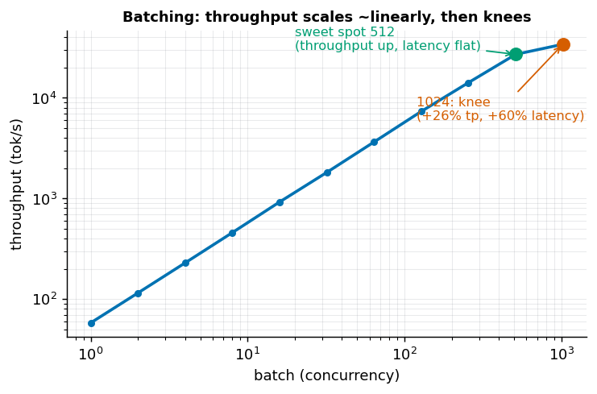

# 第 3 章 Batching：从 static 到 continuous batching

> 本章目标：讲清为什么 batching 是推理吞吐的第一杠杆、"甜点 batch size"从何而来，
> 以及 static batching 有什么致命问题、continuous batching 怎么解决它。
> 数据用 Qwen3-0.6B 真机实测。

## 3.1 接续：batching 为什么是吞吐第一杠杆

第 1 章我们得到：decode 是**访存受限 (memory-bound)** 的——每生成一个 token，都要把整个模型
权重从显存搬一遍，而算力大量空闲。你在第 1 章的思考题里已经自己推出了结论：

> 多个请求一起 decode，总耗时接近 `1×` 而不是 `N×`，因为权重**搬一次**就能喂给一整批序列。

这就是 batching 的全部原理：**把"搬一次权重"的成本，摊给一批序列**。空闲的算力顺手把这批
序列一起算了，几乎不额外花时间——直到算力也被填满。

## 3.2 实验：吞吐 vs batch size

固定每条序列生成 64 个 token，测不同 batch 下的吞吐和每步延迟：

| batch | 每步延迟 (ms) | 吞吐 (tok/s) | 相对 b=1 |
|------:|-------------:|------------:|--------:|
| 1     | 17.1 | 58    | 1.0× |
| 2     | 17.4 | 115   | 2.0× |
| 4     | 17.5 | 229   | 3.9× |
| 8     | 17.5 | 458   | 7.8× |
| 16    | 17.3 | 923   | 15.8× |
| 32    | 17.6 | 1817  | 31.1× |
| 64    | 17.6 | 3644  | 62.4× |
| 128   | 17.5 | 7334  | 125.6× |
| 256   | 18.1 | 14186 | 242.9× |
| 512   | 18.9 | 27080 | 463.7× |
| 1024  | **30.0** | 34117 | 584.2× |



**怎么读这张表：**

- **batch 1 → 512：几乎线性**。吞吐涨了约 464 倍，而**每步延迟基本不动**（17～19 ms）。
  这段就是 memory-bound 区间：算力还有富余，多塞序列几乎"免费"。**这段 batching 是纯赚**——
  每个用户的每 token 延迟 (TPOT) 没变差，你却同时服务了几百倍的请求。
- **batch 512 → 1024：拐点出现**。每步延迟从 18.9 ms 跳到 **30 ms**，吞吐涨幅从"翻倍"塌成
  1.26 倍。这里算力被填满了，进入 **compute-bound**：再加序列，就要真金白银地多花计算时间了。

> 这张表把第 1 章的 memory-bound / compute-bound 两个概念**连成了一条曲线**：
> 左半段访存受限（加 batch 免费），右半段计算受限（加 batch 变贵），拐点就是"算力被喂饱"的地方。

## 3.3 甜点 batch size：吞吐与延迟的权衡

从曲线看，"最优 batch"不是越大越好：

- 太小：算力浪费，吞吐低、单请求成本高；
- 太大：越过拐点后，每个用户的 TPOT 开始变差（这里 512→1024，延迟涨 60%），
  换来的吞吐却没多少。

所以工程上会挑一个**甜点区间**：在延迟还满足 SLO（服务级目标，比如"每 token < 25 ms"）的前提下，
把 batch 尽量往拐点靠。本例里 512 附近就是很好的甜点——吞吐已 27000 tok/s，延迟还没恶化。

> 注意：拐点位置**随模型和硬件变**。0.6B 小模型 decode 极度 memory-bound，所以到 512 才饱和；
> 换个 70B 大模型，权重搬运本身就吃满带宽，很小的 batch 就会进入 compute-bound。别记数字，记规律。

## 3.4 Static batching 的两个致命问题

上面测的是"一批一起进、一起出"的 **static batching**[^static]。真实服务里它有两个大问题：

### 问题一：长尾浪费

一批请求的**生成长度天差地别**（有的答十几个 token，有的答几百个）。static batching 必须等
**最长的那条**结束，整批才算完——短序列早早生成完，却只能占着槽位空转陪跑。

模拟一批 32 条、输出长度 8～255 不等的请求：

```
总有用 token          = 4110
static 计算的 token-步 = 32 × 255（最长） = 8160
浪费（短序列空转）     = 4050  →  浪费率 49.6%
```

**近一半算力在空转。**

### 问题二：排队延迟（head-of-line blocking）

一批开跑后，**新到的请求必须等整批结束**才能进去。高负载下，一个刚到的短请求可能要干等前一批
里最长那条生成完——首 token 延迟 (TTFT) 被严重拖累。

## 3.5 Continuous batching：调度粒度降到"每一步"

**Continuous batching**[^continuous]（也叫 in-flight batching / iteration-level scheduling，
出自 Orca 论文）的核心思想只有一句：

> 把调度粒度从"整个请求"降到"**每一个 decode 步**"。

具体做法——**每个 decode step 结束后**：

1. **完成的序列立即退出**，马上释放它的 KV cache 槽位；
2. **等待队列里的新请求立即补进**空出来的槽位，加入下一步一起算。

于是：

- **长尾浪费没了**：谁完成谁走，空位立刻被新请求填上，GPU 始终满载——把 3.4 那 ~50% 的浪费收回来；
- **排队延迟大降**：新请求不用等整批结束，下一步就能挤进去，TTFT 大幅改善。

这就是 vLLM / SGLang / TGI 这些引擎吞吐碾压朴素实现的**核心机制**。

## 3.6 和 KV cache 的关系：引出 PagedAttention

continuous batching 让序列**不断进进出出、每条长度还都不一样**。这给 KV cache 的显存管理出了道难题：

- 每条序列要一块**随时间增长**的 KV cache；
- 序列随时加入 / 退出，KV cache 要能**随时分配 / 释放**；
- 如果按"最大长度"预留连续显存，会造成巨大的**碎片和浪费**（第 2 章算过，KV cache 本就巨大）。

**PagedAttention（第 4 章）** 正是为解决这个而生：像操作系统管内存分页一样，把 KV cache 切成小块
按需分配，让 continuous batching 能在有限显存里塞下尽可能多的并发序列。

## 3.7 思考题

1. 看 3.2 的曲线：batch 从 512 到 1024，吞吐只涨 1.26×，每步延迟却从 18.9 ms 涨到 30 ms。
   作为服务提供方，你会把并发 batch 上限设在哪一档附近？为什么？
2. static batching 里那批 32 条请求，为什么浪费率能高到约 50%？continuous batching 具体靠什么把
   这部分收回来？
3. continuous batching 让序列不断进出、长度不一，会给 KV cache 的显存管理带来什么麻烦？
   （这正是下一章 PagedAttention 要解决的。）

> 📖 **参考答案**（想清楚再看）：[Q1](../../qa/03-batching-qa.md#q1) · [Q2](../../qa/03-batching-qa.md#q2) · [Q3](../../qa/03-batching-qa.md#q3)

## 3.8 延伸阅读

- 第 4 章 PagedAttention：支撑 continuous batching 的显存管理。
- 第 8 章 服务指标：吞吐、TTFT、TPOT、goodput 怎么系统地量。
- 第五部分「训练工程」：训练里也有 batching，但目标不同（吞吐 / 收敛），关注的是 global batch size
  与梯度累积——同一个"batch"概念在两端的不同侧重。

## 3.9 附录：本章练习代码

由 `scripts/sync_code.py` 从源码自动同步。源码：`exercises/01-inference/03_batching_throughput.py`。

<!-- CODE:exercises/01-inference/03_batching_throughput.py START -->
```python
#!/usr/bin/env python
# -*- coding: utf-8 -*-
"""
第 3 章练习：亲眼看见 batching 怎么把吞吐拉起来，以及"甜点 batch size"。

实验 A（真机）：固定生成长度，测不同 batch size 下的
    - 吞吐 throughput = batch × 生成token数 / 解码耗时
    - 每步延迟 per-step latency = 解码耗时 / 步数
    预期：batch 小时（memory-bound）吞吐随 batch 近乎线性涨、每步延迟几乎不变；
    batch 大到算力饱和（compute-bound）后，吞吐见顶、每步延迟开始明显上升。

实验 B（模拟）：说明 static batching 的"长尾浪费"——一批里生成长度不齐时，
    短序列早早结束却要陪跑到最长的那条，GPU 空转；continuous batching 能把这部分收回来。

绝对路径：
  /volume/data/hjiang02/workspace/infra-learning/exercises/01-inference/03_batching_throughput.py
"""

import time
import statistics
import torch
from transformers import AutoModelForCausalLM, AutoTokenizer

MODEL_PATH = "/volume/data/models/Qwen3-0.6B"
DEVICE = "cuda:0"
GEN_TOKENS = 64


def sync():
    torch.cuda.synchronize()


@torch.no_grad()
def decode_time(model, input_ids, n_new):
    """prefill 一次，再逐 token decode n_new 步（batch 维度并行），返回纯 decode 耗时。"""
    out = model(input_ids, use_cache=True)
    past = out.past_key_values
    nxt = out.logits[:, -1:].argmax(-1)
    sync()
    t0 = time.perf_counter()
    for _ in range(n_new):
        out = model(nxt, past_key_values=past, use_cache=True)
        past = out.past_key_values
        nxt = out.logits[:, -1:].argmax(-1)
    sync()
    return time.perf_counter() - t0


def main():
    tok = AutoTokenizer.from_pretrained(MODEL_PATH)
    model = AutoModelForCausalLM.from_pretrained(
        MODEL_PATH, torch_dtype=torch.bfloat16
    ).to(DEVICE).eval()

    prompt = "请简要介绍一下你自己。"
    text = tok.apply_chat_template(
        [{"role": "user", "content": prompt}], tokenize=False, add_generation_prompt=True
    )
    base = tok(text, return_tensors="pt").input_ids.to(DEVICE)

    # ---------- 实验 A：吞吐 vs batch size ----------
    print("=" * 70)
    print(f"实验 A：不同 batch size 下的吞吐与每步延迟（各生成 {GEN_TOKENS} 个 token）")
    print("=" * 70)
    print(f"{'batch':>6} | {'解码耗时(s)':>12} | {'每步延迟(ms)':>14} | {'吞吐(tok/s)':>14} | {'相对b=1加速':>12}")
    print("-" * 70)
    base_tp = None
    for bs in [1, 2, 4, 8, 16, 32, 64, 128, 256, 512, 1024]:
        ids = base.repeat(bs, 1)
        # 预热一次
        decode_time(model, ids, 4)
        ts = [decode_time(model, ids, GEN_TOKENS) for _ in range(3)]
        t = statistics.median(ts)
        per_step_ms = t / GEN_TOKENS * 1000
        tp = bs * GEN_TOKENS / t
        if base_tp is None:
            base_tp = tp
        print(f"{bs:>6} | {t:>12.3f} | {per_step_ms:>14.2f} | {tp:>14.1f} | {tp/base_tp:>11.1f}x")

    print("\n读表：吞吐一路往上涨说明 batching 在生效（权重搬一次喂一批）；")
    print("      若某个 batch 之后吞吐涨幅骤减、每步延迟明显变大，那里就是 memory-bound → compute-bound 的翻转点。")

    # ---------- 实验 B：static batching 的长尾浪费（模拟） ----------
    print("\n" + "=" * 70)
    print("实验 B：static batching 的长尾浪费（模拟，不需要真跑模型）")
    print("=" * 70)
    # 造一批"生成长度不齐"的请求
    torch.manual_seed(0)
    lengths = torch.randint(8, 256, (32,)).tolist()  # 32 条请求，输出长度 8~255 不等
    n = len(lengths)
    longest = max(lengths)
    useful = sum(lengths)                 # 真正有用的 token-步
    static_cost = n * longest             # static：所有槽位陪跑到最长那条结束
    print(f"请求数 = {n}，输出长度范围 = [{min(lengths)}, {longest}]，总有用 token = {useful}")
    print(f"static batching 计算的 token-步 = {n} × {longest} = {static_cost}")
    print(f"其中浪费（短序列空转）= {static_cost - useful}  →  浪费率 {100*(1-useful/static_cost):.1f}%")
    print(f"continuous batching：完成即退出、空位即补新请求，基本只算 {useful} 个有用 token-步")
    print(f"  → 同样算力下，continuous batching 的有效吞吐约为 static 的 {static_cost/useful:.1f}x")


if __name__ == "__main__":
    main()
```
<!-- CODE:exercises/01-inference/03_batching_throughput.py END -->

---

[^static]: Static Batching（静态批处理）：一批请求一起进、一起出，整批完成才能开始下一批。详见[术语表](../../glossary.md#static-batching)。
[^continuous]: Continuous Batching（连续批处理）：以 decode 步为粒度调度，完成即退出、空位即补新请求。详见[术语表](../../glossary.md#continuous-batching)。
