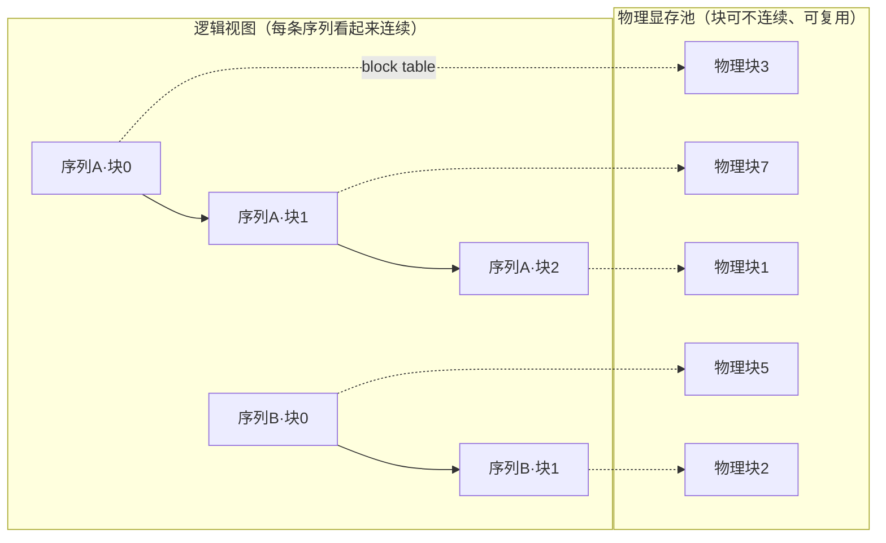

# 第 4 章 PagedAttention 与显存管理

> 本章目标：讲清 continuous batching 带来的 KV cache 碎片问题，以及 PagedAttention 如何
> 借用"操作系统内存分页"的思路把它解决——让同样的显存塞下几十倍的并发序列。

## 4.1 问题回顾：动态 KV cache = 碎片

第 3 章末尾我们看到：continuous batching 让序列**不断进出、每条长度还在动态增长**。
这给 KV cache 的显存分配出了难题。朴素的做法有两种浪费：

- **预留过度（内部浪费）**：为了"万一这条序列生成很长"，给每条序列**预留一整块"最大长度"的连续显存**。
  可绝大多数请求根本用不了那么长——预留的空间大片闲置。
- **外部碎片**：序列长度五花八门、又不断分配 / 释放，连续显存被切得七零八落，
  留下一堆**放不下新序列的小空洞**。

## 4.2 朴素做法有多浪费（模拟）

用第 2 章的 Qwen3-0.6B 参数（每 token KV = 112 KiB）、假设留 8 GiB 给 KV cache、模型最大上下文 40960：

**策略 1 · 每条序列预留最大长度：**

```
每条预留 = 40960 × 112 KiB = 4.38 GiB
8 GiB 预算 → 只能容纳 1 条并发序列
显存利用率 ≈ 平均长度/最大长度 ≈ 1%
```

为了极小概率的"超长请求"，给每条都按 40960 预留，结果显存瞬间见底、利用率 1%。这显然不能忍。

## 4.3 PagedAttention 的核心思想：借用操作系统的分页

操作系统早就解决过一模一样的问题：进程需要的内存大小不定、还动态增长，OS 不给它一整块连续物理内存，
而是切成固定大小的**页 (page)**，用**页表 (page table)** 把进程看到的"连续虚拟地址"映射到**物理上分散**的页。

**PagedAttention**[^paged] 把这套原样搬到 KV cache 上：

- 把 KV cache 切成固定大小的 **block**[^block]（vLLM 默认每块 16 个 token 的 KV）；
- 每条序列维护一张 **block table**[^blocktable]（相当于页表），记录它的"逻辑块"映射到显存池里哪些
  **物理块**——这些物理块**不需要连续**；
- 序列每写满一块，就从池子里**按需再分配**一块；序列结束，它的块**立即归还**池子给别人用。

因为按需分配、且物理块不必连续，**外部碎片被彻底消除**，"预留过度"也没有了——只在每条序列的
**最后一块**留一点没填满的空间（内部碎片，最多 block-1 个 token，很小）。



## 4.4 收益（模拟）

同样 8 GiB 预算、同一批真实长度分布的请求（平均 ~414 token）：

| | 朴素·预留最大长度 | 分页 (PagedAttention) |
|---|---:|---:|
| 每条占用 | 4.38 GiB（预留） | ~46 MiB（按实际长度） |
| 可容纳并发 | **1** | **~178** |
| 显存利用率 | ~1% | **~98%** |

**并发能力约 178 倍，利用率从 1% 拉到 98%。**

> **诚实说明**：这个模拟**只隔离了"显存预留 / 碎片"这一个因素**，所以差距看起来极端（178×）。
> 真实端到端服务里，vLLM 相对朴素实现的吞吐提升通常是 **2–4 倍**——因为还受算力、带宽、调度等
> 其它因素制约。但"消除碎片 → 塞下更多并发 → 吞吐更高"这条因果链是真实且核心的。

## 4.5 额外的大礼：块共享

分页还带来一个朴素连续分配做不到的好处——**多条序列可以共享同一个物理块**（配合写时复制 copy-on-write）：

- 多个请求用**同一段长 system prompt**：这段的 KV 只存一份，大家共享 → 省显存、省重复 prefill；
- **并行采样 / beam search**：从同一个 prompt 分叉出多条候选，共享 prompt 部分的 KV。

这直接引出**第 5 章 前缀复用 (Prefix Caching / RadixAttention)**。

## 4.6 类比一张表

| 操作系统 | PagedAttention |
|---|---|
| 进程的虚拟地址空间 | 一条序列的 KV cache |
| 页 (page) | block（默认 16 token） |
| 页表 (page table) | block table |
| 物理内存 | GPU 显存里的 KV block 池 |
| 按需分页、页可不连续 | 按需分配 block、物理块可不连续 |
| 共享内存页 | 共享 KV block（前缀共享） |

## 4.7 思考题

1. 朴素法利用率只有 ~1%，这浪费主要来自"预留了用不到的空间"还是"分配产生的小空洞"？
   PagedAttention 分别用什么手段消除这两类浪费？各自还剩下什么残余浪费？
2. block 大小（每块多少 token）选大还是选小，有什么权衡？（想想内部碎片 vs 管理开销）
3. 为什么"多个请求共用同一个长 system prompt"时，PagedAttention 能省显存和算力？
   连续预留的朴素法为什么做不到？

> 📖 **参考答案**（想清楚再看）：[Q1](../../qa/04-paged-attention-qa.md#q1) · [Q2](../../qa/04-paged-attention-qa.md#q2) · [Q3](../../qa/04-paged-attention-qa.md#q3)

## 4.8 延伸阅读

- 第 5 章 前缀复用：把 4.5 的"块共享"发挥到极致。
- 第 9 章 引擎实战：vLLM 就是 PagedAttention 的发源地，看它整体架构怎么把前几章串起来。
- 第五部分「训练工程」第 34 章：训练侧的显存管理（激活、offload）与这里思路相通——
  都是"别为峰值预留、按需管理"。

## 4.9 附录：本章练习代码

源码：`exercises/01-inference/04_paged_kv_simulation.py`。

<!-- CODE:exercises/01-inference/04_paged_kv_simulation.py START -->
```python
#!/usr/bin/env python
# -*- coding: utf-8 -*-
"""
第 4 章练习：用模拟对比"预留最大长度"和"分页 (PagedAttention)"两种 KV cache 显存管理，
看后者能在同样显存里塞下多少倍的并发序列、显存利用率差多少。

不需要 GPU：这是一个显存分配的模拟，用来把 PagedAttention 的收益量化出来。

两种策略：
  1) 朴素·预留最大长度：每条活跃序列都按模型最大上下文预留一整块连续显存
     （不管它实际会生成多长）→ 巨大的内部浪费。
  2) 分页 (PagedAttention)：把 KV cache 切成固定大小的 block，按需一块块分配
     → 只在每条序列的"最后一块"有一点内部碎片，利用率极高。

绝对路径：
  /volume/data/hjiang02/workspace/infra-learning/exercises/01-inference/04_paged_kv_simulation.py
"""

import math
import random

# --- 用第 2 章的 Qwen3-0.6B 真实参数算"每 token 的 KV 字节" ---
LAYERS, KV_HEADS, HEAD_DIM, BYTES = 28, 8, 128, 2
PER_TOKEN_BYTES = 2 * LAYERS * KV_HEADS * HEAD_DIM * BYTES  # = 114688 B = 112 KiB

MAX_LEN = 40960          # 模型最大上下文
BLOCK = 16               # PagedAttention 每个 block 的 token 数（vLLM 默认 16）
KV_BUDGET = 8 * 2**30    # 假设留给 KV cache 的显存预算：8 GiB


def human(n):
    for u in ["B", "KiB", "MiB", "GiB"]:
        if n < 1024 or u == "GiB":
            return f"{n:.2f} {u}"
        n /= 1024


def main():
    print(f"每 token KV = {human(PER_TOKEN_BYTES)}，KV 显存预算 = {human(KV_BUDGET)}，"
          f"模型最大上下文 = {MAX_LEN}，block = {BLOCK} tokens\n")

    # 造一批真实的"长度不齐"的请求：大多数短、少数长
    random.seed(0)
    seqs = [min(MAX_LEN, int(random.expovariate(1 / 400)) + 8) for _ in range(2000)]
    avg = sum(seqs) / len(seqs)
    print(f"请求样本 {len(seqs)} 条，平均实际长度 = {avg:.0f} tokens，最长 = {max(seqs)}\n")

    # ---------- 策略 1：预留最大长度 ----------
    reserve_per_seq = MAX_LEN * PER_TOKEN_BYTES
    n_naive = KV_BUDGET // reserve_per_seq
    used_if_naive = n_naive * avg * PER_TOKEN_BYTES
    print("=" * 60)
    print("策略 1：朴素·每条序列预留最大长度的连续显存")
    print("=" * 60)
    print(f"每条预留 = {MAX_LEN} × {human(PER_TOKEN_BYTES)} = {human(reserve_per_seq)}")
    print(f"能容纳并发序列数 = {n_naive}")
    print(f"显存利用率 ≈ 实际用量/预留 = 平均长度/最大长度 = {avg/MAX_LEN*100:.2f}%")

    # ---------- 策略 2：分页 ----------
    total_blocks = KV_BUDGET // (BLOCK * PER_TOKEN_BYTES)
    blocks_per_seq = [math.ceil(s / BLOCK) for s in seqs]
    avg_blocks = sum(blocks_per_seq) / len(blocks_per_seq)
    n_paged = total_blocks / avg_blocks
    # 内部碎片：每条序列最后一个 block 平均浪费 (BLOCK-1)/2 个 token 的空间
    used_tokens = sum(seqs)
    alloc_tokens = sum(blocks_per_seq) * BLOCK
    print("\n" + "=" * 60)
    print("策略 2：分页 PagedAttention（按需分配 block）")
    print("=" * 60)
    print(f"显存池总 block 数 = {total_blocks}")
    print(f"每条序列平均占用 = {avg_blocks:.1f} 个 block（{human(avg_blocks*BLOCK*PER_TOKEN_BYTES)}）")
    print(f"能容纳并发序列数 ≈ {n_paged:.0f}")
    print(f"显存利用率 ≈ 有效token/已分配token = {used_tokens/alloc_tokens*100:.2f}%（只剩最后一块的内部碎片）")

    # ---------- 对比 ----------
    print("\n" + "=" * 60)
    print("对比")
    print("=" * 60)
    print(f"并发能力：分页 / 朴素 ≈ {n_paged/n_naive:.0f}x")
    print(f"利用率  ：{avg/MAX_LEN*100:.1f}%  →  {used_tokens/alloc_tokens*100:.1f}%")
    print("\n结论：朴素法为了'万一序列很长'给每条都预留最大长度，绝大部分显存被闲置；")
    print("      分页只按实际长度一块块给，利用率逼近 100%，同样显存能多塞几十倍并发。")
    print("      这就是 vLLM 用 PagedAttention 把吞吐拉高的根本原因。")


if __name__ == "__main__":
    main()
```
<!-- CODE:exercises/01-inference/04_paged_kv_simulation.py END -->

**运行输出：**

<!-- OUTPUT:exercises/01-inference/outputs/04_paged_kv_simulation.txt START -->
```text
每 token KV = 112.00 KiB，KV 显存预算 = 8.00 GiB，模型最大上下文 = 40960，block = 16 tokens

请求样本 2000 条，平均实际长度 = 414 tokens，最长 = 3702

============================================================
策略 1：朴素·每条序列预留最大长度的连续显存
============================================================
每条预留 = 40960 × 112.00 KiB = 4.38 GiB
能容纳并发序列数 = 1
显存利用率 ≈ 实际用量/预留 = 平均长度/最大长度 = 1.01%

============================================================
策略 2：分页 PagedAttention（按需分配 block）
============================================================
显存池总 block 数 = 4681
每条序列平均占用 = 26.3 个 block（46.11 MiB）
能容纳并发序列数 ≈ 178
显存利用率 ≈ 有效token/已分配token = 98.22%（只剩最后一块的内部碎片）

============================================================
对比
============================================================
并发能力：分页 / 朴素 ≈ 178x
利用率  ：1.0%  →  98.2%

结论：朴素法为了'万一序列很长'给每条都预留最大长度，绝大部分显存被闲置；
      分页只按实际长度一块块给，利用率逼近 100%，同样显存能多塞几十倍并发。
      这就是 vLLM 用 PagedAttention 把吞吐拉高的根本原因。
```
<!-- OUTPUT:exercises/01-inference/outputs/04_paged_kv_simulation.txt END -->

---

[^paged]: PagedAttention：把 KV cache 分页管理的技术，vLLM 提出。详见[术语表](../../glossary.md#paged-attention)。
[^block]: Block（KV 块）：KV cache 分页的固定大小单位（如 16 个 token）。详见[术语表](../../glossary.md#kv-block)。
[^blocktable]: Block Table（块表）：记录一条序列逻辑块→物理块映射的表，相当于页表。详见[术语表](../../glossary.md#block-table)。
