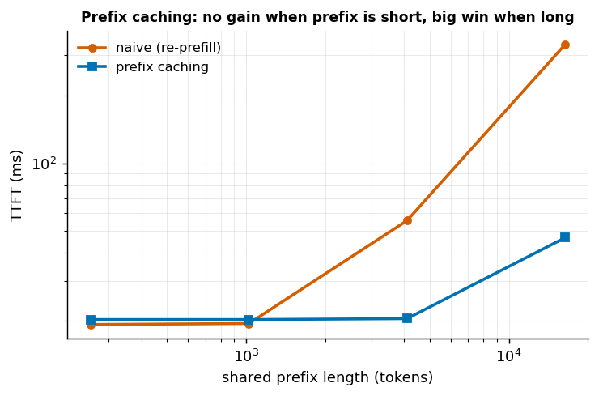
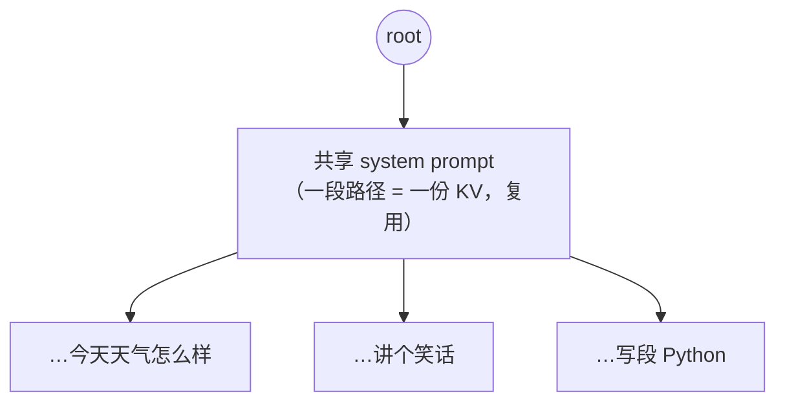

# 第 5 章 前缀复用：Prefix Caching 与 RadixAttention

> 本章目标：把第 4 章的"块共享"发挥到极致——当很多请求**共享同一段前缀**时，
> 只算一次前缀的 prefill，其余请求直接复用，大幅降低 TTFT。数据用 Qwen3-0.6B 真机实测。

## 5.1 接续：从块共享到前缀复用

第 4 章末尾提到，PagedAttention 让多条序列能**共享同一个物理 KV block**。本章把这个能力用到底：
如果两个请求的**开头一段 token 完全相同**（同样的 system prompt、同样的对话历史……），
那这段的 K/V 也完全相同——**只需算一次、存一份，大家复用**。

## 5.2 哪些场景天然"共享前缀"

这类场景在真实业务里极其常见：

- **同一段长 system prompt**：一个 agent / 客服机器人，成千上万请求都带着同一段几千 token 的系统提示；
- **多轮对话**：第 N 轮的 prompt = 前 N-1 轮的**全部历史** + 新消息——历史部分和上一轮完全重叠；
- **Few-shot / RAG**：同一批示例、同一段检索到的上下文，被多个查询共用；
- **并行采样 / beam search**：从同一个 prompt 分叉出多条候选，prompt 部分完全共享。

朴素做法里，这些共享的前缀**每个请求都要重新 prefill 一遍**——纯属重复劳动。

## 5.3 原理：缓存前缀的 KV，跳过它的 prefill

前缀复用 (Prefix Caching)[^prefix] 的做法：

1. 第一次遇到某段前缀时，正常 prefill，把它的 KV **缓存**下来；
2. 后续请求若**以同样的前缀开头**，直接复用这份缓存的 KV，**只对自己新增的那一小段做 prefill**。

省下的正是"重复 prefill 那段共享前缀"的计算——TTFT（首 token 延迟）随之大降。

## 5.4 实验：前缀越长，省得越多（但短前缀没用）

固定每个请求各带 16 token 的 query，共享前缀取不同长度，测 TTFT：

| 共享前缀长度 | 朴素 TTFT | 前缀复用 TTFT | 加速 | 省下 prefill |
|---------:|--------:|-----------:|----:|-----------:|
| 256   | 19.3 ms  | 20.3 ms | 1.0× | **-5%** |
| 1024  | 19.5 ms  | 20.3 ms | 1.0× | **-4%** |
| 4096  | 55.7 ms  | 20.5 ms | 2.7× | 63% |
| 16384 | 335.5 ms | 46.8 ms | 7.2× | 86% |



**两个诚实的结论：**

1. **前缀越长，收益越大**：16384 的共享前缀，TTFT 从 335 ms 砍到 47 ms（7.2×）。多轮长对话、
   长 system prompt 场景，这就是巨大的延迟和成本节省。
2. **短前缀几乎没用，甚至略亏**：256 / 1024 时加速 ≈ 1×，还倒亏 4~5%。为什么？
   回到第 1 章——**短 prompt 的 prefill 本就被固定开销主导 (overhead-bound)**，
   耗时几乎是一条平线（~19 ms）。既然重算这段前缀本来就没花多少时间，跳过它自然省不出东西；
   反而多了一点管理缓存的开销，于是略亏。

> **迁移第 1 章的直觉**：前缀复用的收益，取决于被跳过的那段 prefill **是不是真的很贵**。
> 只有当前缀长到脱离 overhead-bound、进入 compute-bound（这里 ≥4096），省下的计算才可观。

## 5.5 两种实现：vLLM APC 与 SGLang RadixAttention

**vLLM · Automatic Prefix Caching (APC)**：给每个 KV block 按"它的 token 内容 + 前面所有块的 hash"
算一个哈希；哈希相同就是同一段前缀，直接复用那些物理块。基于第 4 章的分页，天然支持。

**SGLang · RadixAttention**[^radix]：用一棵**前缀树 (radix tree)** 管理所有缓存的前缀。
每条请求的 token 序列是树上的一条路径，**共享前缀 = 共享树上的一段路径**；新请求进来时，
自动匹配**最长公共前缀**复用其 KV，显存不够时按 **LRU** 淘汰叶子节点。它把"前缀复用"从
"整段 system prompt"泛化到"任意请求间的任意公共前缀"，更通用。



上图里三个请求共享 `system prompt` 这段路径（KV 只存一份、prefill 只算一次），在分叉点之后才各走各的。

## 5.6 代价与注意点

- **缓存要占显存**：被缓存的前缀 KV 也吃显存，需要淘汰策略（LRU）在"复用收益"和"显存占用"间平衡；
- **position 要对齐**：复用前缀 KV 时，新 token 的位置编码必须接着前缀长度继续，否则结果错；
- **只对"真前缀"有效**：必须是从第 0 个 token 开始逐 token 完全相同，中间只要差一个 token，
  后面就无法复用（这也是为什么 system prompt 放在最前面最划算）。

## 5.7 思考题

1. 为什么共享前缀是 256 / 1024 时，前缀复用几乎没收益、甚至略亏？（提示：回到第 1 章的 overhead-bound）
2. 为什么"多轮对话"是前缀复用的完美场景？（想想第 N 轮的 prompt 和第 N-1 轮的关系）
3. RadixAttention 用一棵前缀树来管理缓存。为什么"树"这个结构特别适合"很多请求共享**不同长度**前缀"
   的场景？（想想树的路径、分叉点各代表什么）

> 📖 **参考答案**（想清楚再看）：[Q1](../../qa/05-prefix-caching-qa.md#q1) · [Q2](../../qa/05-prefix-caching-qa.md#q2) · [Q3](../../qa/05-prefix-caching-qa.md#q3)

## 5.8 延伸阅读

- 第 8 章 服务指标：前缀复用主要改善 TTFT，怎么在压测里体现出来。
- 第 9 章 引擎实战：vLLM 的 APC 与 SGLang 的 RadixAttention 在架构里的位置。
- 第五部分「训练工程」：训练里也有"重复计算换缓存"的权衡（如激活重计算 vs 存激活），
  第 34 章会从另一面讲这种"算力 ↔ 显存"的取舍。

## 5.9 附录：本章练习代码

由 `scripts/sync_code.py` 从源码自动同步。源码：`exercises/01-inference/05_prefix_caching.py`。

<!-- CODE:exercises/01-inference/05_prefix_caching.py START -->
```python
#!/usr/bin/env python
# -*- coding: utf-8 -*-
"""
第 5 章练习：量一量"前缀复用"能省多少 prefill / 把 TTFT 降多少。

场景：很多请求共享同一段长前缀（比如同一个长 system prompt、多轮对话的历史），
后面各接一小段不同的 query。

  - 朴素：每个请求都对"前缀 + query"整体做一次 prefill（重复算了前缀）。
  - 前缀复用：前缀的 KV 只算一次并缓存；每个请求只对自己那一小段 query 做 prefill，
    直接在缓存的前缀 KV 上接着算。

我们测每个请求的 TTFT（首 token 延迟 ≈ prefill 时间）在两种方式下的差别。

绝对路径：
  /volume/data/hjiang02/workspace/infra-learning/exercises/01-inference/05_prefix_caching.py
"""

import time
import statistics
import torch
from transformers import AutoModelForCausalLM, AutoTokenizer

MODEL_PATH = "/volume/data/models/Qwen3-0.6B"
DEVICE = "cuda:0"
QUERY_LEN = 16  # 每个请求各自的一小段 query 长度


def sync():
    torch.cuda.synchronize()


@torch.no_grad()
def ttft_naive(model, full_ids):
    """朴素：对 前缀+query 整体做一次 prefill。"""
    sync(); t0 = time.perf_counter()
    model(full_ids, use_cache=True)
    sync(); return time.perf_counter() - t0


@torch.no_grad()
def ttft_cached(model, prefix_ids, query_ids):
    """前缀复用：前缀 KV 已缓存（不计时），只对 query 段做 prefill。"""
    prefix_past = model(prefix_ids, use_cache=True).past_key_values  # 不计时：一次性、被所有请求摊薄
    sync(); t0 = time.perf_counter()
    model(query_ids, past_key_values=prefix_past, use_cache=True)
    sync(); return time.perf_counter() - t0


def main():
    tok = AutoTokenizer.from_pretrained(MODEL_PATH)
    model = AutoModelForCausalLM.from_pretrained(
        MODEL_PATH, torch_dtype=torch.bfloat16
    ).to(DEVICE).eval()

    print(f"每个请求各自的 query 长度 = {QUERY_LEN} token\n")
    print(f"{'前缀长度':>8} | {'朴素 TTFT(ms)':>14} | {'前缀复用 TTFT(ms)':>18} | {'加速':>8} | {'省下 prefill':>12}")
    print("-" * 74)

    for prefix_len in [256, 1024, 4096, 16384]:
        prefix_ids = torch.randint(0, tok.vocab_size, (1, prefix_len), device=DEVICE)
        query_ids = torch.randint(0, tok.vocab_size, (1, QUERY_LEN), device=DEVICE)
        full_ids = torch.cat([prefix_ids, query_ids], dim=1)

        # 预热
        ttft_naive(model, full_ids); ttft_cached(model, prefix_ids, query_ids)

        naive = statistics.median([ttft_naive(model, full_ids) for _ in range(5)]) * 1000
        cached = statistics.median([ttft_cached(model, prefix_ids, query_ids) for _ in range(5)]) * 1000
        print(f"{prefix_len:>8} | {naive:>14.2f} | {cached:>18.2f} | {naive/cached:>7.1f}x | "
              f"{100*(1-cached/naive):>10.1f}%")

    print("\n结论：共享前缀越长，前缀复用省得越多——因为朴素每次都在重算这段前缀的 prefill，")
    print("      而前缀复用把它摊成'只算一次'。多轮对话、长 system prompt、few-shot 场景收益巨大。")


if __name__ == "__main__":
    main()
```
<!-- CODE:exercises/01-inference/05_prefix_caching.py END -->

**运行输出**（真机跑出，由 `run_exercises.py` 捕获、`sync_code.py` 内联）：

<!-- OUTPUT:exercises/01-inference/logs/05_prefix_caching.log START -->
```text
每个请求各自的 query 长度 = 16 token

    前缀长度 |    朴素 TTFT(ms) |      前缀复用 TTFT(ms) |       加速 |   省下 prefill
--------------------------------------------------------------------------
     256 |          19.40 |              20.23 |     1.0x |       -4.3%
    1024 |          19.36 |              19.99 |     1.0x |       -3.3%
    4096 |          55.93 |              20.10 |     2.8x |       64.1%
   16384 |         335.69 |              46.77 |     7.2x |       86.1%

结论：共享前缀越长，前缀复用省得越多——因为朴素每次都在重算这段前缀的 prefill，
      而前缀复用把它摊成'只算一次'。多轮对话、长 system prompt、few-shot 场景收益巨大。
```
<!-- OUTPUT:exercises/01-inference/logs/05_prefix_caching.log END -->

---

[^prefix]: Prefix Caching（前缀复用/前缀缓存）：缓存共享前缀的 KV，后续同前缀请求直接复用、跳过其 prefill。详见[术语表](../../glossary.md#prefix-caching)。
[^radix]: RadixAttention：SGLang 用前缀树自动管理与复用任意公共前缀 KV 的技术。详见[术语表](../../glossary.md#radix-attention)。
