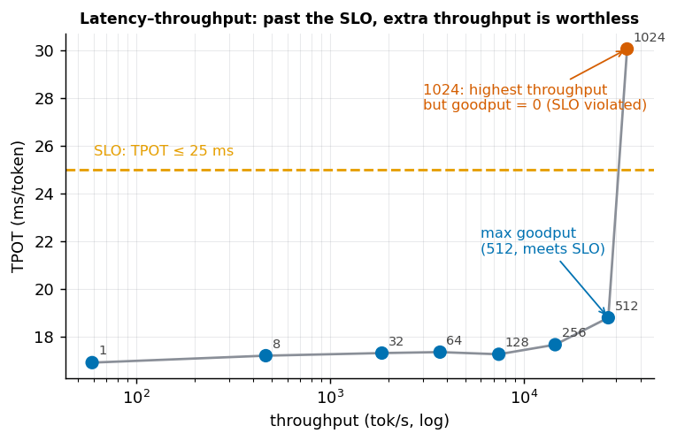

# 第 8 章 服务指标与压测

> 本章目标：把前 7 章各种"快"收敛成一套统一的服务指标，理解延迟-吞吐权衡、尾延迟、
> 以及最重要的 **goodput**，并掌握科学压测的方法论。这是第一部分的收尾方法论。

## 8.1 为什么要统一指标

前面 7 章讲了 batching、PagedAttention、量化、投机解码各种"提速"。但"快"有很多面：
是首字快？还是每个字快？还是同时能服务的人多？不把它们拆成明确的指标，就没法比较、没法定目标、
没法知道优化到底有没有用。

## 8.2 四个核心指标

| 指标 | 含义 | 主要由谁决定 |
|------|------|------------|
| **TTFT** (Time To First Token) | 从请求到吐出第一个 token 的延迟 | prefill（第 1 章） |
| **TPOT** (Time Per Output Token) / ITL | 解码阶段每个后续 token 的间隔 | decode（第 1 章） |
| **端到端延迟** | 一个请求总耗时 ≈ TTFT + TPOT × 输出长度 | 两者之和 |
| **吞吐 (throughput)** | 系统每秒产出多少 token（或每秒完成多少请求 QPS） | batching（第 3 章） |

关键区分：**单请求延迟**（用户等多久）和**系统吞吐**（整体每秒产多少）是**两个视角**，常常此消彼长。

## 8.3 延迟-吞吐权衡（真机数据）

扫不同并发，测 TTFT / TPOT / 吞吐：

| 并发 | TTFT (ms) | TPOT (ms) | 吞吐 (tok/s) |
|----:|--------:|--------:|-----------:|
| 1   | 19.6  | 16.91 | 59 |
| 32  | 19.4  | 17.31 | 1848 |
| 128 | 23.5  | 17.26 | 7415 |
| 256 | 39.9  | 17.66 | 14492 |
| 512 | 76.1  | 18.79 | 27256 |
| 1024| 156.3 | 30.05 | 34071 |

两个观察：

1. **吞吐一路涨**（59 → 34071），但**代价是延迟**：并发越高，单请求越慢。
2. **TTFT 比 TPOT 先恶化**：TTFT 从 19.6 ms 涨到 156 ms，而 TPOT 到 512 都稳。
   因为 TTFT = prefill，batch 越大 prefill 越是 compute-bound、越慢；而 decode 到 512 还 memory-bound，
   所以 TPOT 稳。**高并发先伤"首字延迟"。**

## 8.4 平均值会骗人：要看尾延迟

只报"平均延迟"是危险的——用户体验和 SLA 由**尾延迟**决定。所以要看分位数：

- **P50**（中位数）：一半请求比它快；
- **P90 / P99**：90% / 99% 的请求比它快。**P99 才反映"最差的那批用户"的体验**。

一个 P50 很漂亮、P99 却爆炸的服务，意味着有一小撮请求慢得离谱——在多请求串联的系统里（如 agent 调用链），
一个 P99 慢请求就能拖垮整条链路。**优化和定 SLO 都盯 P99，不看平均。**

> 注：本章练习是"同长度、稳态"测量，看不出分布；真实服务因**输入/输出长度不同、到达时间不同、
> 调度顺序不同**，才会分化出 P50/P99 的差距。

## 8.5 Goodput：只有满足 SLO 的吞吐才算数

这是本章最重要的概念。**吞吐（throughput）** 数的是"产出的所有 token"；
**goodput（有效吞吐）** 只数"**满足延迟 SLO** 的那部分"。

设 SLO：TPOT ≤ 25 ms。看数据：

| 并发 | 吞吐 (tok/s) | 满足 SLO | goodput |
|----:|-----------:|:------:|-------:|
| 512  | 27256 | ✅ | 27256 |
| 1024 | 34071 | ❌（TPOT 30 ms） | 0 |

**1024 并发的原始吞吐最高（34071），goodput 却是 0**——因为所有请求都超时了，超时的服务对用户毫无价值。
**最大 goodput 在并发 512。**



> 结论：**调服务不是"最大化吞吐"，而是"在满足 SLO 的前提下最大化 goodput"。** 越过拐点后一味加并发，
> 只是在生产"没人要的超时 token"。
>
> （这里用了简化：越过 SLO 就记 goodput=0。真实中是"满足 SLO 的那部分请求"计入，通常是逐渐下降而非骤降到 0。）

## 8.6 SLO 怎么定

**SLO (Service Level Objective)** 是你对服务定的量化目标，通常按分位数写，例如：

- P99 TTFT ≤ 500 ms（首字够快，不让用户干等）；
- P99 TPOT ≤ 50 ms（出字够流畅，约等于 20 token/s 的阅读速度）。

定了 SLO，才有"甜点 batch"的客观标准：在不违反 SLO 的前提下，把并发/batch 往拐点靠，最大化 goodput。

## 8.7 压测方法论

科学压测要注意：

- **负载模式**：① 固定并发（同时 N 个请求）；② 固定 QPS（每秒来 λ 个，泊松到达更真实）；
  ③ 逐步加压，画出"延迟-吞吐曲线"找拐点。
- **真实 workload**：输入/输出长度要按真实分布（不是全都等长），否则测不出长尾。
- **预热 + 稳态**：丢掉冷启动（第 1 章的 launch/编译开销），测稳态。
- **工具**：vLLM 的 `benchmark_serving.py`、SGLang 的 `bench_serving`、通用的 locust / wrk 等。

## 8.8 思考题

1. 1024 并发时原始吞吐最高（34071 tok/s），可 goodput 却是 0。为什么？这对"调一个推理服务到底追求什么"有什么启示？
2. 数据里 TTFT 从 19.6 ms 一路涨到 156 ms，而 TPOT 到并发 512 都还稳。为什么高并发**先**伤 TTFT、后伤 TPOT？
   （提示：TTFT 和 TPOT 分别由哪个阶段决定，那个阶段先进入 compute-bound？）
3. 为什么评估服务要看 P99 延迟，而不是平均延迟？

> 📖 **参考答案**（想清楚再看）：[Q1](../../qa/08-serving-metrics-qa.md#q1) · [Q2](../../qa/08-serving-metrics-qa.md#q2) · [Q3](../../qa/08-serving-metrics-qa.md#q3)

## 8.9 延伸阅读

- 第 9 章 推理引擎全景：把第 1–8 章的技术在 vLLM / SGLang / TensorRT-LLM 里对号入座。
- 第五部分「训练工程」的『训练效率度量与扩展性』一章：训练侧的对应指标是 MFU/HFU（算力利用率），
  和这里的 goodput 是"两端各自的效率标尺"。

## 8.10 附录：本章练习代码

源码：`exercises/01-inference/08_serving_metrics.py`。

<!-- CODE:exercises/01-inference/08_serving_metrics.py START -->
```python
#!/usr/bin/env python
# -*- coding: utf-8 -*-
"""
第 8 章练习：把"快"量化成服务指标，画出延迟-吞吐曲线，并理解 goodput。

概念：
  - TTFT (Time To First Token)：首 token 延迟，主要由 prefill 决定。
  - TPOT (Time Per Output Token)：解码阶段每个后续 token 的间隔。
  - 吞吐 (throughput)：整个系统每秒产出多少 token。
  - SLO (Service Level Objective)：延迟目标，如 "TPOT ≤ 25ms"。
  - goodput (有效吞吐)：只有满足 SLO 的吞吐才算数——越过拐点后吞吐虽高但违反 SLO，不算 goodput。

实验：扫不同并发 batch，测 TTFT / TPOT / 吞吐，按 SLO 算 goodput，找到"最大 goodput"的甜点。

绝对路径：
  /volume/data/hjiang02/workspace/infra-learning/exercises/01-inference/08_serving_metrics.py
"""

import time
import statistics
import torch
from transformers import AutoModelForCausalLM, AutoTokenizer

MODEL_PATH = "/volume/data/models/Qwen3-0.6B"
DEVICE = "cuda:0"
GEN = 64
SLO_TPOT_MS = 25.0  # 服务级目标：每 token 延迟不超过 25ms


def sync():
    torch.cuda.synchronize()


def main():
    tok = AutoTokenizer.from_pretrained(MODEL_PATH)
    model = AutoModelForCausalLM.from_pretrained(
        MODEL_PATH, torch_dtype=torch.bfloat16
    ).to(DEVICE).eval()
    text = tok.apply_chat_template(
        [{"role": "user", "content": "请简要介绍一下你自己。"}],
        tokenize=False, add_generation_prompt=True,
    )
    base = tok(text, return_tensors="pt").input_ids.to(DEVICE)

    @torch.no_grad()
    def measure(bs):
        ids = base.repeat(bs, 1)
        # TTFT：prefill 一次的时间
        sync(); t0 = time.perf_counter()
        out = model(ids, use_cache=True)
        sync(); ttft = time.perf_counter() - t0
        past = out.past_key_values
        nxt = out.logits[:, -1:].argmax(-1)
        # TPOT：decode 每步
        sync(); t0 = time.perf_counter()
        for _ in range(GEN):
            out = model(nxt, past_key_values=past, use_cache=True)
            past = out.past_key_values
            nxt = out.logits[:, -1:].argmax(-1)
        sync(); tpot = (time.perf_counter() - t0) / GEN
        return ttft * 1000, tpot * 1000, bs / tpot  # ms, ms, tok/s(system)

    print(f"SLO：TPOT ≤ {SLO_TPOT_MS} ms\n")
    print(f"{'并发':>6} | {'TTFT(ms)':>9} | {'TPOT(ms)':>9} | {'吞吐(tok/s)':>12} | {'满足SLO':>7} | {'goodput':>10}")
    print("-" * 66)
    best = (0, 0)
    for bs in [1, 8, 32, 64, 128, 256, 512, 1024]:
        measure(min(bs, 4))  # 预热
        ttft, tpot, tp = min((measure(bs) for _ in range(3)), key=lambda r: r[1])
        ok = tpot <= SLO_TPOT_MS
        good = tp if ok else 0.0
        if good > best[1]:
            best = (bs, good)
        print(f"{bs:>6} | {ttft:>9.1f} | {tpot:>9.2f} | {tp:>12.0f} | {'✅' if ok else '❌':>6} | {good:>10.0f}")

    print(f"\n最大 goodput 出现在并发 = {best[0]}（{best[1]:.0f} tok/s）——再往上虽然原始吞吐还涨，")
    print("但 TPOT 越过 SLO，那些请求'超时'不算有效服务，goodput 掉回 0。")
    print("要点：调服务不是最大化吞吐，而是【在满足 SLO 的前提下】最大化 goodput。")


if __name__ == "__main__":
    main()
```
<!-- CODE:exercises/01-inference/08_serving_metrics.py END -->

**运行输出：**

<!-- OUTPUT:exercises/01-inference/outputs/08_serving_metrics.txt START -->
```text
SLO：TPOT ≤ 25.0 ms

    并发 |  TTFT(ms) |  TPOT(ms) |    吞吐(tok/s) |   满足SLO |    goodput
------------------------------------------------------------------
     1 |      18.4 |     17.04 |           59 |      ✅ |         59
     8 |      18.7 |     17.45 |          459 |      ✅ |        459
    32 |      19.4 |     17.57 |         1822 |      ✅ |       1822
    64 |      20.0 |     17.56 |         3645 |      ✅ |       3645
   128 |      22.6 |     17.52 |         7305 |      ✅ |       7305
   256 |      40.0 |     17.94 |        14273 |      ✅ |      14273
   512 |      76.2 |     18.89 |        27105 |      ✅ |      27105
  1024 |     156.4 |     30.03 |        34101 |      ❌ |          0

最大 goodput 出现在并发 = 512（27105 tok/s）——再往上虽然原始吞吐还涨，
但 TPOT 越过 SLO，那些请求'超时'不算有效服务，goodput 掉回 0。
要点：调服务不是最大化吞吐，而是【在满足 SLO 的前提下】最大化 goodput。
```
<!-- OUTPUT:exercises/01-inference/outputs/08_serving_metrics.txt END -->

---

[^ttft]: TTFT (Time To First Token)：首 token 延迟，主要由 prefill 决定。详见[术语表](../../glossary.md#ttft)。
[^goodput]: Goodput（有效吞吐）：只计满足 SLO 的那部分吞吐。详见[术语表](../../glossary.md#goodput)。
