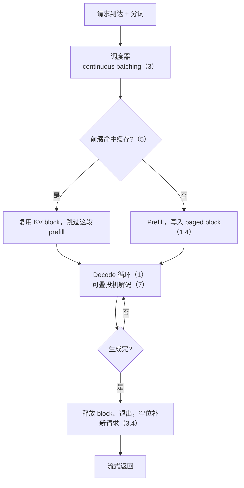

# 第 9 章 推理引擎全景：vLLM / SGLang / TensorRT-LLM

> 第一部分收官。本章把前 8 课的技术在真实引擎里对号入座，对比三大引擎的设计哲学，
> 并把整条主线复盘成一张图。

## 9.1 一个请求在 vLLM 里的一生

把前 8 课串起来，看一个请求怎么走完全程：

1. **进来 & 分词**：HTTP 请求到达，prompt 被 tokenize。
2. **调度 (scheduler)**：请求进等待队列。调度器按 **continuous batching**（第 3 章）决定这一步谁参与。
3. **前缀复用检查**：若 prompt 前缀命中缓存（**APC / RadixAttention**，第 5 章），复用已有 KV block，
   跳过这段 prefill。
4. **Prefill**（第 1 章）：为未命中的 prompt 部分算 KV，写入按需分配的 **paged block**（第 4 章）。
5. **Decode 循环**：每一步为 batch 里所有活跃序列各出 1 个 token（第 1 章）；写满一块就再要一块；
   若开了**投机解码**（第 7 章），这一步验证草稿的多个 token。
6. **完成即退出**：某序列生成完 → 立即释放它的 block（第 4 章）、退出 batch，空位由等待队列补上（第 3 章）。
7. **流式返回 & 分词回文本**，KV block 归还池子。



**前 8 课的每个概念，都是这条流水线上的一个环节。**

## 9.2 技术 → 引擎 映射

| 技术（章） | vLLM | SGLang | TensorRT-LLM |
|-----------|------|--------|--------------|
| Continuous batching（3） | ✅ | ✅ | ✅（in-flight batching） |
| PagedAttention（4） | ✅（发源地） | ✅ | ✅（paged KV） |
| 前缀复用（5） | ✅ APC（哈希块） | ✅ **RadixAttention**（前缀树，招牌） | ✅ |
| 量化（6） | ✅ AWQ/GPTQ/FP8/INT8 | ✅ | ✅（TRT 内核，含 FP8） |
| 投机解码（7） | ✅（含 EAGLE） | ✅（含 EAGLE） | ✅ |
| KV 量化（6） | ✅ | ✅ | ✅ |

**共同点**：continuous batching + PagedAttention 是**人人必备的吞吐地基**；差异在上层。

## 9.3 三大引擎的设计哲学

**vLLM**——PagedAttention 的发源地。
- Python 为主、易读易扩展，社区和生态最大，兼容多种硬件后端；
- 定位：通用、好上手、功能全的"默认选择"。

**SGLang**——招牌是 **RadixAttention**（第 5 章）+ **可编程前端**。
- 用前缀树自动复用任意公共前缀，多轮对话 / agent / 结构化生成场景优势明显；
- 提供一套 DSL 描述复杂生成流程（分支、并行、约束解码）；
- 定位：复杂交互 / 高前缀复用场景的性能利器。

**TensorRT-LLM**——NVIDIA 官方，走**提前编译 (AOT)** 路线。
- 把模型**编译成一个高度优化的引擎**（融合 kernel、选最优实现），配 in-flight batching；
- 在 NVIDIA 卡上往往能压出**极致性能**，但编译流程重、灵活性低、只服务 NVIDIA；
- 定位：NVIDIA 平台上追求极致延迟/吞吐、愿意付出工程成本的生产部署。

> 一句话选型：**想快速跑起来、要灵活 → vLLM；前缀复用重、交互复杂 → SGLang；
> NVIDIA 上榨干最后一滴性能、能接受编译 → TensorRT-LLM。**（三者都在快速演进，具体以实测为准。）

## 9.4 怎么把前 8 课用起来：决策助手

优化不是"全都上"，而是**看场景对症下药**。本章练习 `09_inference_advisor.py` 把前 8 课的规则写成一个
决策工具，输入模型+场景，输出该上哪些优化。两个真实对比：

**场景 A · 单用户客服（低并发、长 system prompt）**：
→ 前缀复用（前缀占 90%）✅、投机解码（低并发有效）✅、weight-only 量化（70B decode 带宽受限）✅。

**场景 B · 离线批量处理（高并发、prompt 各异）**：
→ **不上**投机解码（高并发目标已 compute-bound，无用）、**不上**前缀复用（无共享前缀）；
靠大 batch continuous batching + 量化腾显存。

**同一个模型，两个场景，最优优化组合完全不同**——这正是学完第一部分该有的判断力。

## 9.5 收尾

本章把前 8 章的技术落到了真实引擎。整个第一部分的**一页速查**（主线、两个公式、九章速览、
选型判断表、记忆卡）见 **[第一部分小结](summary.md)**——那里专门做回顾，本章不再重复。

## 9.6 思考题

1. 一个 **70B 模型、单用户交互（低并发）、带很长 system prompt** 的客服场景，你会优先上哪几个优化？为什么？
2. 一个**离线批量处理**场景（追求高吞吐、不在乎延迟、每条 prompt 各不相同），你会优先上哪些？
   哪些明确**不该上**？为什么？
3. 为什么三大引擎都必然实现 PagedAttention + continuous batching，却在"前缀复用 / 编译 / 可编程"上各有侧重？

> 📖 **参考答案**（想清楚再看）：[Q1](../../qa/09-engines-qa.md#q1) · [Q2](../../qa/09-engines-qa.md#q2) · [Q3](../../qa/09-engines-qa.md#q3)

## 9.7 延伸阅读

- 第二部分（下一站）：GPU 架构与算子优化——前面把引擎"用"明白了，接下来往下钻到 kernel 层，
  学会**读、写、优化**这些引擎底下的算子（含手撕 FlashAttention）。
- 第五部分「训练工程」：推理这套"显存/带宽/瓶颈"的思维方式，会整套迁移到训练侧。

## 9.8 附录：本章练习代码

源码：`exercises/01-inference/09_inference_advisor.py`。

<!-- CODE:exercises/01-inference/09_inference_advisor.py START -->
```python
#!/usr/bin/env python
# -*- coding: utf-8 -*-
"""
第 9 章练习 / 第一部分总复盘：推理优化决策助手。

把前 8 课的规则写成代码：输入模型配置 + workload，自动估算显存/瓶颈，并给出
"该上哪些优化、为什么"的建议。不需要 GPU——这是一个把整部分知识串起来的决策工具。

用到的规则来自：
  第1章 memory/compute-bound、TPOT下限=模型字节/带宽
  第2章 KV_bytes = 2·层·KV头·head_dim·seqlen·batch·字节
  第3章 batching（高并发提吞吐）
  第4章 PagedAttention（显存碎片/并发）
  第5章 前缀复用（长共享前缀）
  第6章 量化（省显存/大模型decode提速）
  第7章 投机解码（低并发有效、高并发失效）

绝对路径：
  /volume/data/hjiang02/workspace/infra-learning/exercises/01-inference/09_inference_advisor.py
"""

from dataclasses import dataclass


@dataclass
class Model:
    name: str
    params: float          # 参数量
    layers: int
    kv_heads: int
    head_dim: int
    bytes_per: int = 2     # bf16


@dataclass
class Workload:
    name: str
    prompt_len: int
    gen_len: int
    batch: int             # 并发
    shared_prefix_frac: float  # 共享前缀占 prompt 比例 0~1
    latency_sensitive: bool
    gpu_mem_gb: float
    gpu_bw_tbps: float = 1.8


def gib(x): return x / 2**30


def advise(m: Model, w: Workload):
    print("=" * 66)
    print(f"模型 {m.name}（{m.params/1e9:.0f}B）  场景「{w.name}」")
    print("=" * 66)

    # --- 显存 ---
    model_bytes = m.params * m.bytes_per
    kv_per_tok = 2 * m.layers * m.kv_heads * m.head_dim * m.bytes_per
    seqlen = w.prompt_len + w.gen_len
    kv_total = kv_per_tok * seqlen * w.batch
    print(f"权重显存        ≈ {gib(model_bytes):.1f} GiB")
    print(f"KV cache/‌token  ≈ {kv_per_tok/1024:.0f} KiB")
    print(f"KV cache 总量   ≈ {gib(kv_total):.1f} GiB（seqlen {seqlen} × batch {w.batch}）")
    total_need = gib(model_bytes) + gib(kv_total)
    print(f"合计需求        ≈ {total_need:.1f} GiB / 可用 {w.gpu_mem_gb} GiB "
          f"{'⚠️ 超了！' if total_need > w.gpu_mem_gb else '✅'}")

    # --- 瓶颈判断 ---
    tpot_floor_ms = model_bytes / (w.gpu_bw_tbps * 1e12) * 1000
    print(f"\nTPOT 下限（模型字节/带宽）≈ {tpot_floor_ms:.1f} ms/token")
    decode_regime = "compute-bound（算力已被喂饱）" if w.batch >= 256 else "memory-bound（算力有富余）"
    print(f"decode 大致处于：{decode_regime}")

    # --- 建议 ---
    print("\n建议优化（按前 8 课规则）：")
    recs = []
    # PagedAttention + continuous batching：几乎总是要（引擎默认）
    recs.append(("PagedAttention + continuous batching", "引擎地基：消碎片、吞吐第一杠杆，用任何现代引擎都自带"))
    # 显存吃紧
    if total_need > w.gpu_mem_gb:
        recs.append(("KV cache 量化 / GQA / MLA", "显存超了，KV cache 是大头（第2章），砍它最直接"))
        recs.append(("权重量化 (int8/int4)", "腾出权重显存给 KV cache（第6章）"))
    # 长共享前缀
    if w.shared_prefix_frac >= 0.3:
        recs.append(("前缀复用 (Prefix Caching / RadixAttention)",
                     f"共享前缀占 {w.shared_prefix_frac*100:.0f}%，且 prompt 长，省大量重复 prefill（第5章）"))
    # 大模型 decode 提速
    if m.params >= 30e9 and tpot_floor_ms > 10:
        recs.append(("weight-only 量化 (W4A16)", "大模型 decode 是 bandwidth-bound，压权重≈按字节比提速（第6章）"))
    # 投机解码：低并发才有效
    if w.batch <= 8 and w.latency_sensitive:
        recs.append(("投机解码 (Speculative / EAGLE)", "低并发、算力有富余，无损降 TPOT（第7章）"))
    else:
        print("  ✗ 投机解码：高并发下目标已 compute-bound，收益小，跳过（第7章）")
    # 前缀复用不适用
    if w.shared_prefix_frac < 0.1:
        print("  ✗ 前缀复用：无共享前缀，用不上（第5章）")

    for i, (name, why) in enumerate(recs, 1):
        print(f"  {i}. {name}\n     → {why}")


if __name__ == "__main__":
    qwen70 = Model("Qwen-like-70B", 70e9, 80, 8, 128)
    # 场景 A：单用户长 system prompt 客服（低并发、延迟敏感、长共享前缀）
    advise(qwen70, Workload("单用户客服(长system prompt)", prompt_len=4000, gen_len=500,
                            batch=1, shared_prefix_frac=0.9, latency_sensitive=True, gpu_mem_gb=80))
    print()
    # 场景 B：离线批量改写（高吞吐、不在乎延迟、prompt 各不相同）
    advise(qwen70, Workload("离线批量处理", prompt_len=1000, gen_len=1000,
                            batch=256, shared_prefix_frac=0.0, latency_sensitive=False, gpu_mem_gb=80))
```
<!-- CODE:exercises/01-inference/09_inference_advisor.py END -->

**运行输出：**

<!-- OUTPUT:exercises/01-inference/outputs/09_inference_advisor.txt START -->
```text
==================================================================
模型 Qwen-like-70B（70B）  场景「单用户客服(长system prompt)」
==================================================================
权重显存        ≈ 130.4 GiB
KV cache/‌token  ≈ 320 KiB
KV cache 总量   ≈ 1.4 GiB（seqlen 4500 × batch 1）
合计需求        ≈ 131.8 GiB / 可用 80 GiB ⚠️ 超了！

TPOT 下限（模型字节/带宽）≈ 77.8 ms/token
decode 大致处于：memory-bound（算力有富余）

建议优化（按前 8 课规则）：
  1. PagedAttention + continuous batching
     → 引擎地基：消碎片、吞吐第一杠杆，用任何现代引擎都自带
  2. KV cache 量化 / GQA / MLA
     → 显存超了，KV cache 是大头（第2章），砍它最直接
  3. 权重量化 (int8/int4)
     → 腾出权重显存给 KV cache（第6章）
  4. 前缀复用 (Prefix Caching / RadixAttention)
     → 共享前缀占 90%，且 prompt 长，省大量重复 prefill（第5章）
  5. weight-only 量化 (W4A16)
     → 大模型 decode 是 bandwidth-bound，压权重≈按字节比提速（第6章）
  6. 投机解码 (Speculative / EAGLE)
     → 低并发、算力有富余，无损降 TPOT（第7章）

==================================================================
模型 Qwen-like-70B（70B）  场景「离线批量处理」
==================================================================
权重显存        ≈ 130.4 GiB
KV cache/‌token  ≈ 320 KiB
KV cache 总量   ≈ 156.2 GiB（seqlen 2000 × batch 256）
合计需求        ≈ 286.6 GiB / 可用 80 GiB ⚠️ 超了！

TPOT 下限（模型字节/带宽）≈ 77.8 ms/token
decode 大致处于：compute-bound（算力已被喂饱）

建议优化（按前 8 课规则）：
  ✗ 投机解码：高并发下目标已 compute-bound，收益小，跳过（第7章）
  ✗ 前缀复用：无共享前缀，用不上（第5章）
  1. PagedAttention + continuous batching
     → 引擎地基：消碎片、吞吐第一杠杆，用任何现代引擎都自带
  2. KV cache 量化 / GQA / MLA
     → 显存超了，KV cache 是大头（第2章），砍它最直接
  3. 权重量化 (int8/int4)
     → 腾出权重显存给 KV cache（第6章）
  4. weight-only 量化 (W4A16)
     → 大模型 decode 是 bandwidth-bound，压权重≈按字节比提速（第6章）
```
<!-- OUTPUT:exercises/01-inference/outputs/09_inference_advisor.txt END -->
